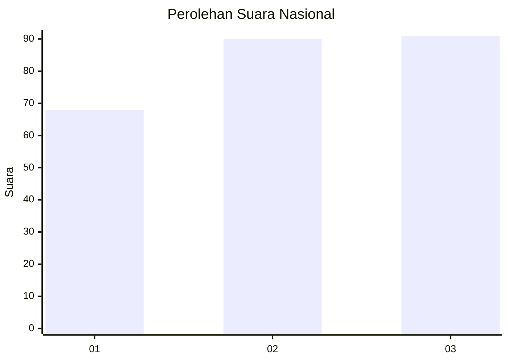
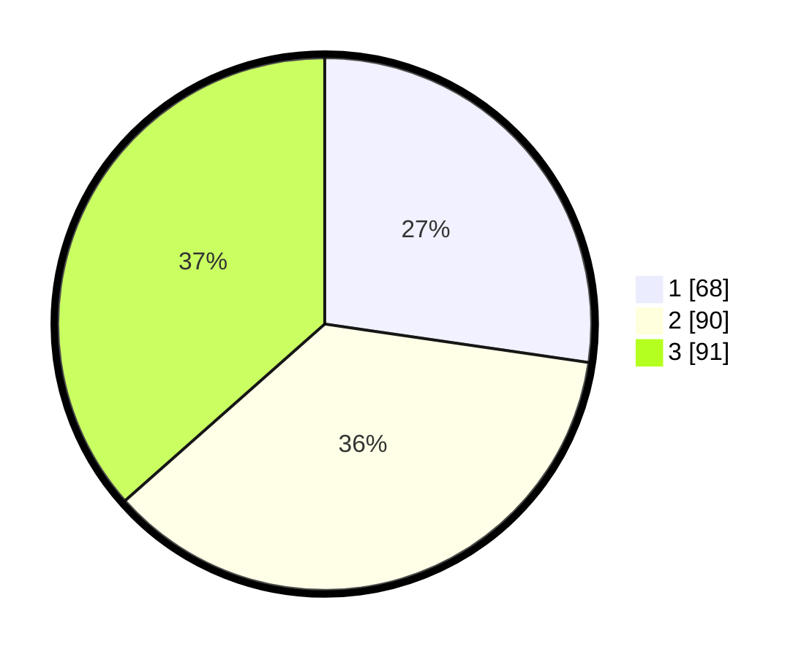

# Hasil

## Grafik

## Tabel

| No.    | Nama Paslon    | Suara | Suara (raw) | Persentase |
|:------ |:-------------- | -----:| -----------:| ----------:|
| 100025 | ANIES MUHAIMIN | 68    | [68][p-1]   | 27,31      |
| 100026 | PRABOWO GIBRAN | 90    | [90][p-2]   | 36,14      |
| 100027 | GANJAR MAHFUD  | 91    | [91][p-3]   | 36,55      |

[p-1]: https://github.com/gigit-pemilu/pemilu-2024/blob/main/pilpres/hitung-suara/sub/31-dki-jakarta/sub/75-jakarta-timur/sub/03-jatinegara/sub/1007-cipinang-besar-selatan/sub/078-tps/sub/paslon-1.txt
[p-2]: https://github.com/gigit-pemilu/pemilu-2024/blob/main/pilpres/hitung-suara/sub/31-dki-jakarta/sub/75-jakarta-timur/sub/03-jatinegara/sub/1007-cipinang-besar-selatan/sub/078-tps/sub/paslon-2.txt
[p-3]: https://github.com/gigit-pemilu/pemilu-2024/blob/main/pilpres/hitung-suara/sub/31-dki-jakarta/sub/75-jakarta-timur/sub/03-jatinegara/sub/1007-cipinang-besar-selatan/sub/078-tps/sub/paslon-3.txt

## Foto C Plano

https://sirekap-obj-formc.kpu.go.id/df87/pemilu/ppwp/31/75/03/10/07/3175031007078-20240214-225142--1cc0f45a-3d7e-4a0d-bcc2-aab891894866.jpg

https://sirekap-obj-formc.kpu.go.id/df87/pemilu/ppwp/31/75/03/10/07/3175031007078-20240217-120513--dec7ff9e-545c-4b01-9331-ccb1b466ffb6.jpg

https://sirekap-obj-formc.kpu.go.id/df87/pemilu/ppwp/31/75/03/10/07/3175031007078-20240214-215745--18a253f4-a62f-4363-a9be-3d830579f3de.jpg

## Metadata

| Key        | Value               |
| ---------- | ------------------- |
| Time Stamp | 2024-02-29 19:00:00 |

