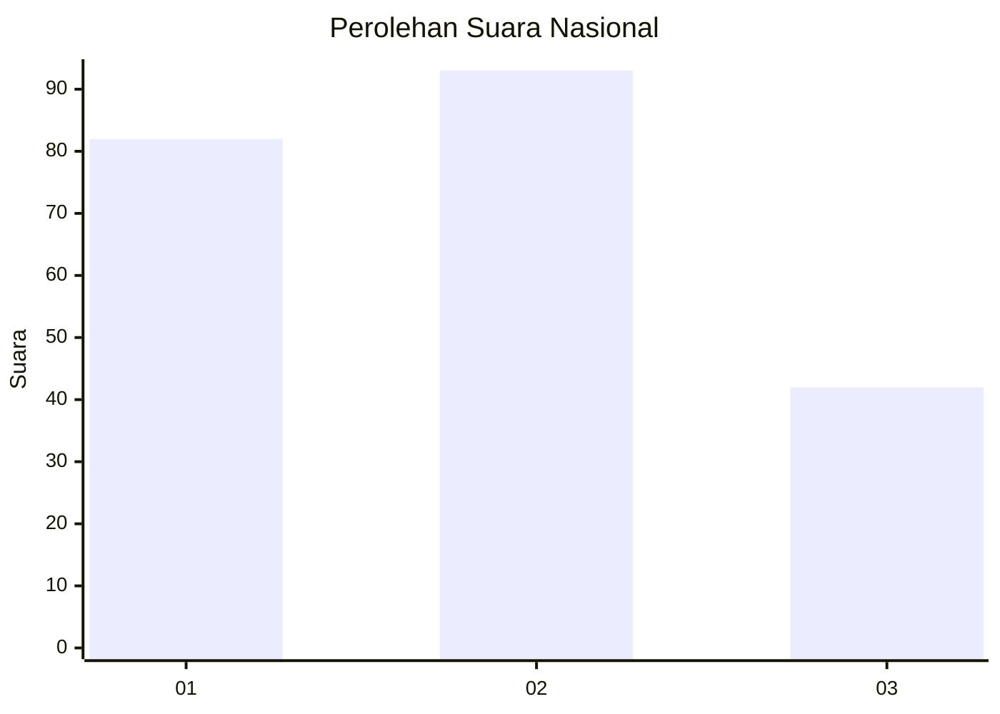
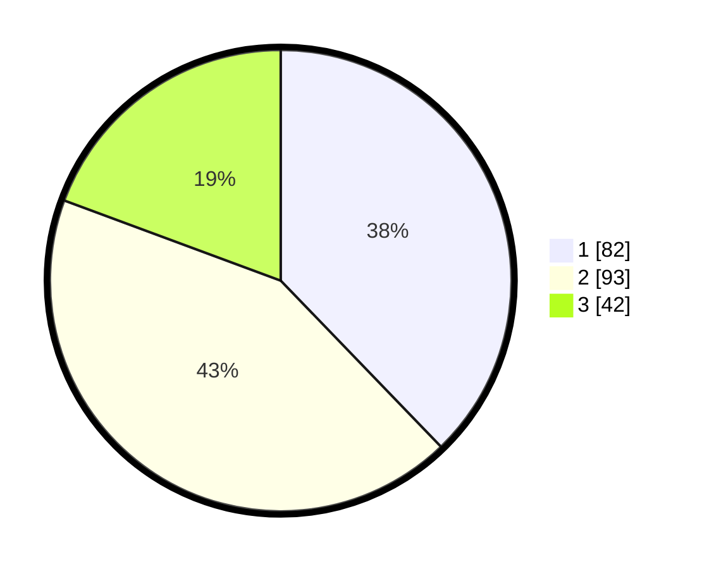

# Hasil

## Grafik

## Tabel

| No.    | Nama Paslon    | Suara | Suara (raw) | Persentase |
|:------ |:-------------- | -----:| -----------:| ----------:|
| 100025 | ANIES MUHAIMIN | 82    | [82][p-1]   | 37,79      |
| 100026 | PRABOWO GIBRAN | 93    | [93][p-2]   | 42,86      |
| 100027 | GANJAR MAHFUD  | 42    | [42][p-3]   | 19,35      |

[p-1]: https://github.com/gigit-pemilu/pemilu-2024/blob/main/pilpres/hitung-suara/sub/31-dki-jakarta/sub/75-jakarta-timur/sub/03-jatinegara/sub/1007-cipinang-besar-selatan/sub/096-tps/sub/paslon-1.txt
[p-2]: https://github.com/gigit-pemilu/pemilu-2024/blob/main/pilpres/hitung-suara/sub/31-dki-jakarta/sub/75-jakarta-timur/sub/03-jatinegara/sub/1007-cipinang-besar-selatan/sub/096-tps/sub/paslon-2.txt
[p-3]: https://github.com/gigit-pemilu/pemilu-2024/blob/main/pilpres/hitung-suara/sub/31-dki-jakarta/sub/75-jakarta-timur/sub/03-jatinegara/sub/1007-cipinang-besar-selatan/sub/096-tps/sub/paslon-3.txt

## Foto C Plano

https://sirekap-obj-formc.kpu.go.id/efe6/pemilu/ppwp/31/75/03/10/07/3175031007096-20240214-205156--b53be661-d2c2-4e30-b4a7-c1518ef8bc50.jpg

https://sirekap-obj-formc.kpu.go.id/efe6/pemilu/ppwp/31/75/03/10/07/3175031007096-20240214-215443--8a3ec443-a440-43f8-aa3f-475edfa50aac.jpg

https://sirekap-obj-formc.kpu.go.id/efe6/pemilu/ppwp/31/75/03/10/07/3175031007096-20240214-215141--153868dd-0941-4e9a-9d12-5920ece63c4f.jpg

## Metadata

| Key        | Value               |
| ---------- | ------------------- |
| Time Stamp | 2024-02-16 00:00:26 |

