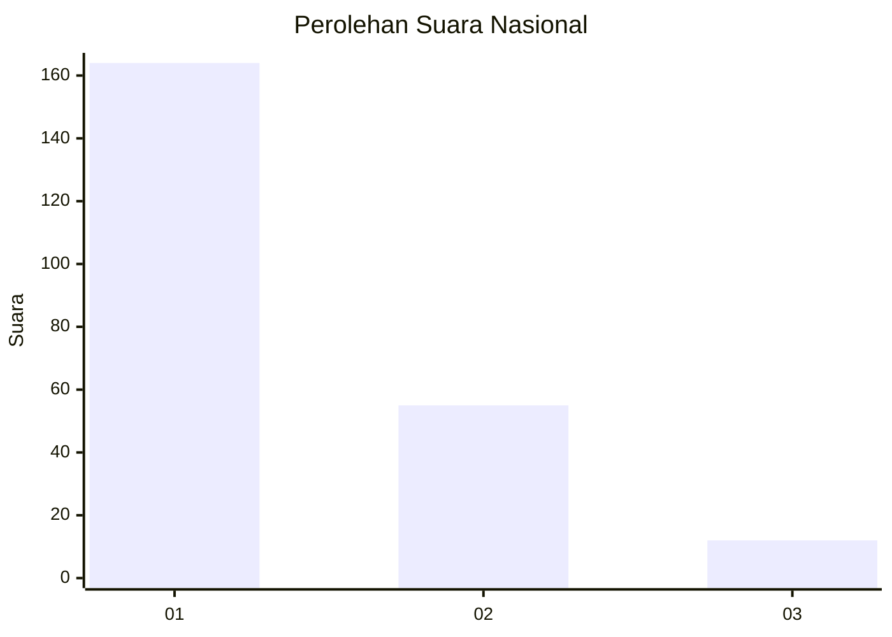
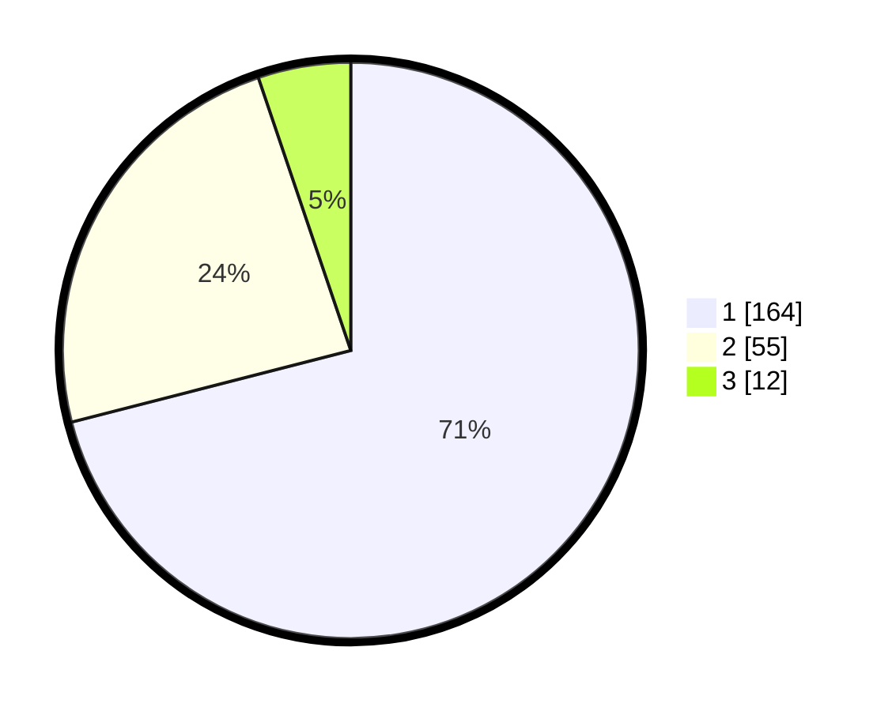

# Hasil

## Grafik

## Tabel

| No.    | Nama Paslon    | Suara | Suara (raw) | Persentase |
|:------ |:-------------- | -----:| -----------:| ----------:|
| 100025 | ANIES MUHAIMIN | 164   | [164][p-1]  | 71,00      |
| 100026 | PRABOWO GIBRAN | 55    | [55][p-2]   | 23,81      |
| 100027 | GANJAR MAHFUD  | 12    | [12][p-3]   | 5,19       |

[p-1]: https://github.com/gigit-pemilu/pemilu-2024/blob/main/pilpres/hitung-suara/sub/31-dki-jakarta/sub/75-jakarta-timur/sub/03-jatinegara/sub/1007-cipinang-besar-selatan/sub/107-tps/sub/paslon-1.txt
[p-2]: https://github.com/gigit-pemilu/pemilu-2024/blob/main/pilpres/hitung-suara/sub/31-dki-jakarta/sub/75-jakarta-timur/sub/03-jatinegara/sub/1007-cipinang-besar-selatan/sub/107-tps/sub/paslon-2.txt
[p-3]: https://github.com/gigit-pemilu/pemilu-2024/blob/main/pilpres/hitung-suara/sub/31-dki-jakarta/sub/75-jakarta-timur/sub/03-jatinegara/sub/1007-cipinang-besar-selatan/sub/107-tps/sub/paslon-3.txt

## Foto C Plano

https://sirekap-obj-formc.kpu.go.id/c1e1/pemilu/ppwp/31/75/03/10/07/3175031007107-20240215-001514--290e97b2-9897-4274-b427-8b9660505709.jpg

https://sirekap-obj-formc.kpu.go.id/c1e1/pemilu/ppwp/31/75/03/10/07/3175031007107-20240216-153440--d371f590-0afb-45f5-98f4-38b128e4f2cc.jpg

https://sirekap-obj-formc.kpu.go.id/c1e1/pemilu/ppwp/31/75/03/10/07/3175031007107-20240216-153550--84a77ed2-f566-4867-8bce-dc5fb97f2dfe.jpg

## Metadata

| Key        | Value               |
| ---------- | ------------------- |
| Time Stamp | 2024-02-17 00:00:00 |

