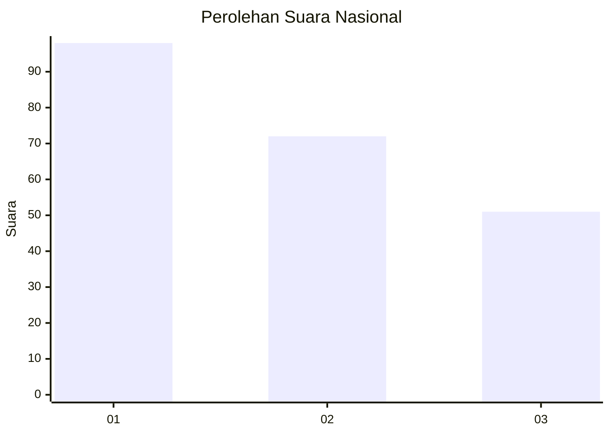
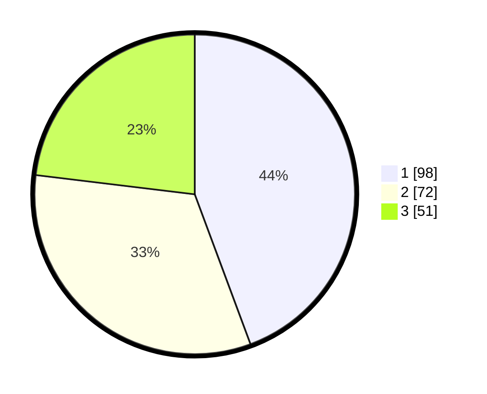

# Hasil

## Grafik

## Tabel

| No.    | Nama Paslon    | Suara | Suara (raw) | Persentase |
|:------ |:-------------- | -----:| -----------:| ----------:|
| 100025 | ANIES MUHAIMIN | 98    | [98][p-1]   | 44,34      |
| 100026 | PRABOWO GIBRAN | 72    | [72][p-2]   | 32,58      |
| 100027 | GANJAR MAHFUD  | 51    | [51][p-3]   | 23,08      |

[p-1]: https://github.com/gigit-pemilu/pemilu-2024/blob/main/pilpres/hitung-suara/sub/31-dki-jakarta/sub/75-jakarta-timur/sub/03-jatinegara/sub/1007-cipinang-besar-selatan/sub/112-tps/sub/paslon-1.txt
[p-2]: https://github.com/gigit-pemilu/pemilu-2024/blob/main/pilpres/hitung-suara/sub/31-dki-jakarta/sub/75-jakarta-timur/sub/03-jatinegara/sub/1007-cipinang-besar-selatan/sub/112-tps/sub/paslon-2.txt
[p-3]: https://github.com/gigit-pemilu/pemilu-2024/blob/main/pilpres/hitung-suara/sub/31-dki-jakarta/sub/75-jakarta-timur/sub/03-jatinegara/sub/1007-cipinang-besar-selatan/sub/112-tps/sub/paslon-3.txt

## Foto C Plano

https://sirekap-obj-formc.kpu.go.id/d7d9/pemilu/ppwp/31/75/03/10/07/3175031007112-20240215-010104--0bb66cf8-a0a7-4ce9-9d52-41e28c8fcc72.jpg

https://sirekap-obj-formc.kpu.go.id/d7d9/pemilu/ppwp/31/75/03/10/07/3175031007112-20240215-010715--54c92c76-23ac-4114-8fe4-6549b3e2de26.jpg

https://sirekap-obj-formc.kpu.go.id/d7d9/pemilu/ppwp/31/75/03/10/07/3175031007112-20240215-010922--63c1f5af-e146-4952-b240-dc9aafcf88b2.jpg

## Metadata

| Key        | Value               |
| ---------- | ------------------- |
| Time Stamp | 2024-02-24 22:31:28 |

