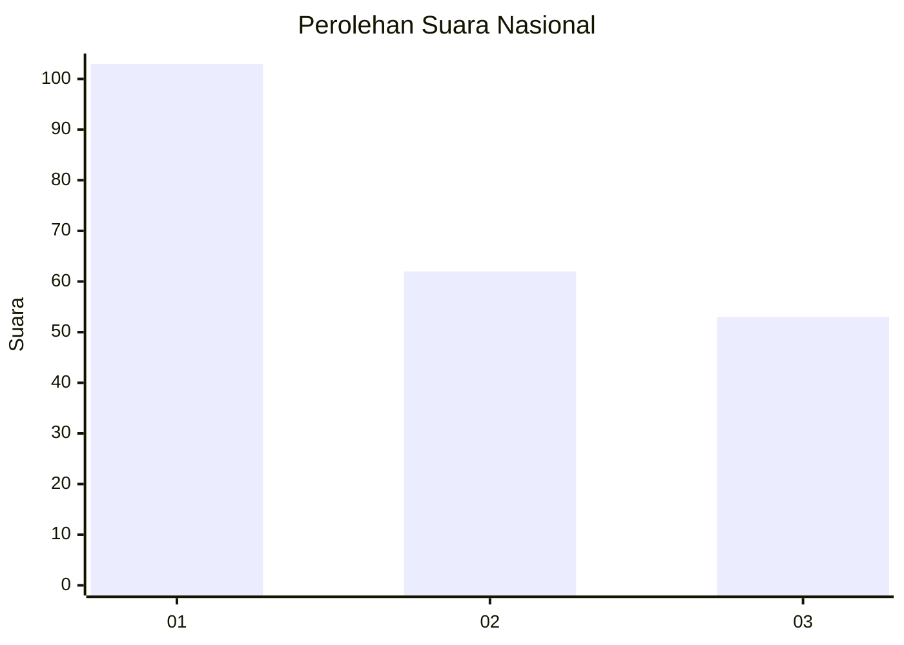
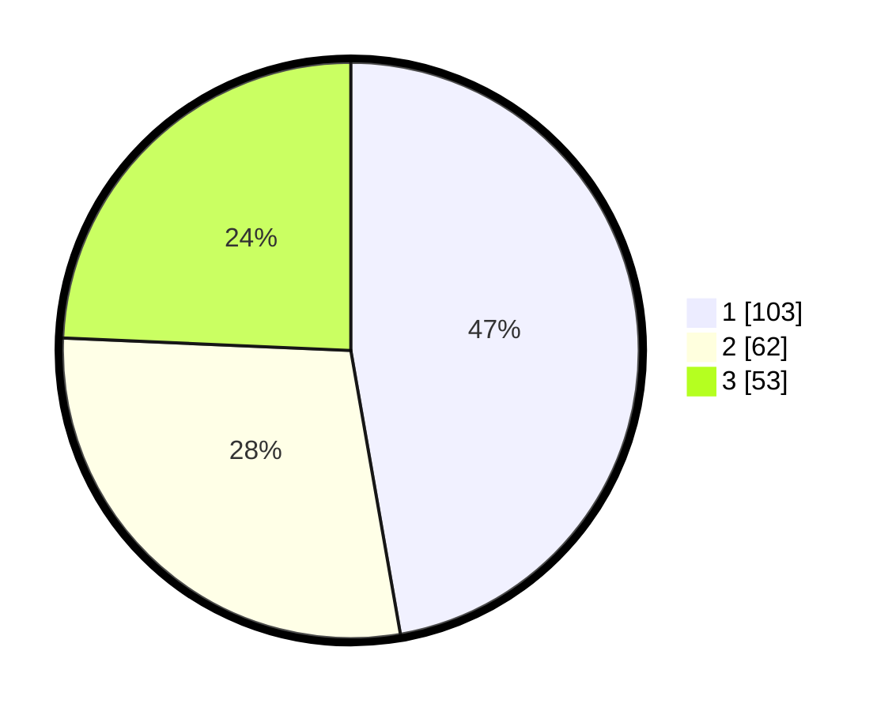

# Hasil

## Grafik

## Tabel

| No.    | Nama Paslon    | Suara | Suara (raw) | Persentase |
|:------ |:-------------- | -----:| -----------:| ----------:|
| 100025 | ANIES MUHAIMIN | 103   | [103][p-1]  | 47,25      |
| 100026 | PRABOWO GIBRAN | 62    | [62][p-2]   | 28,44      |
| 100027 | GANJAR MAHFUD  | 53    | [53][p-3]   | 24,31      |

[p-1]: https://github.com/gigit-pemilu/pemilu-2024/blob/main/pilpres/hitung-suara/sub/31-dki-jakarta/sub/75-jakarta-timur/sub/03-jatinegara/sub/1007-cipinang-besar-selatan/sub/113-tps/sub/paslon-1.txt
[p-2]: https://github.com/gigit-pemilu/pemilu-2024/blob/main/pilpres/hitung-suara/sub/31-dki-jakarta/sub/75-jakarta-timur/sub/03-jatinegara/sub/1007-cipinang-besar-selatan/sub/113-tps/sub/paslon-2.txt
[p-3]: https://github.com/gigit-pemilu/pemilu-2024/blob/main/pilpres/hitung-suara/sub/31-dki-jakarta/sub/75-jakarta-timur/sub/03-jatinegara/sub/1007-cipinang-besar-selatan/sub/113-tps/sub/paslon-3.txt

## Foto C Plano

https://sirekap-obj-formc.kpu.go.id/5e28/pemilu/ppwp/31/75/03/10/07/3175031007113-20240214-191748--2a1507a0-750b-485a-9474-d9b70ef33bae.jpg

https://sirekap-obj-formc.kpu.go.id/5e28/pemilu/ppwp/31/75/03/10/07/3175031007113-20240214-155031--55c934a3-052b-4222-a0e4-09e23e5f55c1.jpg

https://sirekap-obj-formc.kpu.go.id/5e28/pemilu/ppwp/31/75/03/10/07/3175031007113-20240214-155131--df894e1d-3df4-45f9-beef-6f2eee09ac4e.jpg

## Metadata

| Key        | Value               |
| ---------- | ------------------- |
| Time Stamp | 2024-02-24 22:31:28 |

