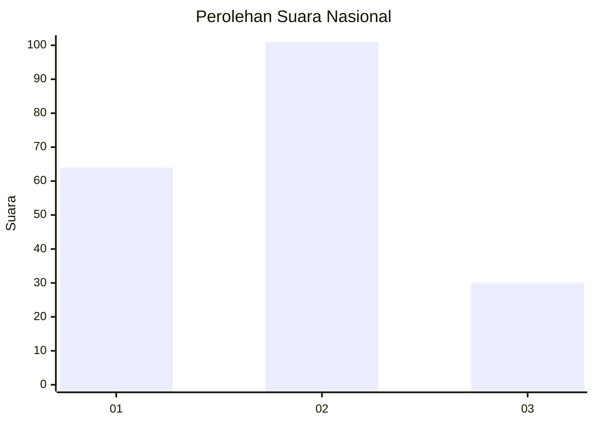
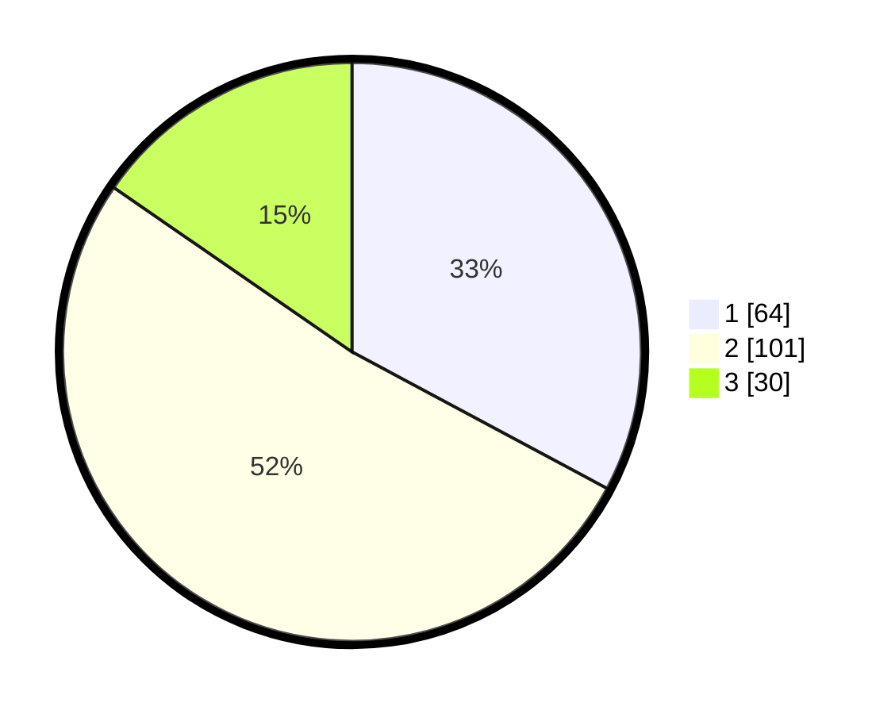

# Hasil

## Grafik

## Tabel

| No.    | Nama Paslon    | Suara | Suara (raw) | Persentase |
|:------ |:-------------- | -----:| -----------:| ----------:|
| 100025 | ANIES MUHAIMIN | 64    | [64][p-1]   | 32,82      |
| 100026 | PRABOWO GIBRAN | 101   | [101][p-2]  | 51,79      |
| 100027 | GANJAR MAHFUD  | 30    | [30][p-3]   | 15,38      |

[p-1]: https://github.com/gigit-pemilu/pemilu-2024/blob/main/pilpres/hitung-suara/sub/31-dki-jakarta/sub/75-jakarta-timur/sub/03-jatinegara/sub/1008-cipinang-besar-utara/sub/001-tps/sub/paslon-1.txt
[p-2]: https://github.com/gigit-pemilu/pemilu-2024/blob/main/pilpres/hitung-suara/sub/31-dki-jakarta/sub/75-jakarta-timur/sub/03-jatinegara/sub/1008-cipinang-besar-utara/sub/001-tps/sub/paslon-2.txt
[p-3]: https://github.com/gigit-pemilu/pemilu-2024/blob/main/pilpres/hitung-suara/sub/31-dki-jakarta/sub/75-jakarta-timur/sub/03-jatinegara/sub/1008-cipinang-besar-utara/sub/001-tps/sub/paslon-3.txt

## Foto C Plano

https://sirekap-obj-formc.kpu.go.id/59e6/pemilu/ppwp/31/75/03/10/08/3175031008001-20240214-222232--b9146871-2f31-4460-bc39-432d0161b7a0.jpg

https://sirekap-obj-formc.kpu.go.id/59e6/pemilu/ppwp/31/75/03/10/08/3175031008001-20240214-222622--e2c8c13c-babb-46a5-8437-f7137ed63fcf.jpg

https://sirekap-obj-formc.kpu.go.id/59e6/pemilu/ppwp/31/75/03/10/08/3175031008001-20240214-222907--44009790-28ba-4e6a-be67-88d1e3b19cd3.jpg

## Metadata

| Key        | Value               |
| ---------- | ------------------- |
| Time Stamp | 2024-02-24 22:31:28 |

