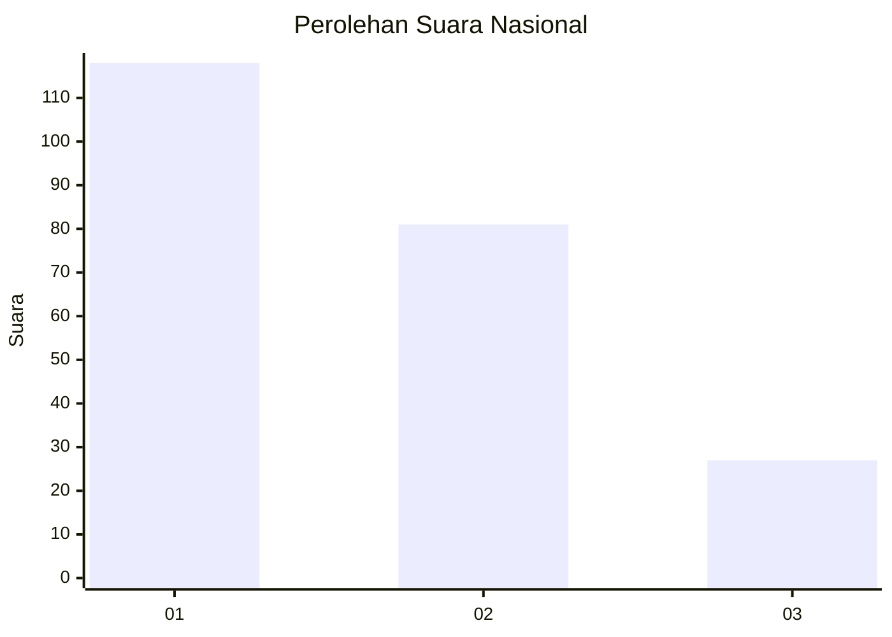
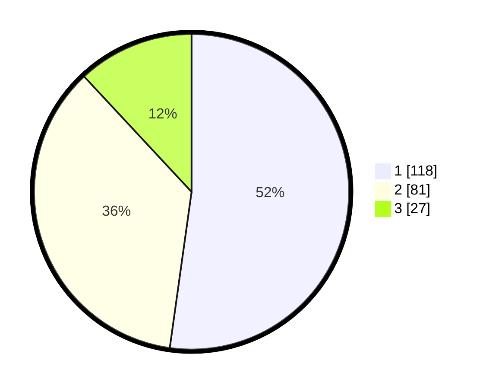

# Hasil

## Grafik

## Tabel

| No.    | Nama Paslon    | Suara | Suara (raw) | Persentase |
|:------ |:-------------- | -----:| -----------:| ----------:|
| 100025 | ANIES MUHAIMIN | 118   | [118][p-1]  | 52,21      |
| 100026 | PRABOWO GIBRAN | 81    | [81][p-2]   | 35,84      |
| 100027 | GANJAR MAHFUD  | 27    | [27][p-3]   | 11,95      |

[p-1]: https://github.com/gigit-pemilu/pemilu-2024/blob/main/pilpres/hitung-suara/sub/31-dki-jakarta/sub/75-jakarta-timur/sub/03-jatinegara/sub/1008-cipinang-besar-utara/sub/011-tps/sub/paslon-1.txt
[p-2]: https://github.com/gigit-pemilu/pemilu-2024/blob/main/pilpres/hitung-suara/sub/31-dki-jakarta/sub/75-jakarta-timur/sub/03-jatinegara/sub/1008-cipinang-besar-utara/sub/011-tps/sub/paslon-2.txt
[p-3]: https://github.com/gigit-pemilu/pemilu-2024/blob/main/pilpres/hitung-suara/sub/31-dki-jakarta/sub/75-jakarta-timur/sub/03-jatinegara/sub/1008-cipinang-besar-utara/sub/011-tps/sub/paslon-3.txt

## Foto C Plano

https://sirekap-obj-formc.kpu.go.id/ba59/pemilu/ppwp/31/75/03/10/08/3175031008011-20240215-041508--abdbaa86-373d-4834-885b-a98da3905de5.jpg

https://sirekap-obj-formc.kpu.go.id/ba59/pemilu/ppwp/31/75/03/10/08/3175031008011-20240215-004826--b429ad5d-2530-48c3-b54d-9af3502a9bbf.jpg

https://sirekap-obj-formc.kpu.go.id/ba59/pemilu/ppwp/31/75/03/10/08/3175031008011-20240215-041617--8e416b49-738d-4b67-b343-e89dac9f73b8.jpg

## Metadata

| Key        | Value               |
| ---------- | ------------------- |
| Time Stamp | 2024-02-25 15:00:00 |

