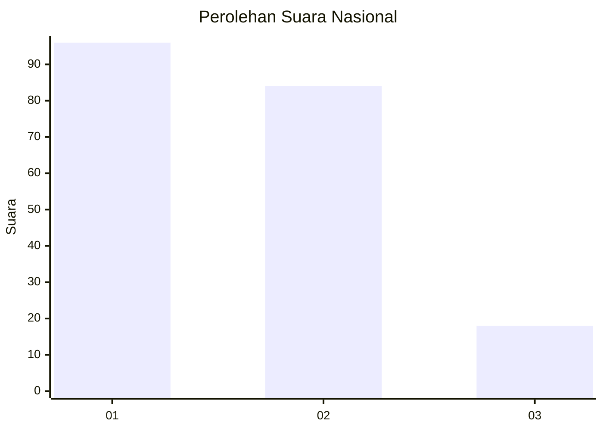
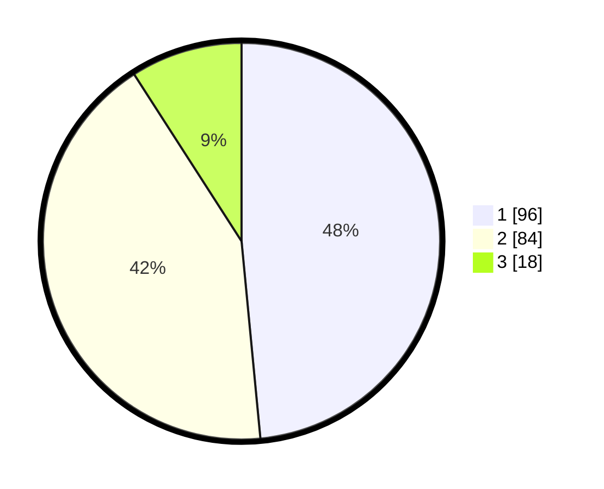

# Hasil

## Grafik

## Tabel

| No.    | Nama Paslon    | Suara | Suara (raw) | Persentase |
|:------ |:-------------- | -----:| -----------:| ----------:|
| 100025 | ANIES MUHAIMIN | 96    | [96][p-1]   | 48,48      |
| 100026 | PRABOWO GIBRAN | 84    | [84][p-2]   | 42,42      |
| 100027 | GANJAR MAHFUD  | 18    | [18][p-3]   | 9,09       |

[p-1]: https://github.com/gigit-pemilu/pemilu-2024/blob/main/pilpres/hitung-suara/sub/31-dki-jakarta/sub/75-jakarta-timur/sub/03-jatinegara/sub/1008-cipinang-besar-utara/sub/012-tps/sub/paslon-1.txt
[p-2]: https://github.com/gigit-pemilu/pemilu-2024/blob/main/pilpres/hitung-suara/sub/31-dki-jakarta/sub/75-jakarta-timur/sub/03-jatinegara/sub/1008-cipinang-besar-utara/sub/012-tps/sub/paslon-2.txt
[p-3]: https://github.com/gigit-pemilu/pemilu-2024/blob/main/pilpres/hitung-suara/sub/31-dki-jakarta/sub/75-jakarta-timur/sub/03-jatinegara/sub/1008-cipinang-besar-utara/sub/012-tps/sub/paslon-3.txt

## Foto C Plano

https://sirekap-obj-formc.kpu.go.id/1568/pemilu/ppwp/31/75/03/10/08/3175031008012-20240215-024451--32c50e93-ce9f-412a-b4fc-cde31f6cca10.jpg

https://sirekap-obj-formc.kpu.go.id/1568/pemilu/ppwp/31/75/03/10/08/3175031008012-20240215-024533--d2b06140-0806-47cd-b05b-4f1574e88884.jpg

https://sirekap-obj-formc.kpu.go.id/1568/pemilu/ppwp/31/75/03/10/08/3175031008012-20240215-024558--90ba784a-fd37-4e2e-8651-b0ea757e32d7.jpg

## Metadata

| Key        | Value               |
| ---------- | ------------------- |
| Time Stamp | 2024-02-24 22:31:28 |

