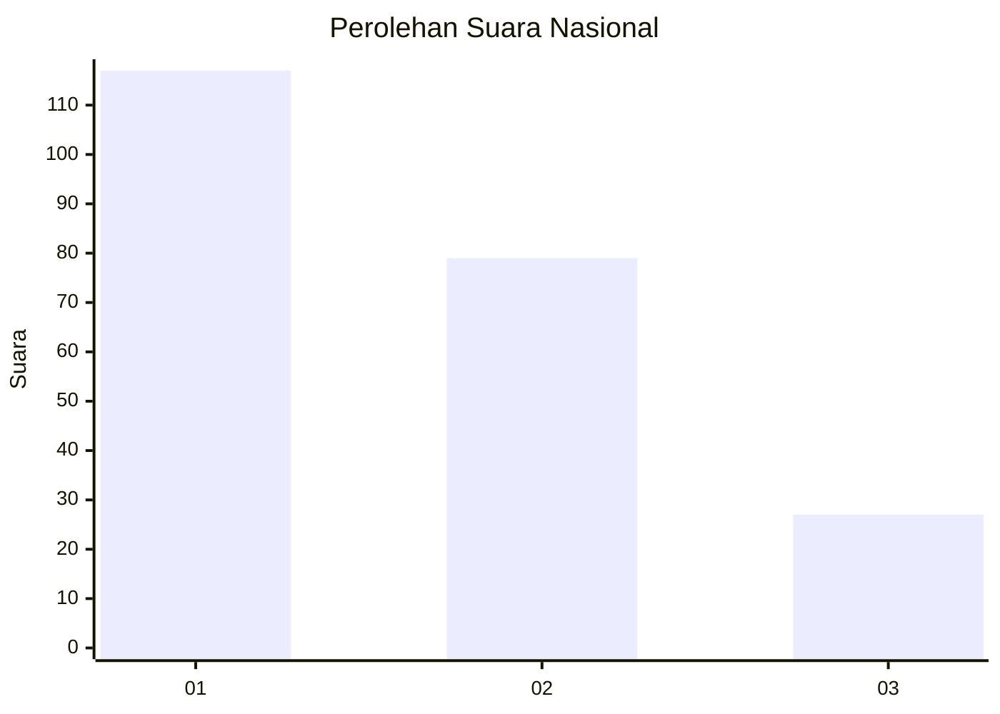
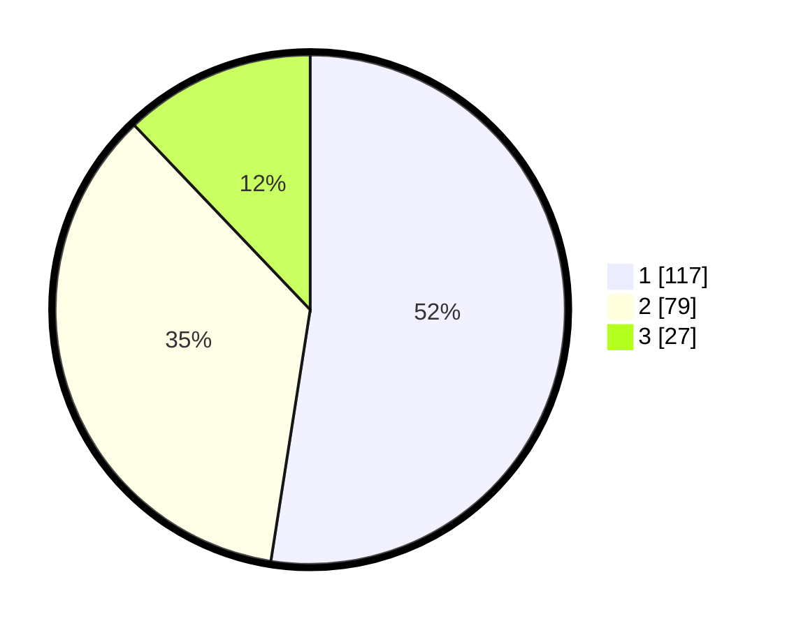

# Hasil

## Grafik

## Tabel

| No.    | Nama Paslon    | Suara | Suara (raw) | Persentase |
|:------ |:-------------- | -----:| -----------:| ----------:|
| 100025 | ANIES MUHAIMIN | 117   | [117][p-1]  | 52,47      |
| 100026 | PRABOWO GIBRAN | 79    | [79][p-2]   | 35,43      |
| 100027 | GANJAR MAHFUD  | 27    | [27][p-3]   | 12,11      |

[p-1]: https://github.com/gigit-pemilu/pemilu-2024/blob/main/pilpres/hitung-suara/sub/31-dki-jakarta/sub/75-jakarta-timur/sub/03-jatinegara/sub/1008-cipinang-besar-utara/sub/021-tps/sub/paslon-1.txt
[p-2]: https://github.com/gigit-pemilu/pemilu-2024/blob/main/pilpres/hitung-suara/sub/31-dki-jakarta/sub/75-jakarta-timur/sub/03-jatinegara/sub/1008-cipinang-besar-utara/sub/021-tps/sub/paslon-2.txt
[p-3]: https://github.com/gigit-pemilu/pemilu-2024/blob/main/pilpres/hitung-suara/sub/31-dki-jakarta/sub/75-jakarta-timur/sub/03-jatinegara/sub/1008-cipinang-besar-utara/sub/021-tps/sub/paslon-3.txt

## Foto C Plano

https://sirekap-obj-formc.kpu.go.id/5a79/pemilu/ppwp/31/75/03/10/08/3175031008021-20240215-000415--668ee640-7d81-4c08-bd4c-db8f76753d7a.jpg

https://sirekap-obj-formc.kpu.go.id/5a79/pemilu/ppwp/31/75/03/10/08/3175031008021-20240215-000420--cc9d5761-1b1f-451c-a601-9a4b3f32e631.jpg

https://sirekap-obj-formc.kpu.go.id/5a79/pemilu/ppwp/31/75/03/10/08/3175031008021-20240215-000441--054d89e8-39c5-437a-a2e5-bffd488fcc04.jpg

## Metadata

| Key        | Value               |
| ---------- | ------------------- |
| Time Stamp | 2024-02-15 12:00:28 |

