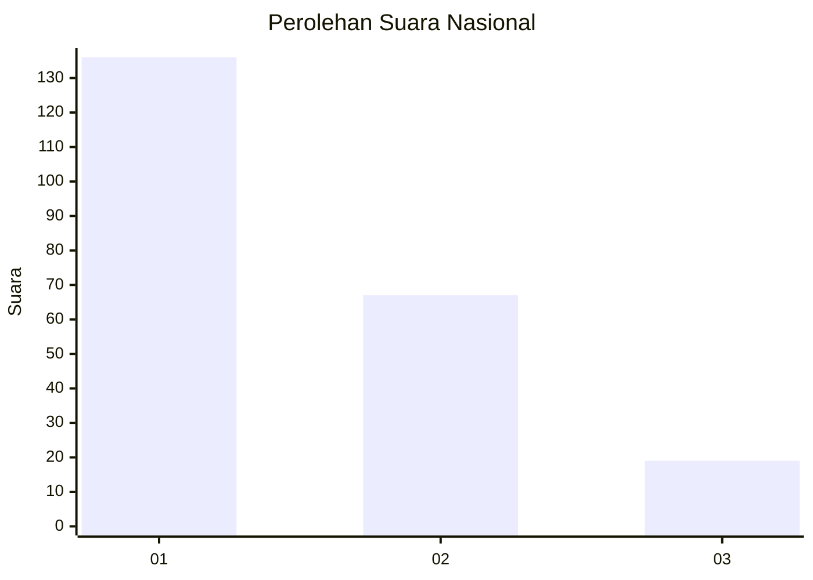
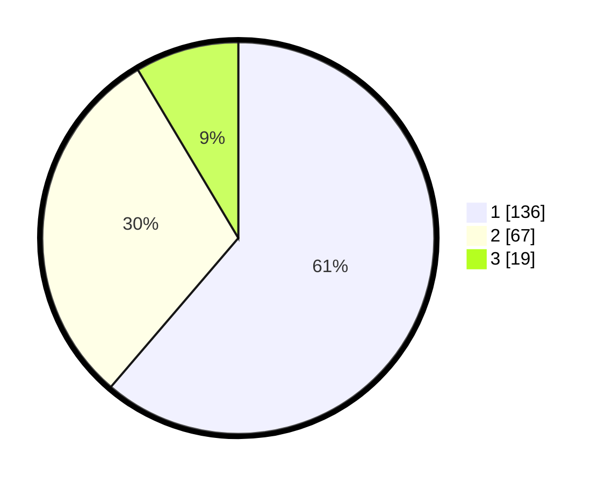

# Hasil

## Grafik

## Tabel

| No.    | Nama Paslon    | Suara | Suara (raw) | Persentase |
|:------ |:-------------- | -----:| -----------:| ----------:|
| 100025 | ANIES MUHAIMIN | 136   | [136][p-1]  | 61,26      |
| 100026 | PRABOWO GIBRAN | 67    | [67][p-2]   | 30,18      |
| 100027 | GANJAR MAHFUD  | 19    | [19][p-3]   | 8,56       |

[p-1]: https://github.com/gigit-pemilu/pemilu-2024/blob/main/pilpres/hitung-suara/sub/31-dki-jakarta/sub/75-jakarta-timur/sub/03-jatinegara/sub/1008-cipinang-besar-utara/sub/050-tps/sub/paslon-1.txt
[p-2]: https://github.com/gigit-pemilu/pemilu-2024/blob/main/pilpres/hitung-suara/sub/31-dki-jakarta/sub/75-jakarta-timur/sub/03-jatinegara/sub/1008-cipinang-besar-utara/sub/050-tps/sub/paslon-2.txt
[p-3]: https://github.com/gigit-pemilu/pemilu-2024/blob/main/pilpres/hitung-suara/sub/31-dki-jakarta/sub/75-jakarta-timur/sub/03-jatinegara/sub/1008-cipinang-besar-utara/sub/050-tps/sub/paslon-3.txt

## Foto C Plano

https://sirekap-obj-formc.kpu.go.id/bb70/pemilu/ppwp/31/75/03/10/08/3175031008050-20240214-213107--2ff21e47-d059-480c-856d-0c83e795ca60.jpg

https://sirekap-obj-formc.kpu.go.id/bb70/pemilu/ppwp/31/75/03/10/08/3175031008050-20240214-213821--a44e1e9b-edf6-4e84-b64c-f40b3f51c71d.jpg

https://sirekap-obj-formc.kpu.go.id/bb70/pemilu/ppwp/31/75/03/10/08/3175031008050-20240214-214039--f0c6bafa-d6f0-4c44-970c-dad7a75032b2.jpg

## Metadata

| Key        | Value               |
| ---------- | ------------------- |
| Time Stamp | 2024-02-24 22:31:28 |

