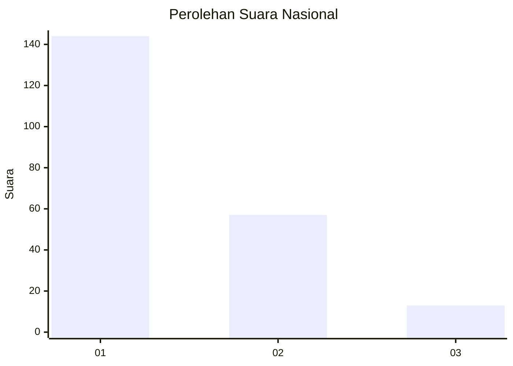
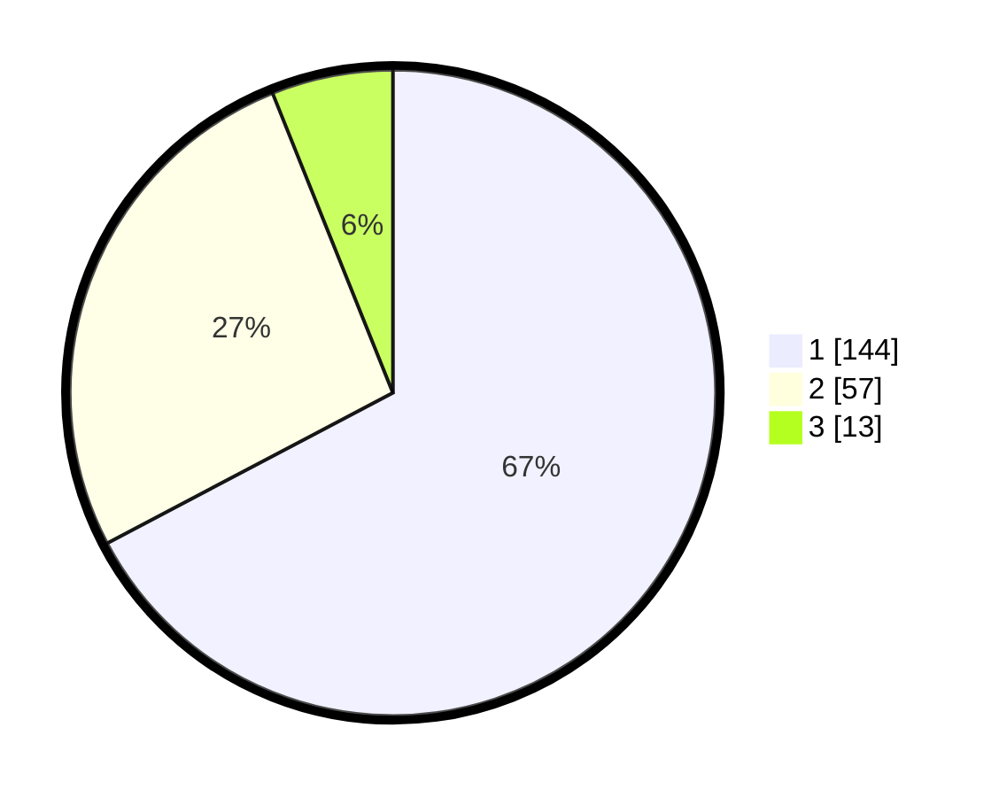

# Hasil

## Grafik

## Tabel

| No.    | Nama Paslon    | Suara | Suara (raw) | Persentase |
|:------ |:-------------- | -----:| -----------:| ----------:|
| 100025 | ANIES MUHAIMIN | 144   | [144][p-1]  | 67,29      |
| 100026 | PRABOWO GIBRAN | 57    | [57][p-2]   | 26,64      |
| 100027 | GANJAR MAHFUD  | 13    | [13][p-3]   | 6,07       |

[p-1]: https://github.com/gigit-pemilu/pemilu-2024/blob/main/pilpres/hitung-suara/sub/31-dki-jakarta/sub/75-jakarta-timur/sub/03-jatinegara/sub/1008-cipinang-besar-utara/sub/060-tps/sub/paslon-1.txt
[p-2]: https://github.com/gigit-pemilu/pemilu-2024/blob/main/pilpres/hitung-suara/sub/31-dki-jakarta/sub/75-jakarta-timur/sub/03-jatinegara/sub/1008-cipinang-besar-utara/sub/060-tps/sub/paslon-2.txt
[p-3]: https://github.com/gigit-pemilu/pemilu-2024/blob/main/pilpres/hitung-suara/sub/31-dki-jakarta/sub/75-jakarta-timur/sub/03-jatinegara/sub/1008-cipinang-besar-utara/sub/060-tps/sub/paslon-3.txt

## Foto C Plano

https://sirekap-obj-formc.kpu.go.id/8428/pemilu/ppwp/31/75/03/10/08/3175031008060-20240214-213503--0247d8b8-ea5f-4b86-bbf8-bbda851703a2.jpg

https://sirekap-obj-formc.kpu.go.id/8428/pemilu/ppwp/31/75/03/10/08/3175031008060-20240214-215409--19780042-aaa4-4788-9770-46a76714eb93.jpg

https://sirekap-obj-formc.kpu.go.id/8428/pemilu/ppwp/31/75/03/10/08/3175031008060-20240214-220148--86de4e15-e065-46f8-b8ec-22766731fbef.jpg

## Metadata

| Key        | Value               |
| ---------- | ------------------- |
| Time Stamp | 2024-02-24 22:31:28 |

