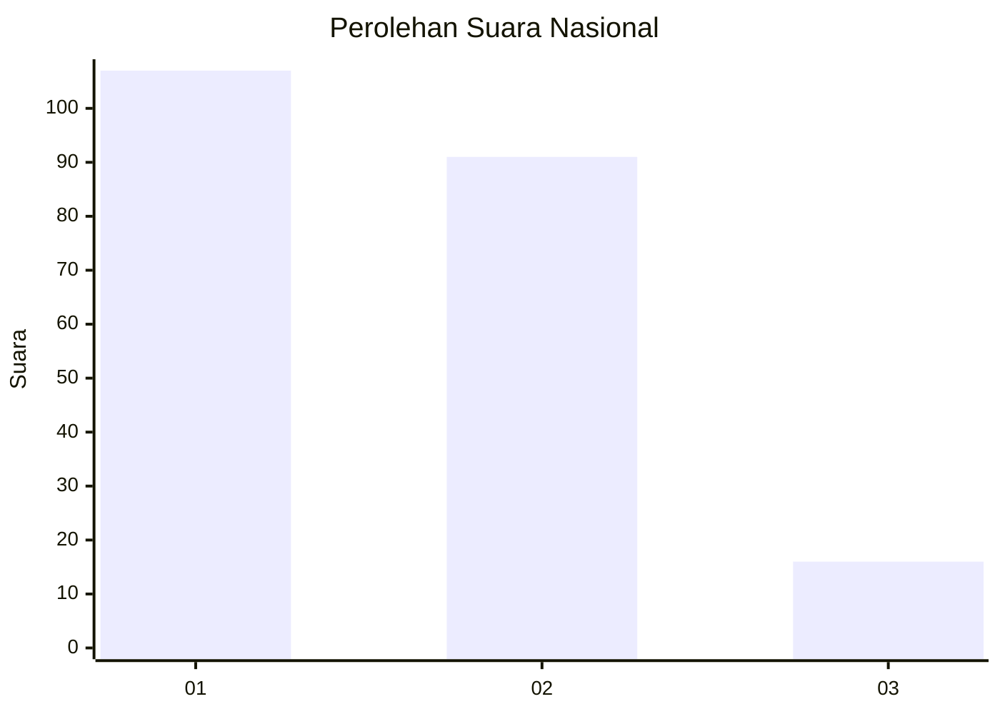
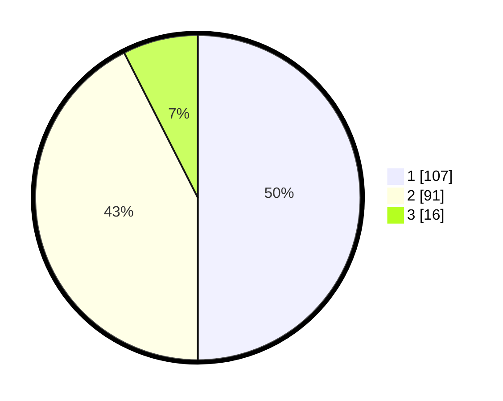

# Hasil

## Grafik

## Tabel

| No.    | Nama Paslon    | Suara | Suara (raw) | Persentase |
|:------ |:-------------- | -----:| -----------:| ----------:|
| 100025 | ANIES MUHAIMIN | 107   | [107][p-1]  | 50,00      |
| 100026 | PRABOWO GIBRAN | 91    | [91][p-2]   | 42,52      |
| 100027 | GANJAR MAHFUD  | 16    | [16][p-3]   | 7,48       |

[p-1]: https://github.com/gigit-pemilu/pemilu-2024/blob/main/pilpres/hitung-suara/sub/31-dki-jakarta/sub/75-jakarta-timur/sub/03-jatinegara/sub/1008-cipinang-besar-utara/sub/063-tps/sub/paslon-1.txt
[p-2]: https://github.com/gigit-pemilu/pemilu-2024/blob/main/pilpres/hitung-suara/sub/31-dki-jakarta/sub/75-jakarta-timur/sub/03-jatinegara/sub/1008-cipinang-besar-utara/sub/063-tps/sub/paslon-2.txt
[p-3]: https://github.com/gigit-pemilu/pemilu-2024/blob/main/pilpres/hitung-suara/sub/31-dki-jakarta/sub/75-jakarta-timur/sub/03-jatinegara/sub/1008-cipinang-besar-utara/sub/063-tps/sub/paslon-3.txt

## Foto C Plano

https://sirekap-obj-formc.kpu.go.id/1738/pemilu/ppwp/31/75/03/10/08/3175031008063-20240215-003159--af35c076-cd97-45d2-bfcc-a2de616f94b0.jpg

https://sirekap-obj-formc.kpu.go.id/1738/pemilu/ppwp/31/75/03/10/08/3175031008063-20240215-003317--d4e6d4d9-62a2-4634-af42-7406ee9d103f.jpg

https://sirekap-obj-formc.kpu.go.id/1738/pemilu/ppwp/31/75/03/10/08/3175031008063-20240215-003518--ed9a25c7-eb22-4ea1-aa39-314f94cbe71c.jpg

## Metadata

| Key        | Value               |
| ---------- | ------------------- |
| Time Stamp | 2024-02-16 00:00:26 |

