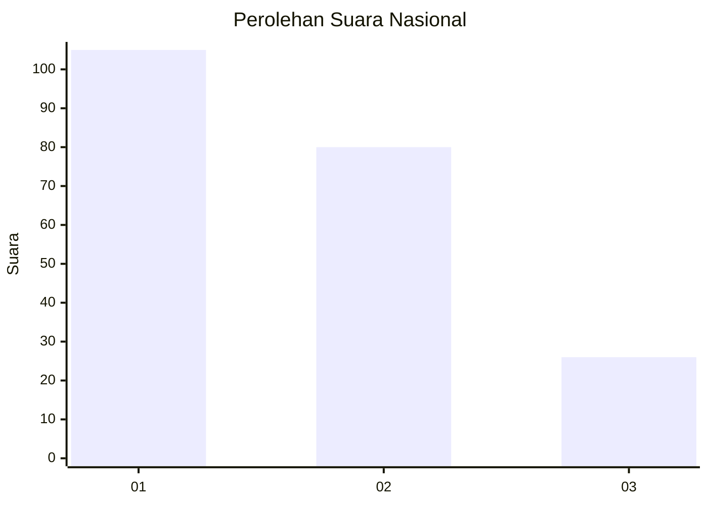
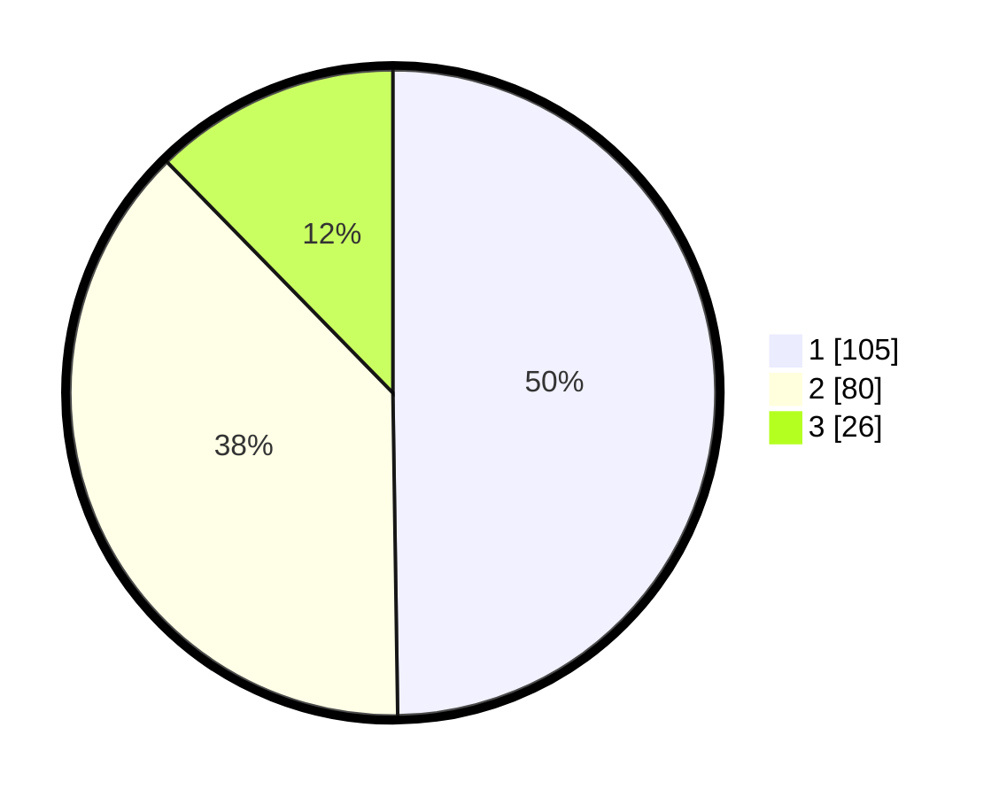

# Hasil

## Grafik

## Tabel

| No.    | Nama Paslon    | Suara | Suara (raw) | Persentase |
|:------ |:-------------- | -----:| -----------:| ----------:|
| 100025 | ANIES MUHAIMIN | 105   | [105][p-1]  | 49,76      |
| 100026 | PRABOWO GIBRAN | 80    | [80][p-2]   | 37,91      |
| 100027 | GANJAR MAHFUD  | 26    | [26][p-3]   | 12,32      |

[p-1]: https://github.com/gigit-pemilu/pemilu-2024/blob/main/pilpres/hitung-suara/sub/31-dki-jakarta/sub/75-jakarta-timur/sub/03-jatinegara/sub/1008-cipinang-besar-utara/sub/075-tps/sub/paslon-1.txt
[p-2]: https://github.com/gigit-pemilu/pemilu-2024/blob/main/pilpres/hitung-suara/sub/31-dki-jakarta/sub/75-jakarta-timur/sub/03-jatinegara/sub/1008-cipinang-besar-utara/sub/075-tps/sub/paslon-2.txt
[p-3]: https://github.com/gigit-pemilu/pemilu-2024/blob/main/pilpres/hitung-suara/sub/31-dki-jakarta/sub/75-jakarta-timur/sub/03-jatinegara/sub/1008-cipinang-besar-utara/sub/075-tps/sub/paslon-3.txt

## Foto C Plano

https://sirekap-obj-formc.kpu.go.id/c269/pemilu/ppwp/31/75/03/10/08/3175031008075-20240214-193853--9a347fa6-3b79-4f7e-b443-f482187ca3bb.jpg

https://sirekap-obj-formc.kpu.go.id/c269/pemilu/ppwp/31/75/03/10/08/3175031008075-20240215-000840--a102da02-bee8-4b93-9dd3-6fbaccb4c09f.jpg

https://sirekap-obj-formc.kpu.go.id/c269/pemilu/ppwp/31/75/03/10/08/3175031008075-20240214-193634--d558a88c-4bed-4f5e-af00-69c60787c144.jpg

## Metadata

| Key        | Value               |
| ---------- | ------------------- |
| Time Stamp | 2024-02-16 00:00:26 |

