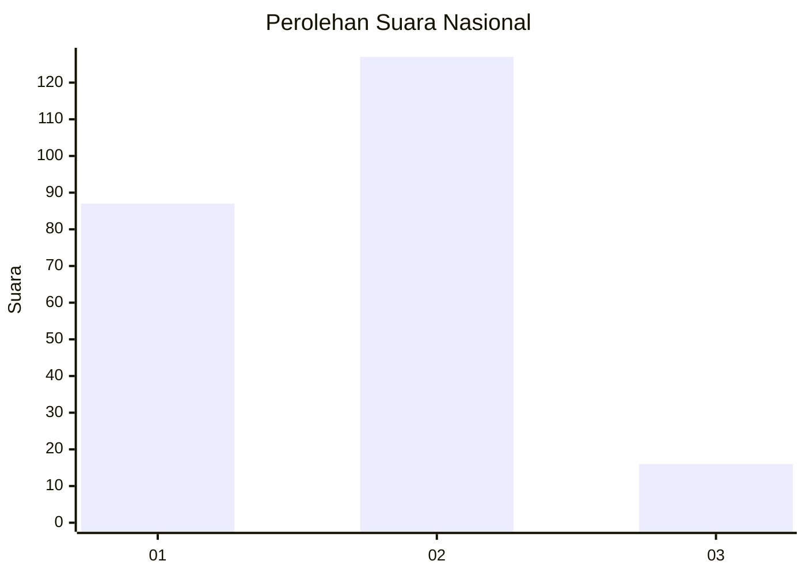
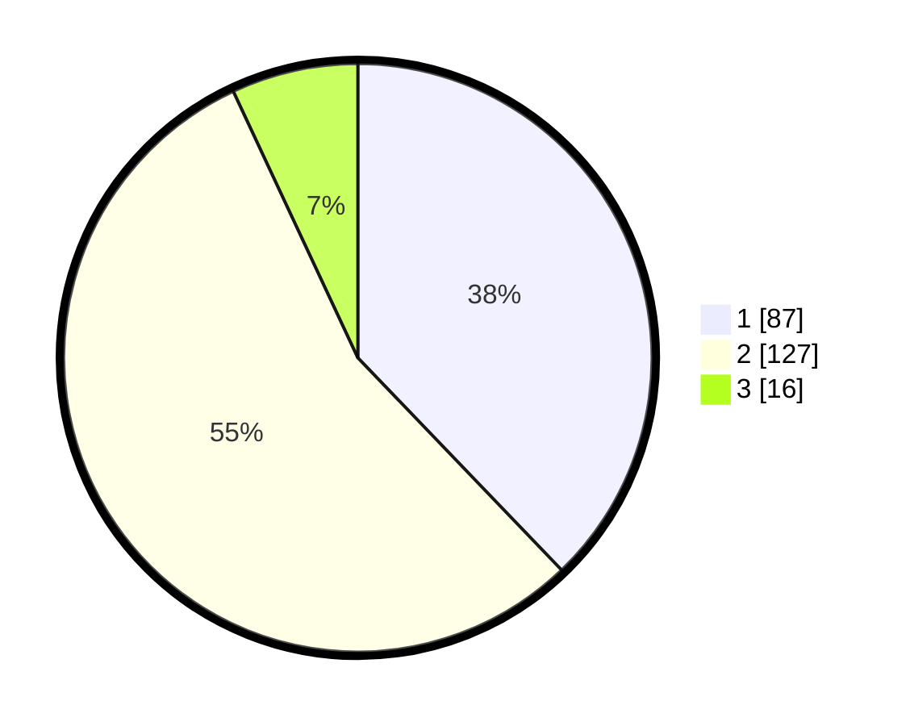

# Hasil

## Grafik

## Tabel

| No.    | Nama Paslon    | Suara | Suara (raw) | Persentase |
|:------ |:-------------- | -----:| -----------:| ----------:|
| 100025 | ANIES MUHAIMIN | 87    | [87][p-1]   | 37,83      |
| 100026 | PRABOWO GIBRAN | 127   | [127][p-2]  | 55,22      |
| 100027 | GANJAR MAHFUD  | 16    | [16][p-3]   | 6,96       |

[p-1]: https://github.com/gigit-pemilu/pemilu-2024/blob/main/pilpres/hitung-suara/sub/31-dki-jakarta/sub/75-jakarta-timur/sub/03-jatinegara/sub/1008-cipinang-besar-utara/sub/077-tps/sub/paslon-1.txt
[p-2]: https://github.com/gigit-pemilu/pemilu-2024/blob/main/pilpres/hitung-suara/sub/31-dki-jakarta/sub/75-jakarta-timur/sub/03-jatinegara/sub/1008-cipinang-besar-utara/sub/077-tps/sub/paslon-2.txt
[p-3]: https://github.com/gigit-pemilu/pemilu-2024/blob/main/pilpres/hitung-suara/sub/31-dki-jakarta/sub/75-jakarta-timur/sub/03-jatinegara/sub/1008-cipinang-besar-utara/sub/077-tps/sub/paslon-3.txt

## Foto C Plano

https://sirekap-obj-formc.kpu.go.id/534e/pemilu/ppwp/31/75/03/10/08/3175031008077-20240214-195523--399d6788-1fac-48a7-9660-2e0fc76b047b.jpg

https://sirekap-obj-formc.kpu.go.id/534e/pemilu/ppwp/31/75/03/10/08/3175031008077-20240214-230150--afd59e0b-2c17-4bb9-9e69-9f35d9661180.jpg

https://sirekap-obj-formc.kpu.go.id/534e/pemilu/ppwp/31/75/03/10/08/3175031008077-20240214-195802--1d6288f7-2328-43f2-b38f-af68297d920c.jpg

## Metadata

| Key        | Value               |
| ---------- | ------------------- |
| Time Stamp | 2024-02-16 00:00:26 |

