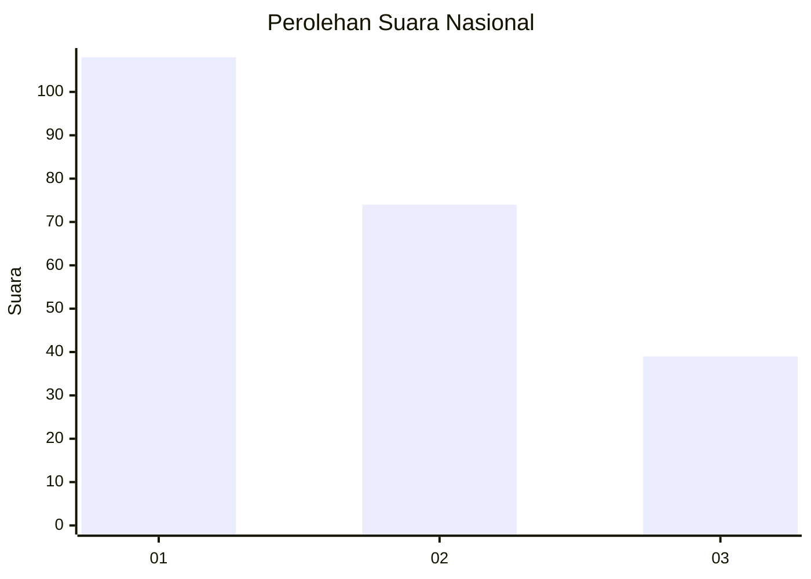
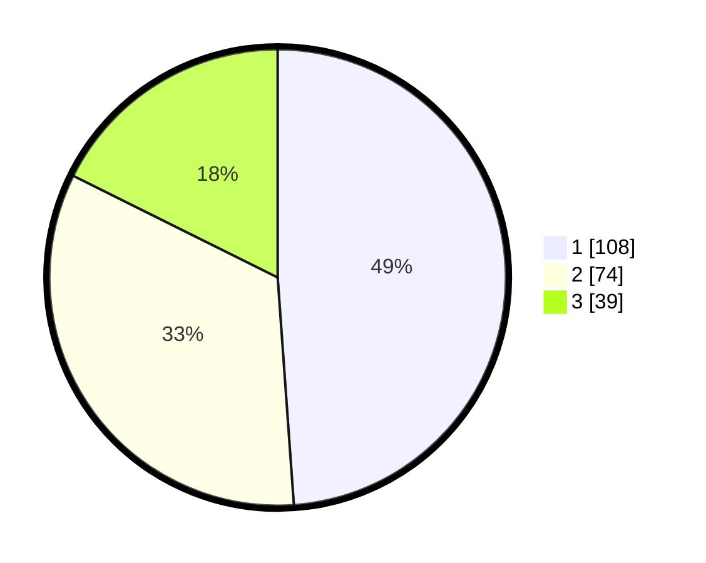

# Hasil

## Grafik

## Tabel

| No.    | Nama Paslon    | Suara | Suara (raw) | Persentase |
|:------ |:-------------- | -----:| -----------:| ----------:|
| 100025 | ANIES MUHAIMIN | 108   | [108][p-1]  | 48,87      |
| 100026 | PRABOWO GIBRAN | 74    | [74][p-2]   | 33,48      |
| 100027 | GANJAR MAHFUD  | 39    | [39][p-3]   | 17,65      |

[p-1]: https://github.com/gigit-pemilu/pemilu-2024/blob/main/pilpres/hitung-suara/sub/31-dki-jakarta/sub/75-jakarta-timur/sub/03-jatinegara/sub/1008-cipinang-besar-utara/sub/097-tps/sub/paslon-1.txt
[p-2]: https://github.com/gigit-pemilu/pemilu-2024/blob/main/pilpres/hitung-suara/sub/31-dki-jakarta/sub/75-jakarta-timur/sub/03-jatinegara/sub/1008-cipinang-besar-utara/sub/097-tps/sub/paslon-2.txt
[p-3]: https://github.com/gigit-pemilu/pemilu-2024/blob/main/pilpres/hitung-suara/sub/31-dki-jakarta/sub/75-jakarta-timur/sub/03-jatinegara/sub/1008-cipinang-besar-utara/sub/097-tps/sub/paslon-3.txt

## Foto C Plano

https://sirekap-obj-formc.kpu.go.id/1812/pemilu/ppwp/31/75/03/10/08/3175031008097-20240214-221611--3a8440c9-9abb-4770-9dae-00559284ec8d.jpg

https://sirekap-obj-formc.kpu.go.id/1812/pemilu/ppwp/31/75/03/10/08/3175031008097-20240214-221704--6a2c299c-479e-442c-a6d9-4317c2887564.jpg

https://sirekap-obj-formc.kpu.go.id/1812/pemilu/ppwp/31/75/03/10/08/3175031008097-20240214-221734--e010eaf3-31fb-437a-a793-b328a2591e36.jpg

## Metadata

| Key        | Value               |
| ---------- | ------------------- |
| Time Stamp | 2024-02-24 22:31:28 |

