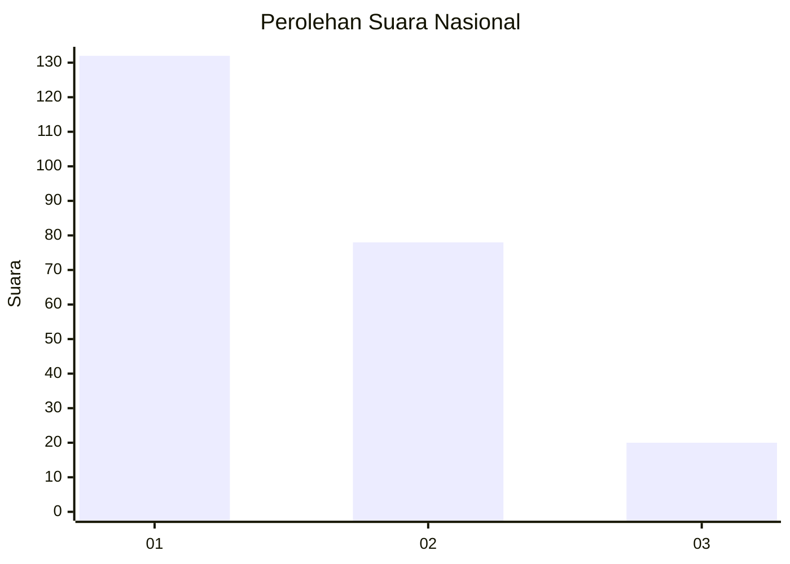
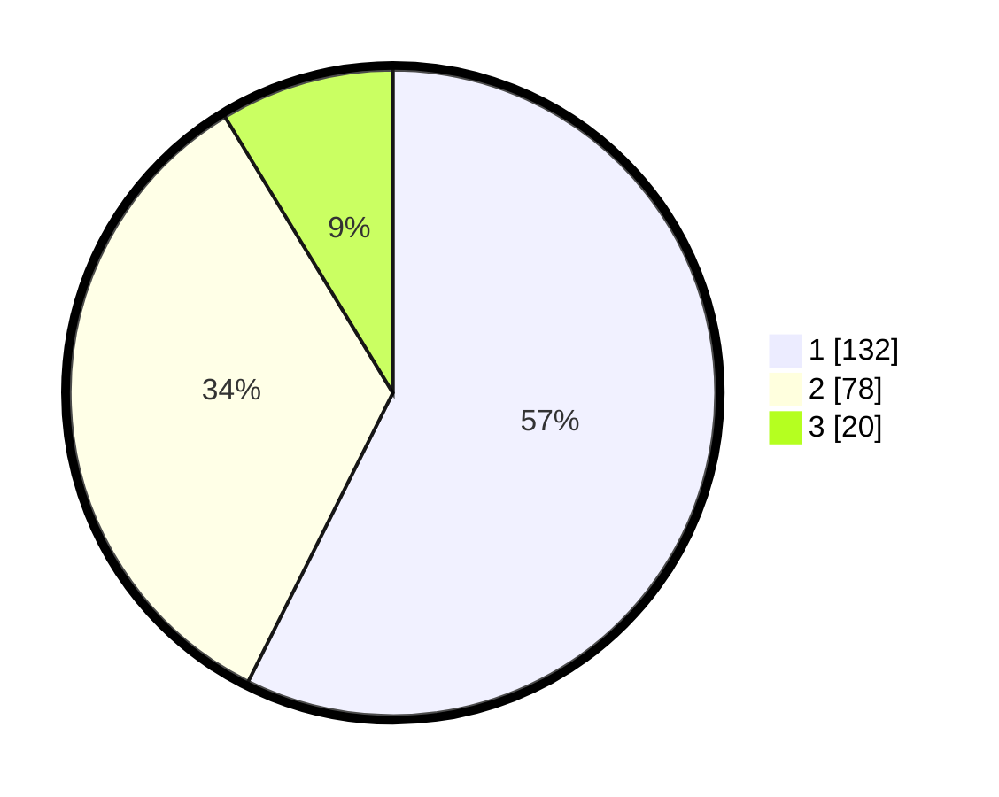

# Hasil

## Grafik

## Tabel

| No.    | Nama Paslon    | Suara | Suara (raw) | Persentase |
|:------ |:-------------- | -----:| -----------:| ----------:|
| 100025 | ANIES MUHAIMIN | 132   | [132][p-1]  | 57,39      |
| 100026 | PRABOWO GIBRAN | 78    | [78][p-2]   | 33,91      |
| 100027 | GANJAR MAHFUD  | 20    | [20][p-3]   | 8,70       |

[p-1]: https://github.com/gigit-pemilu/pemilu-2024/blob/main/pilpres/hitung-suara/sub/31-dki-jakarta/sub/75-jakarta-timur/sub/03-jatinegara/sub/1008-cipinang-besar-utara/sub/106-tps/sub/paslon-1.txt
[p-2]: https://github.com/gigit-pemilu/pemilu-2024/blob/main/pilpres/hitung-suara/sub/31-dki-jakarta/sub/75-jakarta-timur/sub/03-jatinegara/sub/1008-cipinang-besar-utara/sub/106-tps/sub/paslon-2.txt
[p-3]: https://github.com/gigit-pemilu/pemilu-2024/blob/main/pilpres/hitung-suara/sub/31-dki-jakarta/sub/75-jakarta-timur/sub/03-jatinegara/sub/1008-cipinang-besar-utara/sub/106-tps/sub/paslon-3.txt

## Foto C Plano

https://sirekap-obj-formc.kpu.go.id/44d1/pemilu/ppwp/31/75/03/10/08/3175031008106-20240215-012041--ac1af494-28f5-490a-aa89-0c548d51efa9.jpg

https://sirekap-obj-formc.kpu.go.id/44d1/pemilu/ppwp/31/75/03/10/08/3175031008106-20240215-012047--4ca4ee76-02f0-47cb-919b-94ecea24049b.jpg

https://sirekap-obj-formc.kpu.go.id/44d1/pemilu/ppwp/31/75/03/10/08/3175031008106-20240215-012050--7de68a66-9236-44b5-9661-95c4ce02fca7.jpg

## Metadata

| Key        | Value               |
| ---------- | ------------------- |
| Time Stamp | 2024-02-24 22:31:28 |

