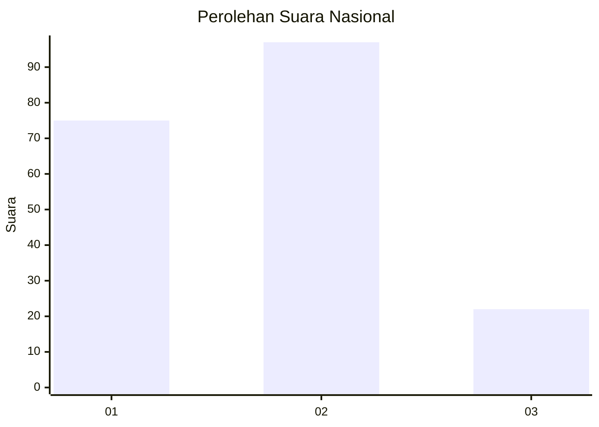
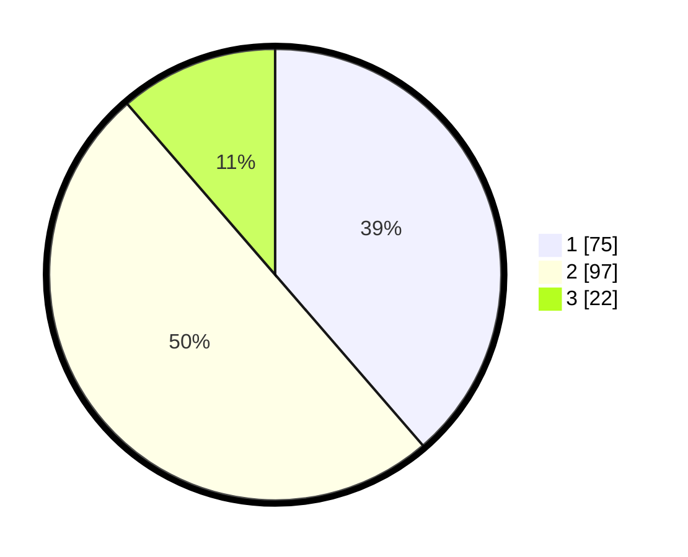

# Hasil

## Grafik

## Tabel

| No.    | Nama Paslon    | Suara | Suara (raw) | Persentase |
|:------ |:-------------- | -----:| -----------:| ----------:|
| 100025 | ANIES MUHAIMIN | 75    | [75][p-1]   | 38,66      |
| 100026 | PRABOWO GIBRAN | 97    | [97][p-2]   | 50,00      |
| 100027 | GANJAR MAHFUD  | 22    | [22][p-3]   | 11,34      |

[p-1]: https://github.com/gigit-pemilu/pemilu-2024/blob/main/pilpres/hitung-suara/sub/31-dki-jakarta/sub/75-jakarta-timur/sub/03-jatinegara/sub/1008-cipinang-besar-utara/sub/113-tps/sub/paslon-1.txt
[p-2]: https://github.com/gigit-pemilu/pemilu-2024/blob/main/pilpres/hitung-suara/sub/31-dki-jakarta/sub/75-jakarta-timur/sub/03-jatinegara/sub/1008-cipinang-besar-utara/sub/113-tps/sub/paslon-2.txt
[p-3]: https://github.com/gigit-pemilu/pemilu-2024/blob/main/pilpres/hitung-suara/sub/31-dki-jakarta/sub/75-jakarta-timur/sub/03-jatinegara/sub/1008-cipinang-besar-utara/sub/113-tps/sub/paslon-3.txt

## Foto C Plano

https://sirekap-obj-formc.kpu.go.id/b0fd/pemilu/ppwp/31/75/03/10/08/3175031008113-20240214-220202--92175144-c880-408b-87e0-1521e9a69e82.jpg

https://sirekap-obj-formc.kpu.go.id/b0fd/pemilu/ppwp/31/75/03/10/08/3175031008113-20240214-220351--260f4a8d-2874-4ed0-a652-f02abce57501.jpg

https://sirekap-obj-formc.kpu.go.id/b0fd/pemilu/ppwp/31/75/03/10/08/3175031008113-20240214-220438--65512368-6de5-46e3-b593-2579a795c773.jpg

## Metadata

| Key        | Value               |
| ---------- | ------------------- |
| Time Stamp | 2024-02-20 10:00:00 |

