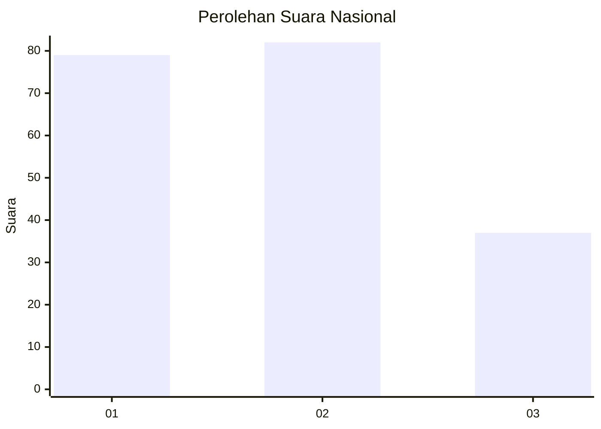
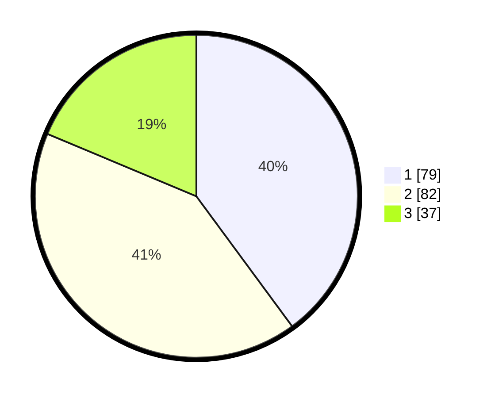

# Hasil

## Grafik

## Tabel

| No.    | Nama Paslon    | Suara | Suara (raw) | Persentase |
|:------ |:-------------- | -----:| -----------:| ----------:|
| 100025 | ANIES MUHAIMIN | 79    | [79][p-1]   | 39,90      |
| 100026 | PRABOWO GIBRAN | 82    | [82][p-2]   | 41,41      |
| 100027 | GANJAR MAHFUD  | 37    | [37][p-3]   | 18,69      |

[p-1]: https://github.com/gigit-pemilu/pemilu-2024/blob/main/pilpres/hitung-suara/sub/31-dki-jakarta/sub/75-jakarta-timur/sub/03-jatinegara/sub/1008-cipinang-besar-utara/sub/122-tps/sub/paslon-1.txt
[p-2]: https://github.com/gigit-pemilu/pemilu-2024/blob/main/pilpres/hitung-suara/sub/31-dki-jakarta/sub/75-jakarta-timur/sub/03-jatinegara/sub/1008-cipinang-besar-utara/sub/122-tps/sub/paslon-2.txt
[p-3]: https://github.com/gigit-pemilu/pemilu-2024/blob/main/pilpres/hitung-suara/sub/31-dki-jakarta/sub/75-jakarta-timur/sub/03-jatinegara/sub/1008-cipinang-besar-utara/sub/122-tps/sub/paslon-3.txt

## Foto C Plano

https://sirekap-obj-formc.kpu.go.id/927d/pemilu/ppwp/31/75/03/10/08/3175031008122-20240214-230429--f093f871-c4ba-4f67-a1a0-a40178ad9f5d.jpg

https://sirekap-obj-formc.kpu.go.id/927d/pemilu/ppwp/31/75/03/10/08/3175031008122-20240214-234821--5b22076b-619f-42f4-856e-36ea843a3d70.jpg

https://sirekap-obj-formc.kpu.go.id/927d/pemilu/ppwp/31/75/03/10/08/3175031008122-20240214-234843--c1d3d36e-1afb-4190-82ed-2c3726ed776d.jpg

## Metadata

| Key        | Value               |
| ---------- | ------------------- |
| Time Stamp | 2024-02-16 00:00:26 |

