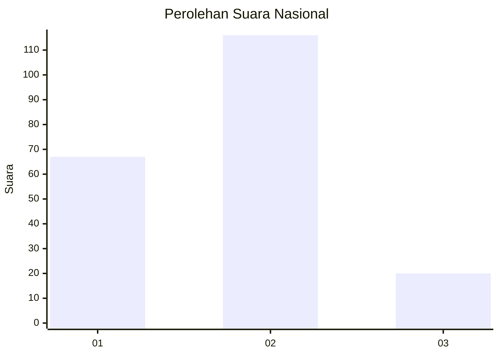
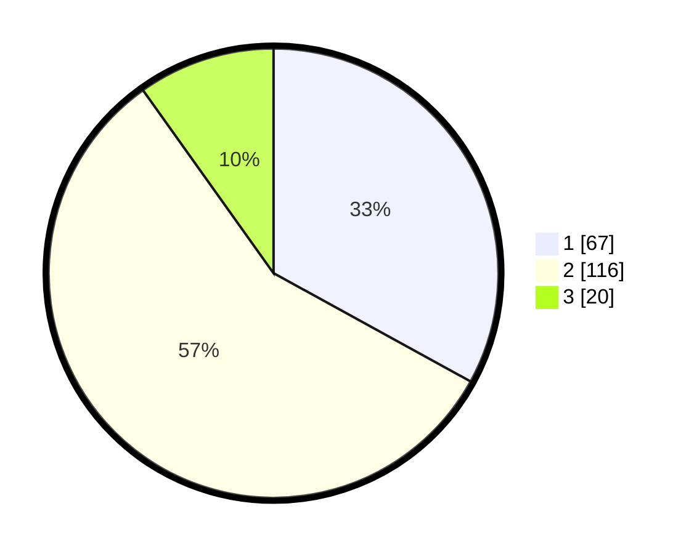

# Hasil

## Grafik

## Tabel

| No.    | Nama Paslon    | Suara | Suara (raw) | Persentase |
|:------ |:-------------- | -----:| -----------:| ----------:|
| 100025 | ANIES MUHAIMIN | 67    | [67][p-1]   | 33,00      |
| 100026 | PRABOWO GIBRAN | 116   | [116][p-2]  | 57,14      |
| 100027 | GANJAR MAHFUD  | 20    | [20][p-3]   | 9,85       |

[p-1]: https://github.com/gigit-pemilu/pemilu-2024/blob/main/pilpres/hitung-suara/sub/31-dki-jakarta/sub/75-jakarta-timur/sub/03-jatinegara/sub/1008-cipinang-besar-utara/sub/153-tps/sub/paslon-1.txt
[p-2]: https://github.com/gigit-pemilu/pemilu-2024/blob/main/pilpres/hitung-suara/sub/31-dki-jakarta/sub/75-jakarta-timur/sub/03-jatinegara/sub/1008-cipinang-besar-utara/sub/153-tps/sub/paslon-2.txt
[p-3]: https://github.com/gigit-pemilu/pemilu-2024/blob/main/pilpres/hitung-suara/sub/31-dki-jakarta/sub/75-jakarta-timur/sub/03-jatinegara/sub/1008-cipinang-besar-utara/sub/153-tps/sub/paslon-3.txt

## Foto C Plano

https://sirekap-obj-formc.kpu.go.id/3c57/pemilu/ppwp/31/75/03/10/08/3175031008153-20240214-223031--59407029-0932-4783-8667-1a7c497c6998.jpg

https://sirekap-obj-formc.kpu.go.id/3c57/pemilu/ppwp/31/75/03/10/08/3175031008153-20240214-223117--468f2908-0d4e-4fc8-82be-553a8fdc9a4b.jpg

https://sirekap-obj-formc.kpu.go.id/3c57/pemilu/ppwp/31/75/03/10/08/3175031008153-20240214-223157--3d8da4ab-cc3f-48a9-842d-6811ad04e2b9.jpg

## Metadata

| Key        | Value               |
| ---------- | ------------------- |
| Time Stamp | 2024-02-24 22:31:28 |

