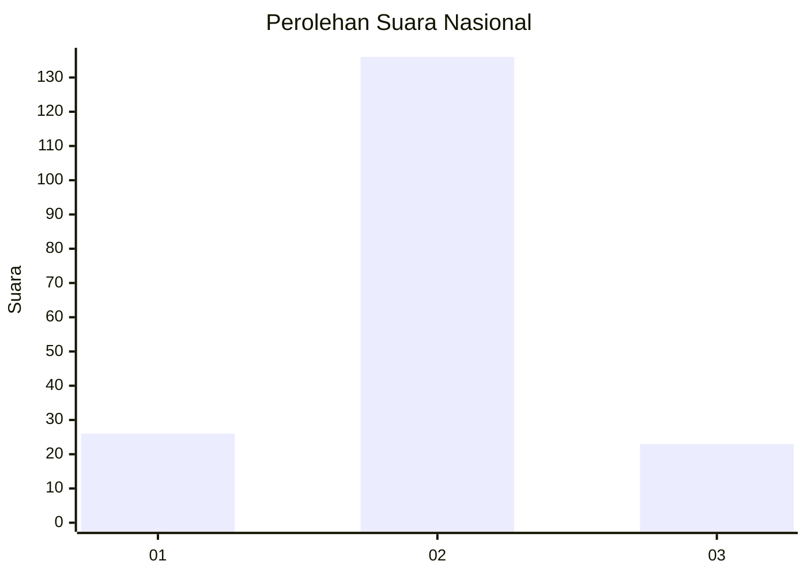
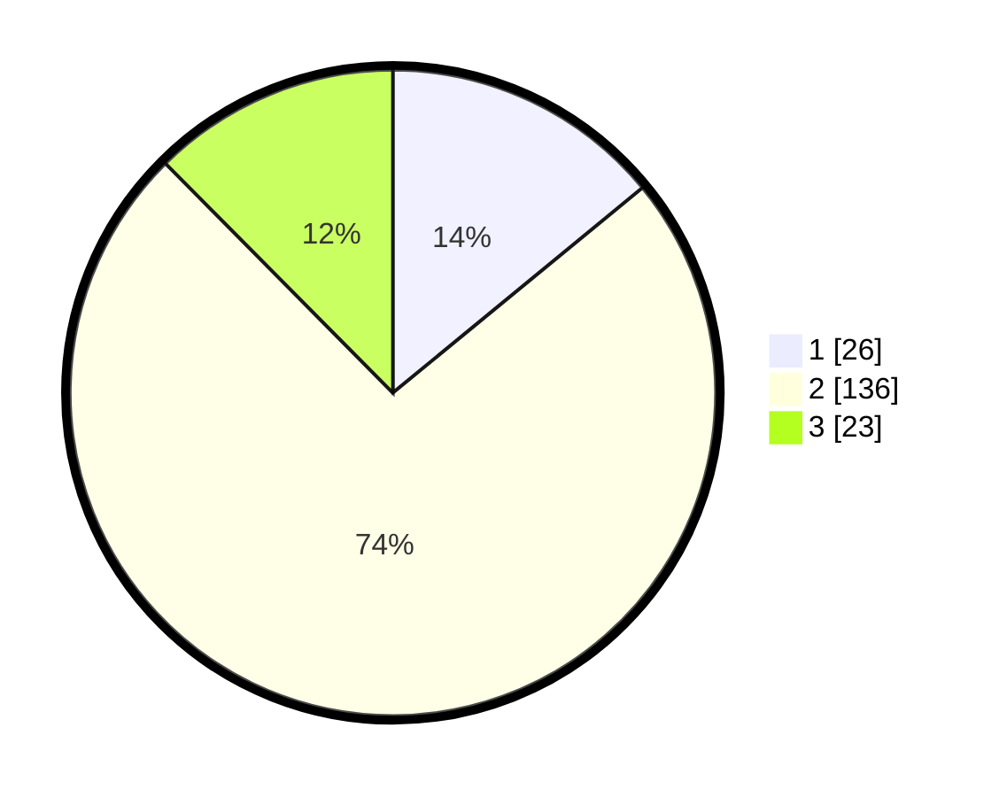

# Hasil

## Grafik

## Tabel

| No.    | Nama Paslon    | Suara | Suara (raw) | Persentase |
|:------ |:-------------- | -----:| -----------:| ----------:|
| 100025 | ANIES MUHAIMIN | 26    | [26][p-1]   | 14,05      |
| 100026 | PRABOWO GIBRAN | 136   | [136][p-2]  | 73,51      |
| 100027 | GANJAR MAHFUD  | 23    | [23][p-3]   | 12,43      |

[p-1]: https://github.com/gigit-pemilu/pemilu-2024/blob/main/pilpres/hitung-suara/sub/31-dki-jakarta/sub/75-jakarta-timur/sub/03-jatinegara/sub/1008-cipinang-besar-utara/sub/922-tps/sub/paslon-1.txt
[p-2]: https://github.com/gigit-pemilu/pemilu-2024/blob/main/pilpres/hitung-suara/sub/31-dki-jakarta/sub/75-jakarta-timur/sub/03-jatinegara/sub/1008-cipinang-besar-utara/sub/922-tps/sub/paslon-2.txt
[p-3]: https://github.com/gigit-pemilu/pemilu-2024/blob/main/pilpres/hitung-suara/sub/31-dki-jakarta/sub/75-jakarta-timur/sub/03-jatinegara/sub/1008-cipinang-besar-utara/sub/922-tps/sub/paslon-3.txt

## Foto C Plano

https://sirekap-obj-formc.kpu.go.id/faac/pemilu/ppwp/31/75/03/10/08/3175031008922-20240214-202234--669fb018-65cc-4a24-b025-a22629806e23.jpg

https://sirekap-obj-formc.kpu.go.id/faac/pemilu/ppwp/31/75/03/10/08/3175031008922-20240214-202248--bfbc940e-9194-477a-927c-70640be5ca07.jpg

https://sirekap-obj-formc.kpu.go.id/faac/pemilu/ppwp/31/75/03/10/08/3175031008922-20240214-202252--9e239beb-0ba4-4bf9-b01d-cdcc0949caee.jpg

## Metadata

| Key        | Value               |
| ---------- | ------------------- |
| Time Stamp | 2024-02-24 22:31:28 |

