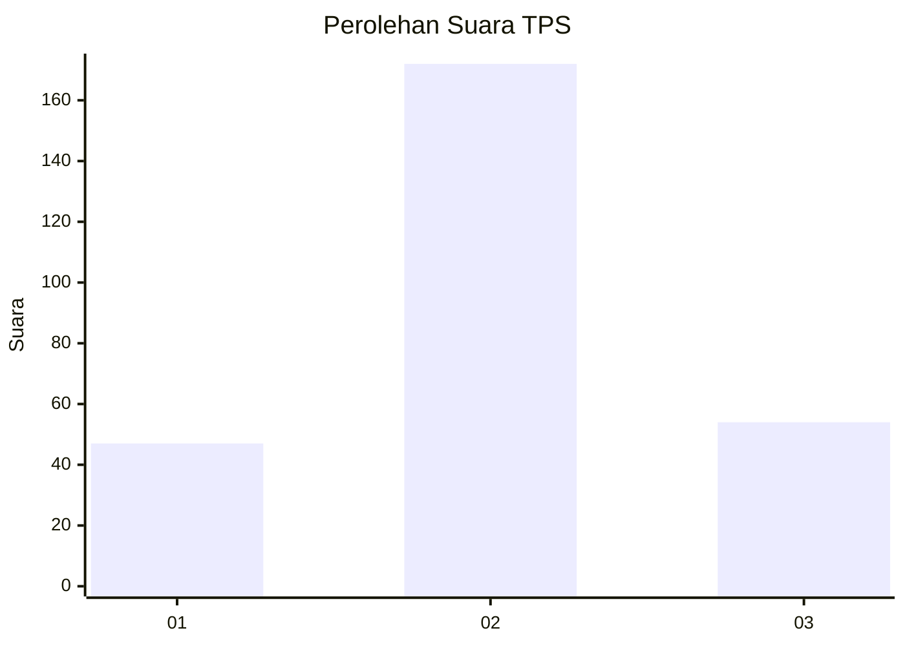
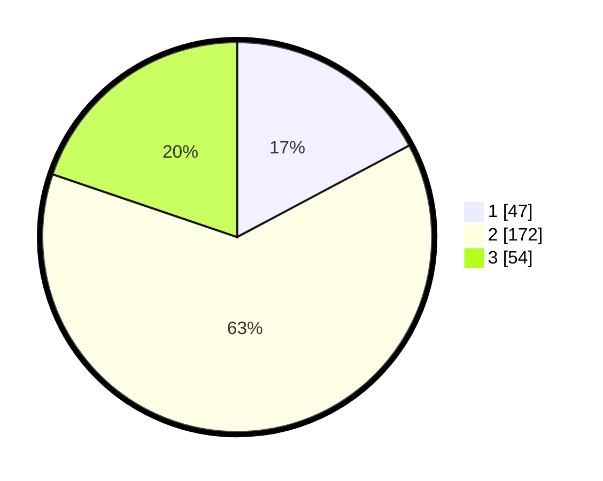

# Hasil

## Grafik

## Tabel

| No. | Nama Paslon    | Suara | Suara (raw) | Persentase |
|:--- |:-------------- | -----:| -----------:| ----------:|
| 1   | ANIES MUHAIMIN | 47    | [47][p-1]   | 17,22      |
| 2   | PRABOWO GIBRAN | 172   | [172][p-2]  | 63,00      |
| 3   | GANJAR MAHFUD  | 54    | [54][p-3]   | 19,78      |

[p-1]: https://github.com/gigit-pemilu/pemilu-2024-31-dki-jakarta/blob/main/pilpres/hitung-suara/sub/31-dki-jakarta/sub/75-jakarta-timur/sub/03-jatinegara/sub/1008-cipinang-besar-utara/sub/930-tps/sub/paslon-1.txt
[p-2]: https://github.com/gigit-pemilu/pemilu-2024-31-dki-jakarta/blob/main/pilpres/hitung-suara/sub/31-dki-jakarta/sub/75-jakarta-timur/sub/03-jatinegara/sub/1008-cipinang-besar-utara/sub/930-tps/sub/paslon-2.txt
[p-3]: https://github.com/gigit-pemilu/pemilu-2024-31-dki-jakarta/blob/main/pilpres/hitung-suara/sub/31-dki-jakarta/sub/75-jakarta-timur/sub/03-jatinegara/sub/1008-cipinang-besar-utara/sub/930-tps/sub/paslon-3.txt

## Foto C Plano

https://sirekap-obj-formc.kpu.go.id/17a9/pemilu/ppwp/31/75/03/10/08/3175031008930-20240214-220349--5c147e22-fb91-4451-b916-038c52aaeb53.jpg

https://sirekap-obj-formc.kpu.go.id/17a9/pemilu/ppwp/31/75/03/10/08/3175031008930-20240214-193416--e535b05a-b893-44f8-9eb5-b26128f1b9f8.jpg

https://sirekap-obj-formc.kpu.go.id/17a9/pemilu/ppwp/31/75/03/10/08/3175031008930-20240214-193522--50dde53a-3c80-4982-a8af-4f37abb0712d.jpg

## Metadata

| Key        | Value               |
| ---------- | ------------------- |
| Time Stamp | 2024-02-24 22:31:28 |

