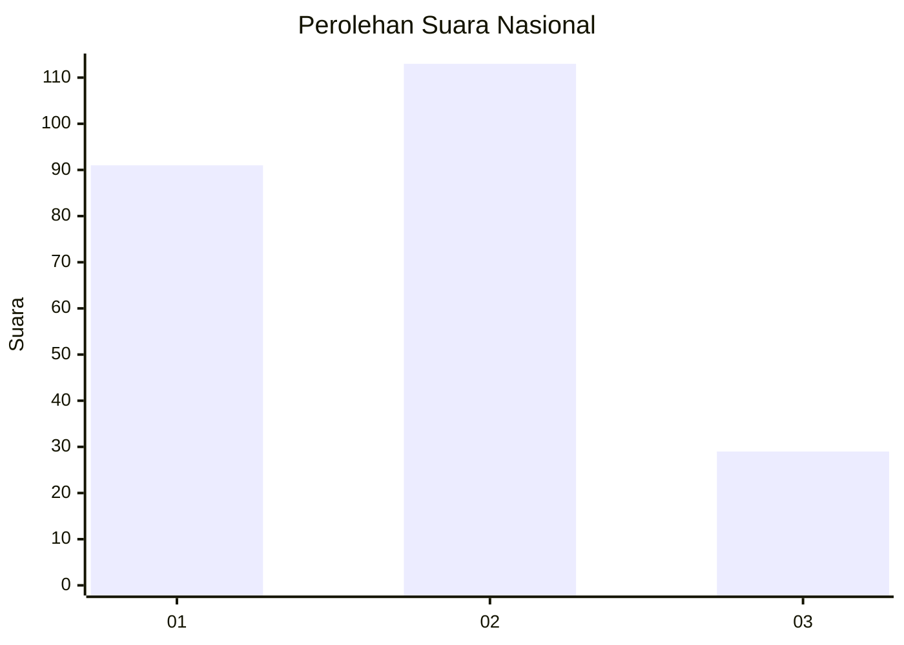
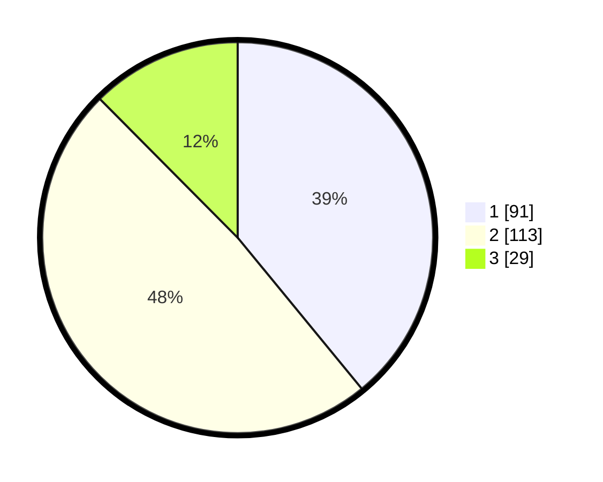

# Hasil

## Grafik

## Tabel

| No.    | Nama Paslon    | Suara | Suara (raw) | Persentase |
|:------ |:-------------- | -----:| -----------:| ----------:|
| 100025 | ANIES MUHAIMIN | 91    | [91][p-1]   | 39,06      |
| 100026 | PRABOWO GIBRAN | 113   | [113][p-2]  | 48,50      |
| 100027 | GANJAR MAHFUD  | 29    | [29][p-3]   | 12,45      |

[p-1]: https://github.com/gigit-pemilu/pemilu-2024/blob/main/pilpres/hitung-suara/sub/31-dki-jakarta/sub/75-jakarta-timur/sub/04-kramatjati/sub/1001-kramatjati/sub/021-tps/sub/paslon-1.txt
[p-2]: https://github.com/gigit-pemilu/pemilu-2024/blob/main/pilpres/hitung-suara/sub/31-dki-jakarta/sub/75-jakarta-timur/sub/04-kramatjati/sub/1001-kramatjati/sub/021-tps/sub/paslon-2.txt
[p-3]: https://github.com/gigit-pemilu/pemilu-2024/blob/main/pilpres/hitung-suara/sub/31-dki-jakarta/sub/75-jakarta-timur/sub/04-kramatjati/sub/1001-kramatjati/sub/021-tps/sub/paslon-3.txt

## Foto C Plano

https://sirekap-obj-formc.kpu.go.id/0fcb/pemilu/ppwp/31/75/04/10/01/3175041001021-20240214-200945--45e26cab-b4e4-47b9-b279-3c6f1a71975d.jpg

https://sirekap-obj-formc.kpu.go.id/0fcb/pemilu/ppwp/31/75/04/10/01/3175041001021-20240214-203310--ac72c178-b6c0-4d40-bdc7-245be067fa46.jpg

https://sirekap-obj-formc.kpu.go.id/0fcb/pemilu/ppwp/31/75/04/10/01/3175041001021-20240214-203448--56045894-ab9f-4143-bbd2-343e5bc20c59.jpg

## Metadata

| Key        | Value               |
| ---------- | ------------------- |
| Time Stamp | 2024-02-15 12:00:28 |

