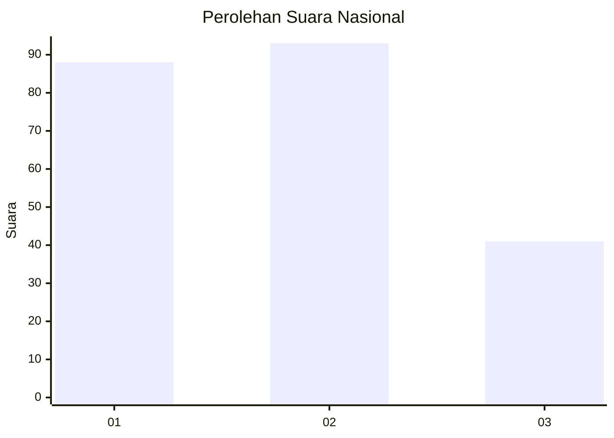
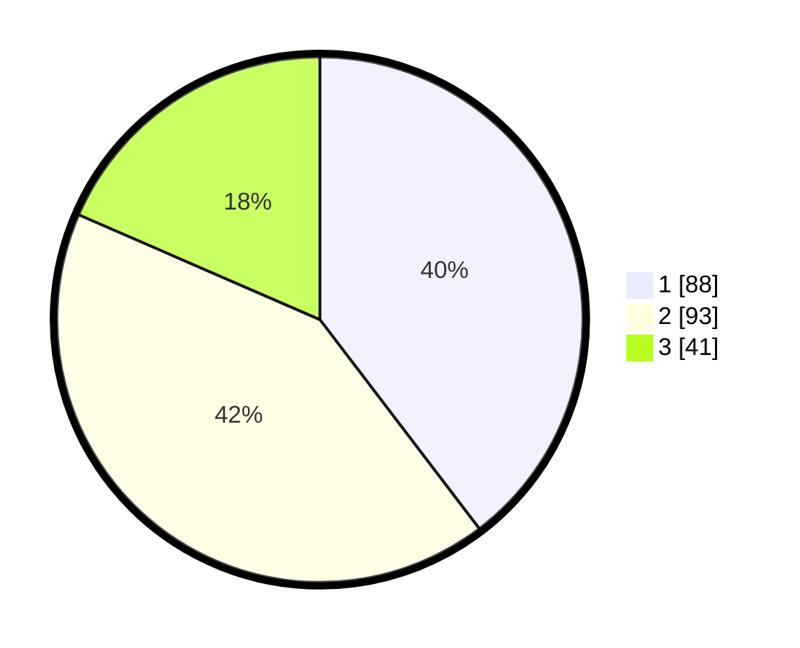

# Hasil

## Grafik

## Tabel

| No.    | Nama Paslon    | Suara | Suara (raw) | Persentase |
|:------ |:-------------- | -----:| -----------:| ----------:|
| 100025 | ANIES MUHAIMIN | 88    | [88][p-1]   | 39,64      |
| 100026 | PRABOWO GIBRAN | 93    | [93][p-2]   | 41,89      |
| 100027 | GANJAR MAHFUD  | 41    | [41][p-3]   | 18,47      |

[p-1]: https://github.com/gigit-pemilu/pemilu-2024/blob/main/pilpres/hitung-suara/sub/31-dki-jakarta/sub/75-jakarta-timur/sub/04-kramatjati/sub/1001-kramatjati/sub/029-tps/sub/paslon-1.txt
[p-2]: https://github.com/gigit-pemilu/pemilu-2024/blob/main/pilpres/hitung-suara/sub/31-dki-jakarta/sub/75-jakarta-timur/sub/04-kramatjati/sub/1001-kramatjati/sub/029-tps/sub/paslon-2.txt
[p-3]: https://github.com/gigit-pemilu/pemilu-2024/blob/main/pilpres/hitung-suara/sub/31-dki-jakarta/sub/75-jakarta-timur/sub/04-kramatjati/sub/1001-kramatjati/sub/029-tps/sub/paslon-3.txt

## Foto C Plano

https://sirekap-obj-formc.kpu.go.id/79e6/pemilu/ppwp/31/75/04/10/01/3175041001029-20240214-190918--90af2e21-7187-4e83-b22d-fba69405a960.jpg

https://sirekap-obj-formc.kpu.go.id/79e6/pemilu/ppwp/31/75/04/10/01/3175041001029-20240214-231616--c503e9d1-3bc2-493a-9fcb-287f350b0b23.jpg

https://sirekap-obj-formc.kpu.go.id/79e6/pemilu/ppwp/31/75/04/10/01/3175041001029-20240214-190947--465a1a36-fc96-4996-9b23-31981cc0e6bc.jpg

## Metadata

| Key        | Value               |
| ---------- | ------------------- |
| Time Stamp | 2024-02-16 00:30:27 |

## DATA PEMILIH TETAP

Jumlah pemilih dalam DPT: **230**.
 * L: **132**.
 * P: **148**.

## DATA PENGGUNA HAK PILIH

Jumlah pengguna hak pilih dalam DPT: **223**.
 * L: **703**.
 * P: **120**.

Jumlah pengguna hak pilih dalam DPTb: **0**.
 * L: **800**.
 * P: **880**.

Jumlah pengguna hak pilih dalam DPK: **800**.
 * L: **0**.
 * P: **8**.

Jumlah pengguna hak pilih: **223**.
 * L: **103**.
 * P: **720**.

## JUMLAH SUARA SAH DAN TIDAK SAH

JUMLAH SELURUH SUARA SAH: **221**.

JUMLAH SUARA TIDAK SAH: **2**.

JUMLAH SELURUH SUARA SAH DAN SUARA TIDAK SAH: **223**.

