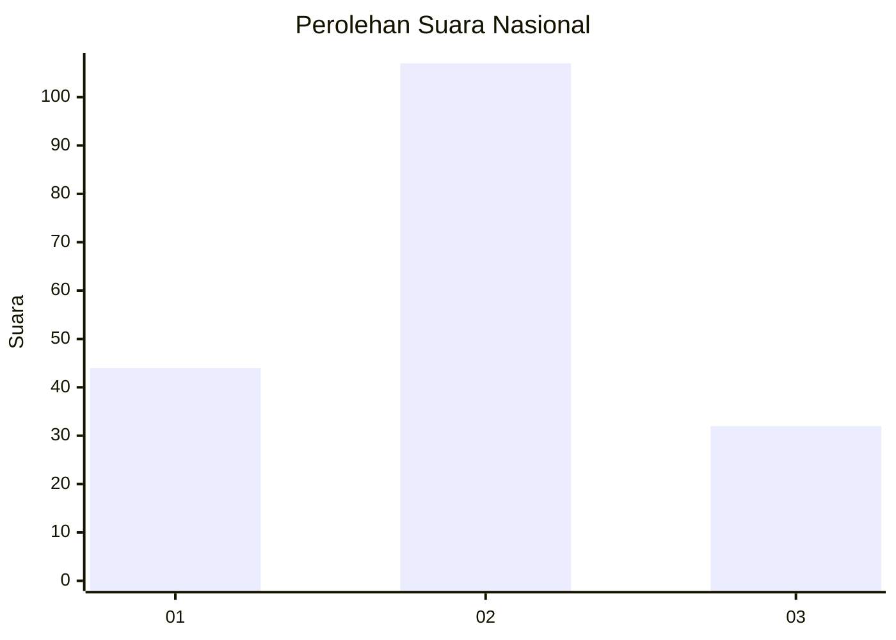
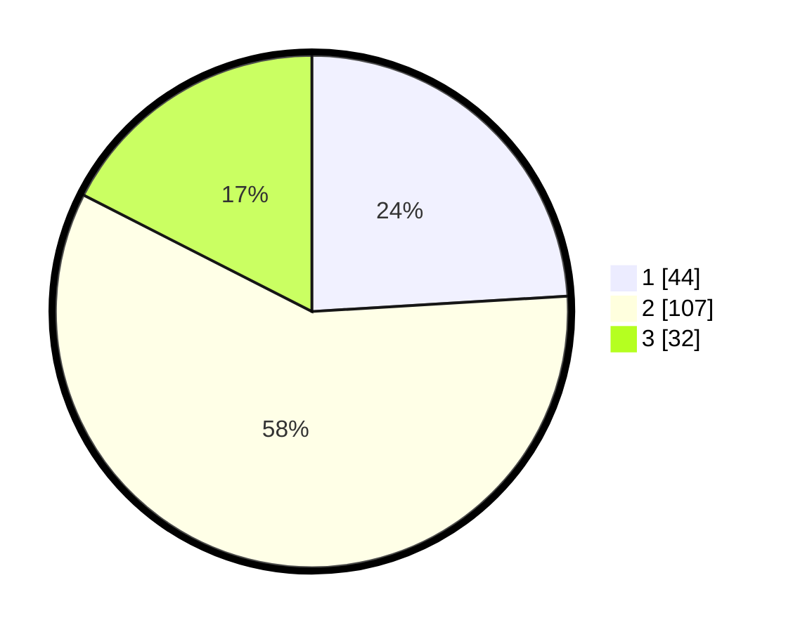

# Hasil

## Grafik

## Tabel

| No.    | Nama Paslon    | Suara | Suara (raw) | Persentase |
|:------ |:-------------- | -----:| -----------:| ----------:|
| 100025 | ANIES MUHAIMIN | 44    | [44][p-1]   | 24,04      |
| 100026 | PRABOWO GIBRAN | 107   | [107][p-2]  | 58,47      |
| 100027 | GANJAR MAHFUD  | 32    | [32][p-3]   | 17,49      |

[p-1]: https://github.com/gigit-pemilu/pemilu-2024/blob/main/pilpres/hitung-suara/sub/31-dki-jakarta/sub/75-jakarta-timur/sub/04-kramatjati/sub/1001-kramatjati/sub/035-tps/sub/paslon-1.txt
[p-2]: https://github.com/gigit-pemilu/pemilu-2024/blob/main/pilpres/hitung-suara/sub/31-dki-jakarta/sub/75-jakarta-timur/sub/04-kramatjati/sub/1001-kramatjati/sub/035-tps/sub/paslon-2.txt
[p-3]: https://github.com/gigit-pemilu/pemilu-2024/blob/main/pilpres/hitung-suara/sub/31-dki-jakarta/sub/75-jakarta-timur/sub/04-kramatjati/sub/1001-kramatjati/sub/035-tps/sub/paslon-3.txt

## Foto C Plano

https://sirekap-obj-formc.kpu.go.id/9926/pemilu/ppwp/31/75/04/10/01/3175041001035-20240214-185237--f8975b20-94b2-4cf4-9631-2b82958e9d74.jpg

https://sirekap-obj-formc.kpu.go.id/9926/pemilu/ppwp/31/75/04/10/01/3175041001035-20240217-170800--ae6ed4a8-d22b-43f1-a66d-2c8c38bfcd74.jpg

https://sirekap-obj-formc.kpu.go.id/9926/pemilu/ppwp/31/75/04/10/01/3175041001035-20240217-170905--c3be79b7-0d5a-45f9-8601-da5c41d0be3c.jpg

## Metadata

| Key        | Value               |
| ---------- | ------------------- |
| Time Stamp | 2024-02-19 11:00:00 |

