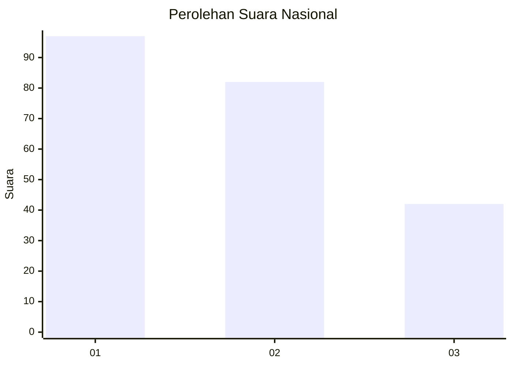
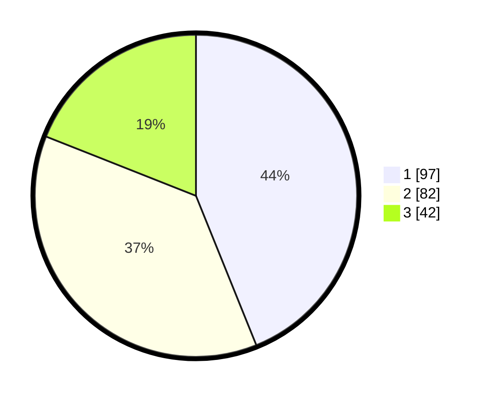

# Hasil

## Grafik

## Tabel

| No.    | Nama Paslon    | Suara | Suara (raw) | Persentase |
|:------ |:-------------- | -----:| -----------:| ----------:|
| 100025 | ANIES MUHAIMIN | 97    | [97][p-1]   | 43,89      |
| 100026 | PRABOWO GIBRAN | 82    | [82][p-2]   | 37,10      |
| 100027 | GANJAR MAHFUD  | 42    | [42][p-3]   | 19,00      |

[p-1]: https://github.com/gigit-pemilu/pemilu-2024/blob/main/pilpres/hitung-suara/sub/31-dki-jakarta/sub/75-jakarta-timur/sub/04-kramatjati/sub/1001-kramatjati/sub/058-tps/sub/paslon-1.txt
[p-2]: https://github.com/gigit-pemilu/pemilu-2024/blob/main/pilpres/hitung-suara/sub/31-dki-jakarta/sub/75-jakarta-timur/sub/04-kramatjati/sub/1001-kramatjati/sub/058-tps/sub/paslon-2.txt
[p-3]: https://github.com/gigit-pemilu/pemilu-2024/blob/main/pilpres/hitung-suara/sub/31-dki-jakarta/sub/75-jakarta-timur/sub/04-kramatjati/sub/1001-kramatjati/sub/058-tps/sub/paslon-3.txt

## Foto C Plano

https://sirekap-obj-formc.kpu.go.id/53d8/pemilu/ppwp/31/75/04/10/01/3175041001058-20240215-030623--433cc47e-81b1-4a06-a9c2-3688470cfe57.jpg

https://sirekap-obj-formc.kpu.go.id/53d8/pemilu/ppwp/31/75/04/10/01/3175041001058-20240214-223059--74bfefb0-c508-4db5-b441-ae89a0968097.jpg

https://sirekap-obj-formc.kpu.go.id/53d8/pemilu/ppwp/31/75/04/10/01/3175041001058-20240215-030815--c3e47826-4c46-4d73-9782-9e684a86f027.jpg

## Metadata

| Key        | Value               |
| ---------- | ------------------- |
| Time Stamp | 2024-02-15 12:00:28 |

