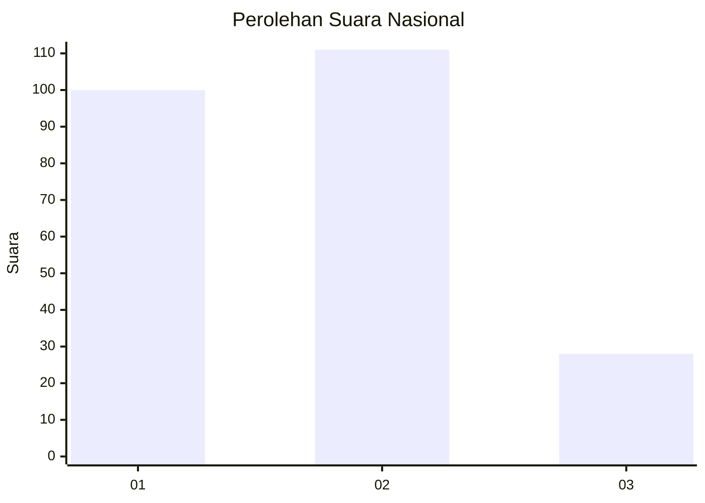
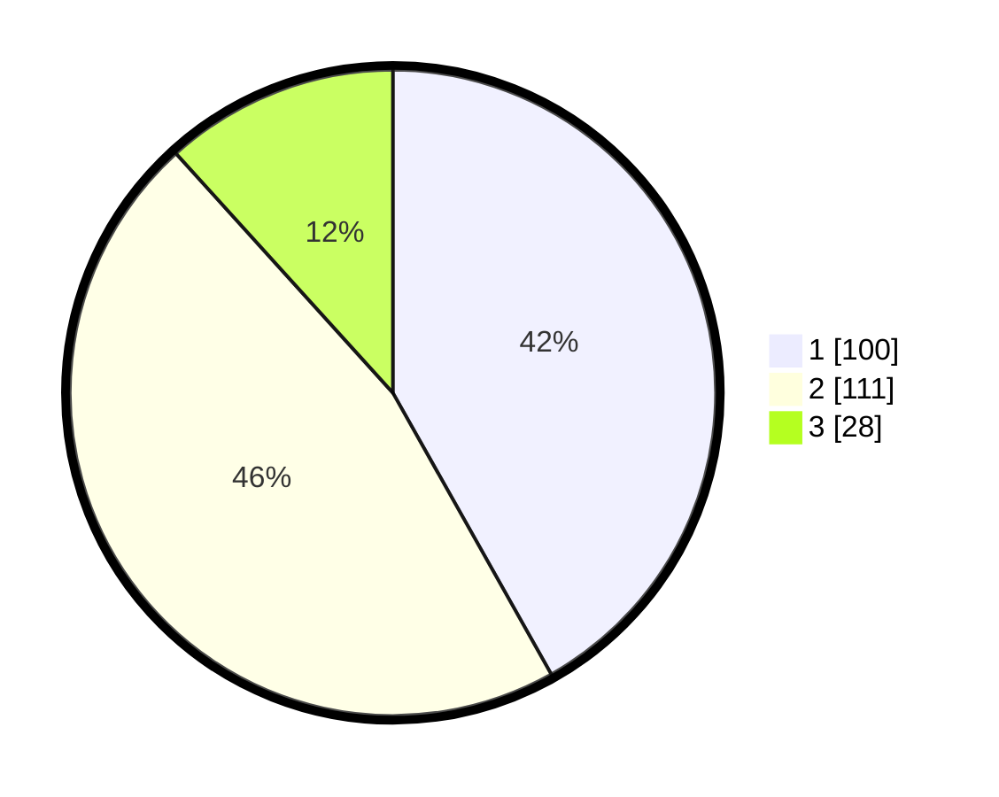

# Hasil

## Grafik

## Tabel

| No.    | Nama Paslon    | Suara | Suara (raw) | Persentase |
|:------ |:-------------- | -----:| -----------:| ----------:|
| 100025 | ANIES MUHAIMIN | 100   | [100][p-1]  | 41,84      |
| 100026 | PRABOWO GIBRAN | 111   | [111][p-2]  | 46,44      |
| 100027 | GANJAR MAHFUD  | 28    | [28][p-3]   | 11,72      |

[p-1]: https://github.com/gigit-pemilu/pemilu-2024/blob/main/pilpres/hitung-suara/sub/31-dki-jakarta/sub/75-jakarta-timur/sub/04-kramatjati/sub/1001-kramatjati/sub/061-tps/sub/paslon-1.txt
[p-2]: https://github.com/gigit-pemilu/pemilu-2024/blob/main/pilpres/hitung-suara/sub/31-dki-jakarta/sub/75-jakarta-timur/sub/04-kramatjati/sub/1001-kramatjati/sub/061-tps/sub/paslon-2.txt
[p-3]: https://github.com/gigit-pemilu/pemilu-2024/blob/main/pilpres/hitung-suara/sub/31-dki-jakarta/sub/75-jakarta-timur/sub/04-kramatjati/sub/1001-kramatjati/sub/061-tps/sub/paslon-3.txt

## Foto C Plano

https://sirekap-obj-formc.kpu.go.id/5089/pemilu/ppwp/31/75/04/10/01/3175041001061-20240214-224914--24facc75-d549-4e7a-abb1-ad277f34dcb3.jpg

https://sirekap-obj-formc.kpu.go.id/5089/pemilu/ppwp/31/75/04/10/01/3175041001061-20240214-225009--cad001a5-631f-4410-be8c-3355ff36e393.jpg

https://sirekap-obj-formc.kpu.go.id/5089/pemilu/ppwp/31/75/04/10/01/3175041001061-20240214-225114--4be85a62-3295-4fbc-bce4-528120405225.jpg

## Metadata

| Key        | Value               |
| ---------- | ------------------- |
| Time Stamp | 2024-02-15 15:00:29 |

