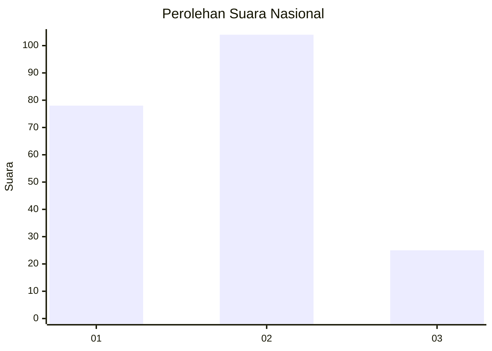
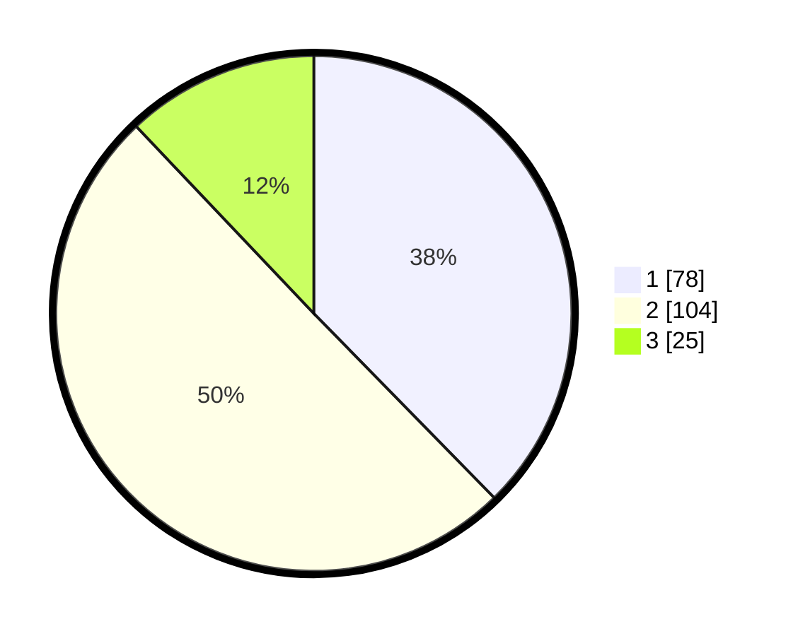

# Hasil

## Grafik

## Tabel

| No.    | Nama Paslon    | Suara | Suara (raw) | Persentase |
|:------ |:-------------- | -----:| -----------:| ----------:|
| 100025 | ANIES MUHAIMIN | 78    | [78][p-1]   | 37,68      |
| 100026 | PRABOWO GIBRAN | 104   | [104][p-2]  | 50,24      |
| 100027 | GANJAR MAHFUD  | 25    | [25][p-3]   | 12,08      |

[p-1]: https://github.com/gigit-pemilu/pemilu-2024/blob/main/pilpres/hitung-suara/sub/31-dki-jakarta/sub/75-jakarta-timur/sub/04-kramatjati/sub/1001-kramatjati/sub/071-tps/sub/paslon-1.txt
[p-2]: https://github.com/gigit-pemilu/pemilu-2024/blob/main/pilpres/hitung-suara/sub/31-dki-jakarta/sub/75-jakarta-timur/sub/04-kramatjati/sub/1001-kramatjati/sub/071-tps/sub/paslon-2.txt
[p-3]: https://github.com/gigit-pemilu/pemilu-2024/blob/main/pilpres/hitung-suara/sub/31-dki-jakarta/sub/75-jakarta-timur/sub/04-kramatjati/sub/1001-kramatjati/sub/071-tps/sub/paslon-3.txt

## Foto C Plano

https://sirekap-obj-formc.kpu.go.id/9827/pemilu/ppwp/31/75/04/10/01/3175041001071-20240217-162515--3ce278f7-36fa-4254-8f4d-44da2459d0b6.jpg

https://sirekap-obj-formc.kpu.go.id/9827/pemilu/ppwp/31/75/04/10/01/3175041001071-20240217-162930--96a6c72e-79dc-4a22-9fe0-a5a4e8916e15.jpg

https://sirekap-obj-formc.kpu.go.id/9827/pemilu/ppwp/31/75/04/10/01/3175041001071-20240217-163113--424731c7-132a-4683-94c6-331d5af7688f.jpg

## Metadata

| Key        | Value               |
| ---------- | ------------------- |
| Time Stamp | 2024-02-19 11:00:00 |

