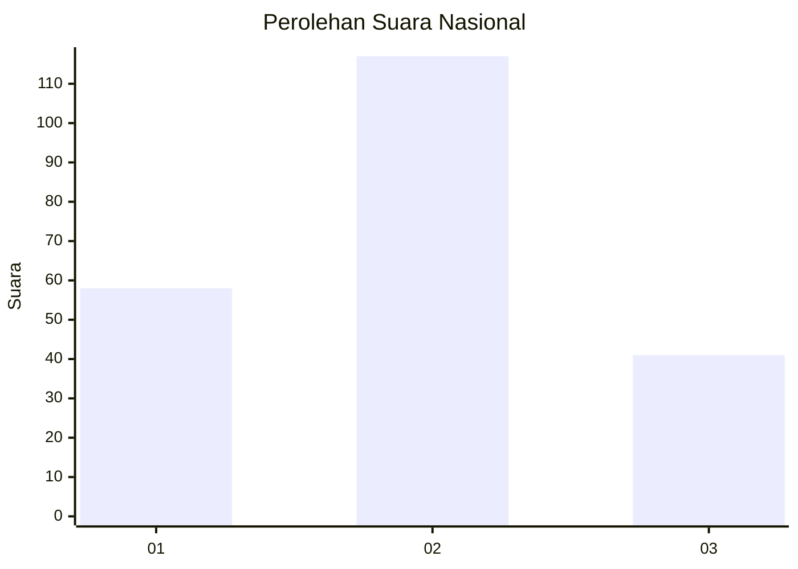
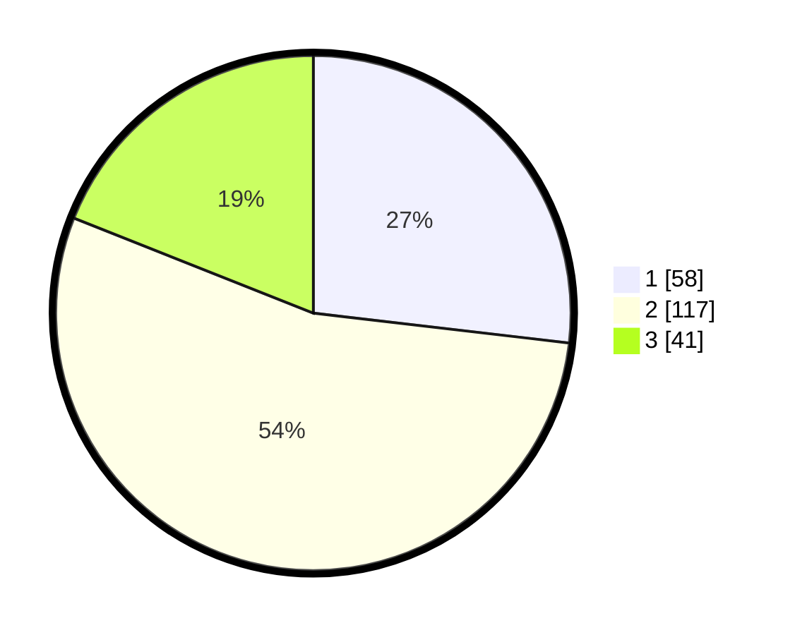

# Hasil

## Grafik

## Tabel

| No.    | Nama Paslon    | Suara | Suara (raw) | Persentase |
|:------ |:-------------- | -----:| -----------:| ----------:|
| 100025 | ANIES MUHAIMIN | 58    | [58][p-1]   | 26,85      |
| 100026 | PRABOWO GIBRAN | 117   | [117][p-2]  | 54,17      |
| 100027 | GANJAR MAHFUD  | 41    | [41][p-3]   | 18,98      |

[p-1]: https://github.com/gigit-pemilu/pemilu-2024/blob/main/pilpres/hitung-suara/sub/31-dki-jakarta/sub/75-jakarta-timur/sub/04-kramatjati/sub/1001-kramatjati/sub/075-tps/sub/paslon-1.txt
[p-2]: https://github.com/gigit-pemilu/pemilu-2024/blob/main/pilpres/hitung-suara/sub/31-dki-jakarta/sub/75-jakarta-timur/sub/04-kramatjati/sub/1001-kramatjati/sub/075-tps/sub/paslon-2.txt
[p-3]: https://github.com/gigit-pemilu/pemilu-2024/blob/main/pilpres/hitung-suara/sub/31-dki-jakarta/sub/75-jakarta-timur/sub/04-kramatjati/sub/1001-kramatjati/sub/075-tps/sub/paslon-3.txt

## Foto C Plano

https://sirekap-obj-formc.kpu.go.id/b491/pemilu/ppwp/31/75/04/10/01/3175041001075-20240219-002740--a79fbbf7-4c0f-4562-826a-4c899aa2c77f.jpg

https://sirekap-obj-formc.kpu.go.id/b491/pemilu/ppwp/31/75/04/10/01/3175041001075-20240219-002821--fed24f73-d25f-4d24-80ee-eb7cfec4cb50.jpg

https://sirekap-obj-formc.kpu.go.id/b491/pemilu/ppwp/31/75/04/10/01/3175041001075-20240219-002043--2042f7e6-a14b-4317-8c61-b06395f26dfe.jpg

## Metadata

| Key        | Value               |
| ---------- | ------------------- |
| Time Stamp | 2024-02-24 22:31:28 |

