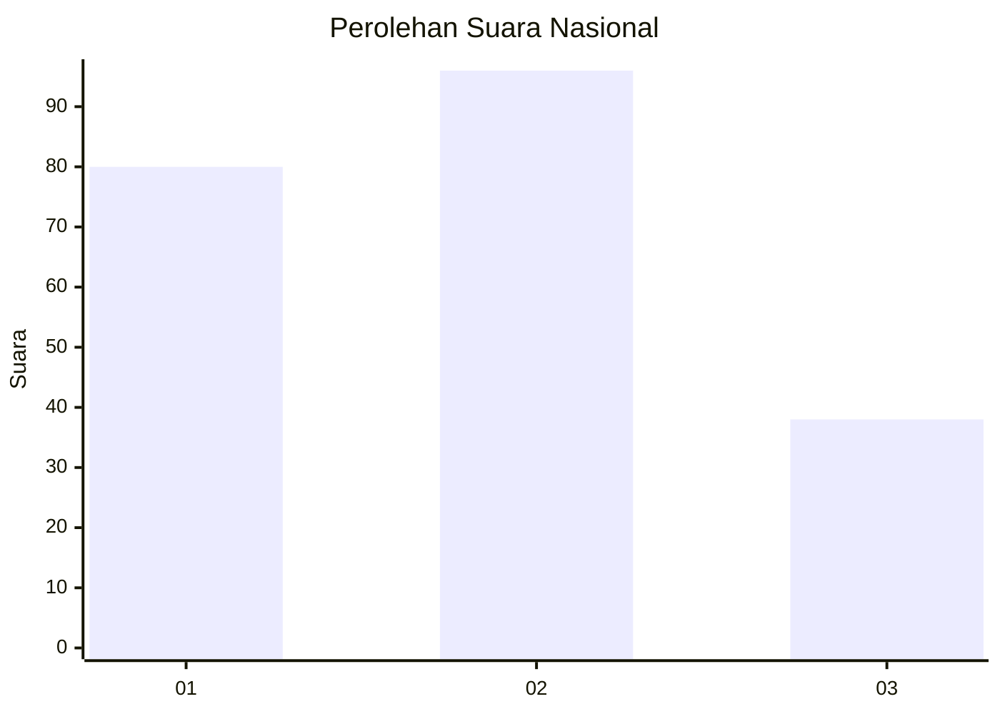
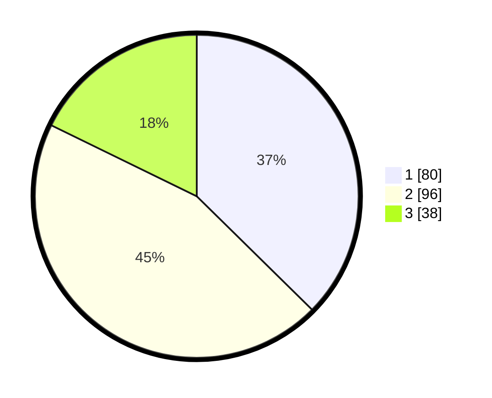

# Hasil

## Grafik

## Tabel

| No.    | Nama Paslon    | Suara | Suara (raw) | Persentase |
|:------ |:-------------- | -----:| -----------:| ----------:|
| 100025 | ANIES MUHAIMIN | 80    | [80][p-1]   | 37,38      |
| 100026 | PRABOWO GIBRAN | 96    | [96][p-2]   | 44,86      |
| 100027 | GANJAR MAHFUD  | 38    | [38][p-3]   | 17,76      |

[p-1]: https://github.com/gigit-pemilu/pemilu-2024/blob/main/pilpres/hitung-suara/sub/31-dki-jakarta/sub/75-jakarta-timur/sub/04-kramatjati/sub/1001-kramatjati/sub/081-tps/sub/paslon-1.txt
[p-2]: https://github.com/gigit-pemilu/pemilu-2024/blob/main/pilpres/hitung-suara/sub/31-dki-jakarta/sub/75-jakarta-timur/sub/04-kramatjati/sub/1001-kramatjati/sub/081-tps/sub/paslon-2.txt
[p-3]: https://github.com/gigit-pemilu/pemilu-2024/blob/main/pilpres/hitung-suara/sub/31-dki-jakarta/sub/75-jakarta-timur/sub/04-kramatjati/sub/1001-kramatjati/sub/081-tps/sub/paslon-3.txt

## Foto C Plano

https://sirekap-obj-formc.kpu.go.id/aa50/pemilu/ppwp/31/75/04/10/01/3175041001081-20240214-225901--aa94f7a7-eca7-474f-aab6-8591ae05ad2b.jpg

https://sirekap-obj-formc.kpu.go.id/aa50/pemilu/ppwp/31/75/04/10/01/3175041001081-20240214-225931--afa49ed6-fedf-4ad8-9d95-540345310ecf.jpg

https://sirekap-obj-formc.kpu.go.id/aa50/pemilu/ppwp/31/75/04/10/01/3175041001081-20240214-230020--39db64a2-3249-4d37-955d-4f69df42f195.jpg

## Metadata

| Key        | Value               |
| ---------- | ------------------- |
| Time Stamp | 2024-02-15 17:00:25 |

