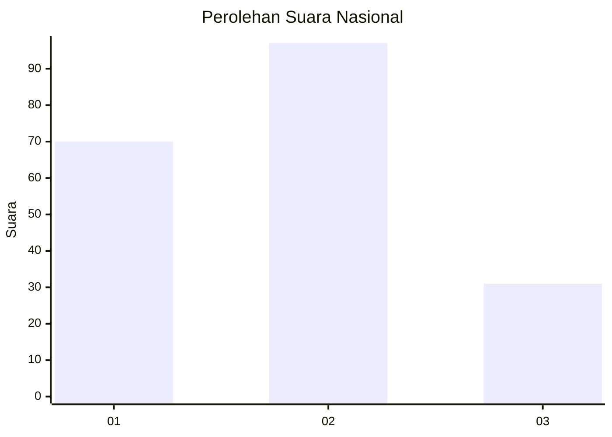
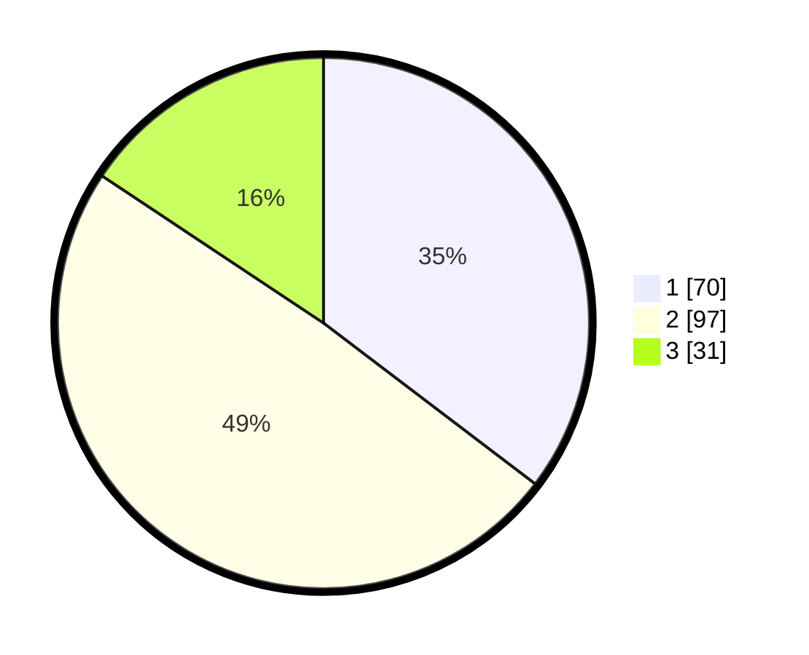

# Hasil

## Grafik

## Tabel

| No.    | Nama Paslon    | Suara | Suara (raw) | Persentase |
|:------ |:-------------- | -----:| -----------:| ----------:|
| 100025 | ANIES MUHAIMIN | 70    | [70][p-1]   | 35,35      |
| 100026 | PRABOWO GIBRAN | 97    | [97][p-2]   | 48,99      |
| 100027 | GANJAR MAHFUD  | 31    | [31][p-3]   | 15,66      |

[p-1]: https://github.com/gigit-pemilu/pemilu-2024/blob/main/pilpres/hitung-suara/sub/31-dki-jakarta/sub/75-jakarta-timur/sub/04-kramatjati/sub/1001-kramatjati/sub/108-tps/sub/paslon-1.txt
[p-2]: https://github.com/gigit-pemilu/pemilu-2024/blob/main/pilpres/hitung-suara/sub/31-dki-jakarta/sub/75-jakarta-timur/sub/04-kramatjati/sub/1001-kramatjati/sub/108-tps/sub/paslon-2.txt
[p-3]: https://github.com/gigit-pemilu/pemilu-2024/blob/main/pilpres/hitung-suara/sub/31-dki-jakarta/sub/75-jakarta-timur/sub/04-kramatjati/sub/1001-kramatjati/sub/108-tps/sub/paslon-3.txt

## Foto C Plano

https://sirekap-obj-formc.kpu.go.id/9005/pemilu/ppwp/31/75/04/10/01/3175041001108-20240223-122257--bd90a2a6-7236-4db9-9a56-9eef2fdbf2ff.jpg

https://sirekap-obj-formc.kpu.go.id/9005/pemilu/ppwp/31/75/04/10/01/3175041001108-20240223-122634--3772e54e-efd0-4360-9492-f822e1b97bac.jpg

https://sirekap-obj-formc.kpu.go.id/9005/pemilu/ppwp/31/75/04/10/01/3175041001108-20240223-131232--35173bbe-3308-4f62-a0a7-731e634a926c.jpg

## Metadata

| Key        | Value               |
| ---------- | ------------------- |
| Time Stamp | 2024-02-24 22:31:28 |

