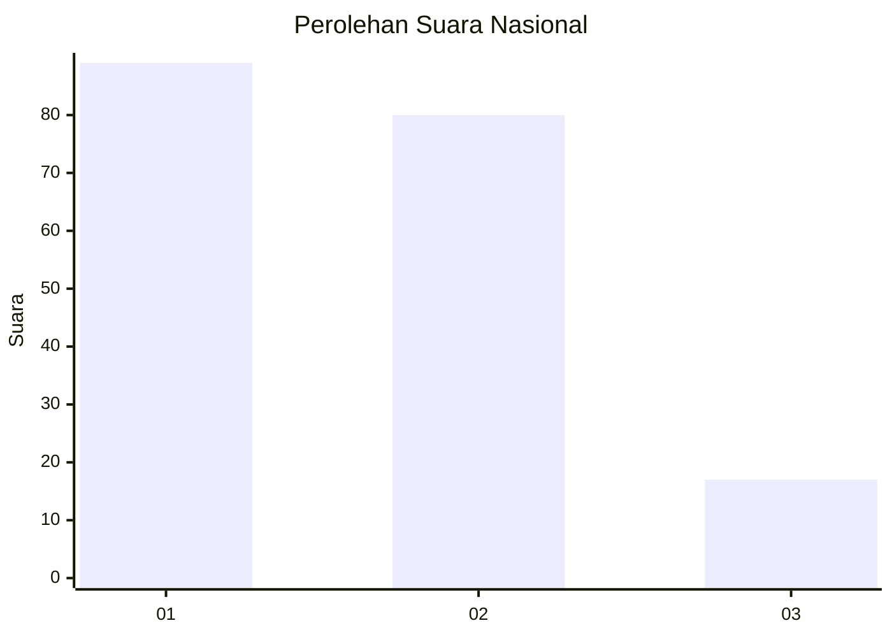
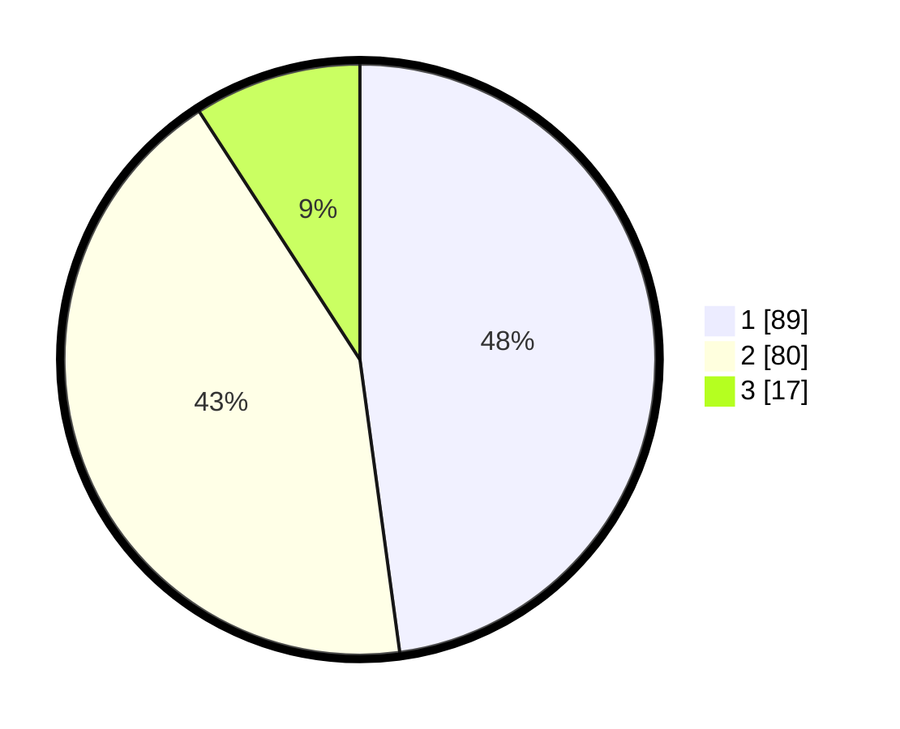

# Hasil

## Grafik

## Tabel

| No.    | Nama Paslon    | Suara | Suara (raw) | Persentase |
|:------ |:-------------- | -----:| -----------:| ----------:|
| 100025 | ANIES MUHAIMIN | 89    | [89][p-1]   | 47,85      |
| 100026 | PRABOWO GIBRAN | 80    | [80][p-2]   | 43,01      |
| 100027 | GANJAR MAHFUD  | 17    | [17][p-3]   | 9,14       |

[p-1]: https://github.com/gigit-pemilu/pemilu-2024/blob/main/pilpres/hitung-suara/sub/31-dki-jakarta/sub/75-jakarta-timur/sub/04-kramatjati/sub/1001-kramatjati/sub/110-tps/sub/paslon-1.txt
[p-2]: https://github.com/gigit-pemilu/pemilu-2024/blob/main/pilpres/hitung-suara/sub/31-dki-jakarta/sub/75-jakarta-timur/sub/04-kramatjati/sub/1001-kramatjati/sub/110-tps/sub/paslon-2.txt
[p-3]: https://github.com/gigit-pemilu/pemilu-2024/blob/main/pilpres/hitung-suara/sub/31-dki-jakarta/sub/75-jakarta-timur/sub/04-kramatjati/sub/1001-kramatjati/sub/110-tps/sub/paslon-3.txt

## Foto C Plano

https://sirekap-obj-formc.kpu.go.id/9a53/pemilu/ppwp/31/75/04/10/01/3175041001110-20240216-172634--3366b7eb-1410-48ee-a13b-6b87a3b77907.jpg

https://sirekap-obj-formc.kpu.go.id/9a53/pemilu/ppwp/31/75/04/10/01/3175041001110-20240216-102701--f6f62dcd-0f14-472f-9ca2-6abacd553b05.jpg

https://sirekap-obj-formc.kpu.go.id/9a53/pemilu/ppwp/31/75/04/10/01/3175041001110-20240214-204033--cb8f736f-7498-4d11-ab13-33c12b88b0be.jpg

## Metadata

| Key        | Value               |
| ---------- | ------------------- |
| Time Stamp | 2024-02-16 17:30:00 |

