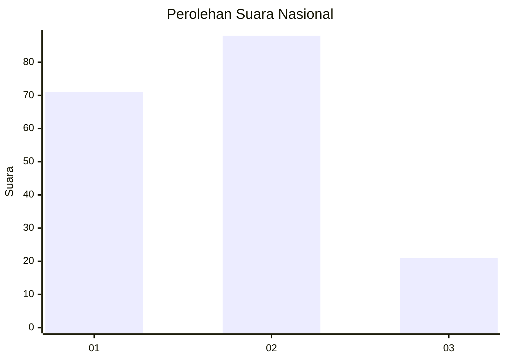
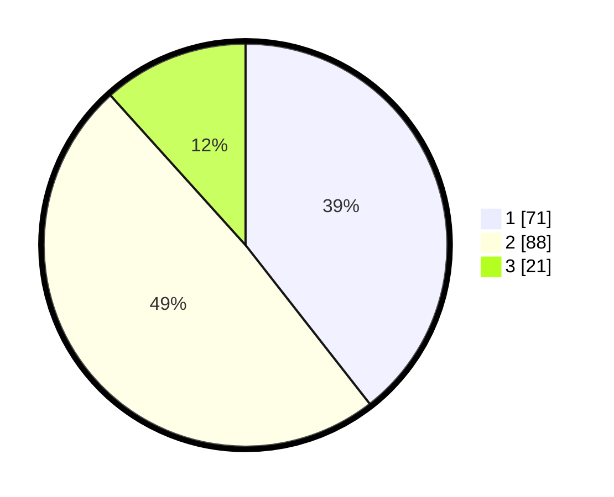

# Hasil

## Grafik

## Tabel

| No.    | Nama Paslon    | Suara | Suara (raw) | Persentase |
|:------ |:-------------- | -----:| -----------:| ----------:|
| 100025 | ANIES MUHAIMIN | 71    | [71][p-1]   | 39,44      |
| 100026 | PRABOWO GIBRAN | 88    | [88][p-2]   | 48,89      |
| 100027 | GANJAR MAHFUD  | 21    | [21][p-3]   | 11,67      |

[p-1]: https://github.com/gigit-pemilu/pemilu-2024/blob/main/pilpres/hitung-suara/sub/31-dki-jakarta/sub/75-jakarta-timur/sub/04-kramatjati/sub/1002-tengah/sub/012-tps/sub/paslon-1.txt
[p-2]: https://github.com/gigit-pemilu/pemilu-2024/blob/main/pilpres/hitung-suara/sub/31-dki-jakarta/sub/75-jakarta-timur/sub/04-kramatjati/sub/1002-tengah/sub/012-tps/sub/paslon-2.txt
[p-3]: https://github.com/gigit-pemilu/pemilu-2024/blob/main/pilpres/hitung-suara/sub/31-dki-jakarta/sub/75-jakarta-timur/sub/04-kramatjati/sub/1002-tengah/sub/012-tps/sub/paslon-3.txt

## Foto C Plano

https://sirekap-obj-formc.kpu.go.id/f7b9/pemilu/ppwp/31/75/04/10/02/3175041002012-20240218-203702--def2cbe1-9d91-4def-bef1-177a1325ae17.jpg

https://sirekap-obj-formc.kpu.go.id/f7b9/pemilu/ppwp/31/75/04/10/02/3175041002012-20240214-210948--2278e8f9-2efe-4aa9-836a-a5113c2127fc.jpg

https://sirekap-obj-formc.kpu.go.id/f7b9/pemilu/ppwp/31/75/04/10/02/3175041002012-20240218-204724--e4cec23a-ae7b-49ea-b341-1fb1cdb84b56.jpg

## Metadata

| Key        | Value               |
| ---------- | ------------------- |
| Time Stamp | 2024-02-19 06:16:00 |

