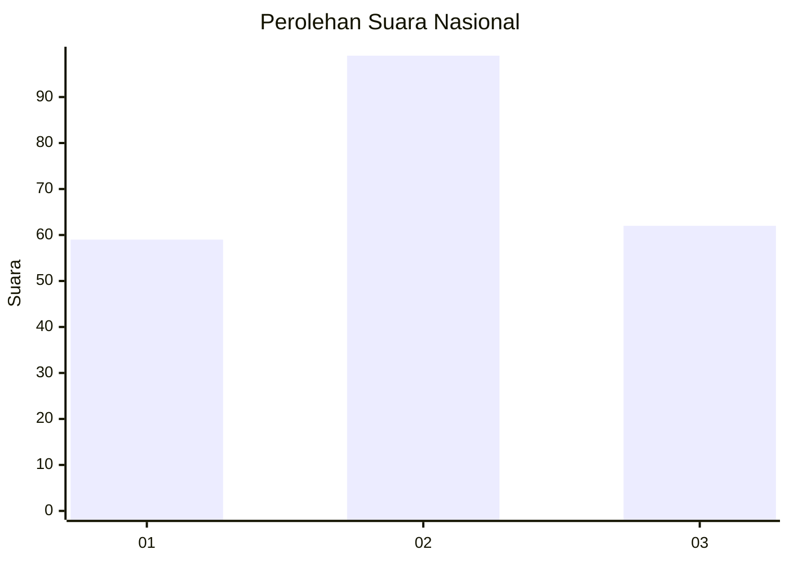
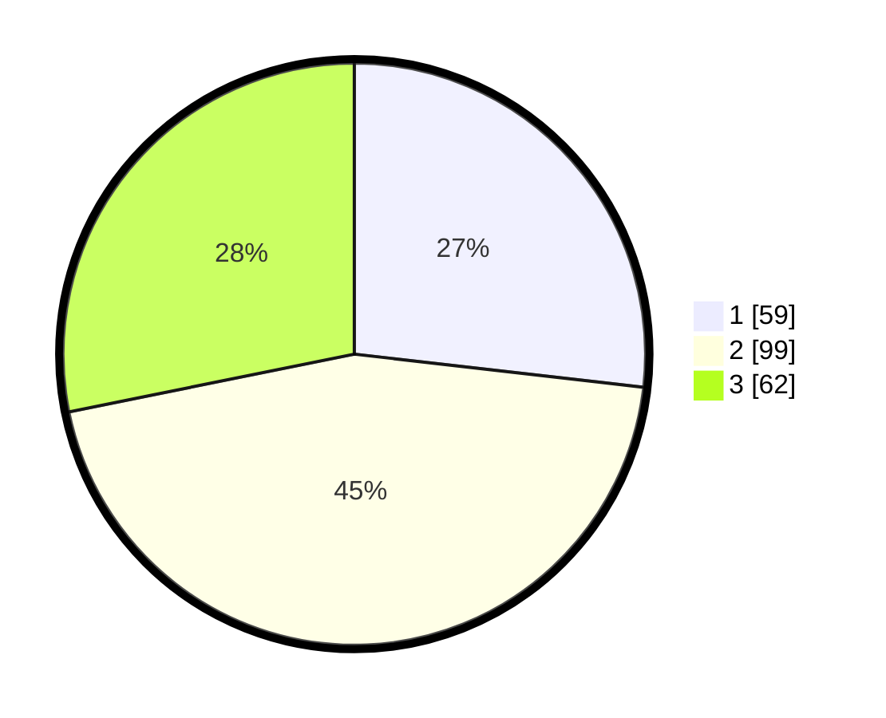

# Hasil

## Grafik

## Tabel

| No.    | Nama Paslon    | Suara | Suara (raw) | Persentase |
|:------ |:-------------- | -----:| -----------:| ----------:|
| 100025 | ANIES MUHAIMIN | 59    | [59][p-1]   | 26,82      |
| 100026 | PRABOWO GIBRAN | 99    | [99][p-2]   | 45,00      |
| 100027 | GANJAR MAHFUD  | 62    | [62][p-3]   | 28,18      |

[p-1]: https://github.com/gigit-pemilu/pemilu-2024/blob/main/pilpres/hitung-suara/sub/31-dki-jakarta/sub/75-jakarta-timur/sub/04-kramatjati/sub/1002-tengah/sub/025-tps/sub/paslon-1.txt
[p-2]: https://github.com/gigit-pemilu/pemilu-2024/blob/main/pilpres/hitung-suara/sub/31-dki-jakarta/sub/75-jakarta-timur/sub/04-kramatjati/sub/1002-tengah/sub/025-tps/sub/paslon-2.txt
[p-3]: https://github.com/gigit-pemilu/pemilu-2024/blob/main/pilpres/hitung-suara/sub/31-dki-jakarta/sub/75-jakarta-timur/sub/04-kramatjati/sub/1002-tengah/sub/025-tps/sub/paslon-3.txt

## Foto C Plano

https://sirekap-obj-formc.kpu.go.id/102a/pemilu/ppwp/31/75/04/10/02/3175041002025-20240214-230841--3b06e4d2-7996-439c-a18f-13ce19d23216.jpg

https://sirekap-obj-formc.kpu.go.id/102a/pemilu/ppwp/31/75/04/10/02/3175041002025-20240214-230911--2852580c-0e52-4114-bf23-fcdbff3158a0.jpg

https://sirekap-obj-formc.kpu.go.id/102a/pemilu/ppwp/31/75/04/10/02/3175041002025-20240214-230930--be2eefcf-b255-4689-945d-07df1621702d.jpg

## Metadata

| Key        | Value               |
| ---------- | ------------------- |
| Time Stamp | 2024-02-15 15:00:29 |

