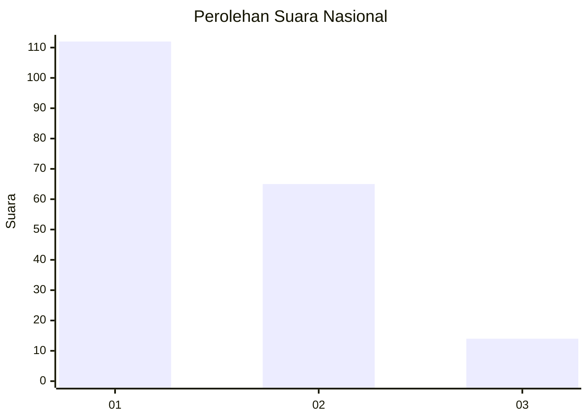
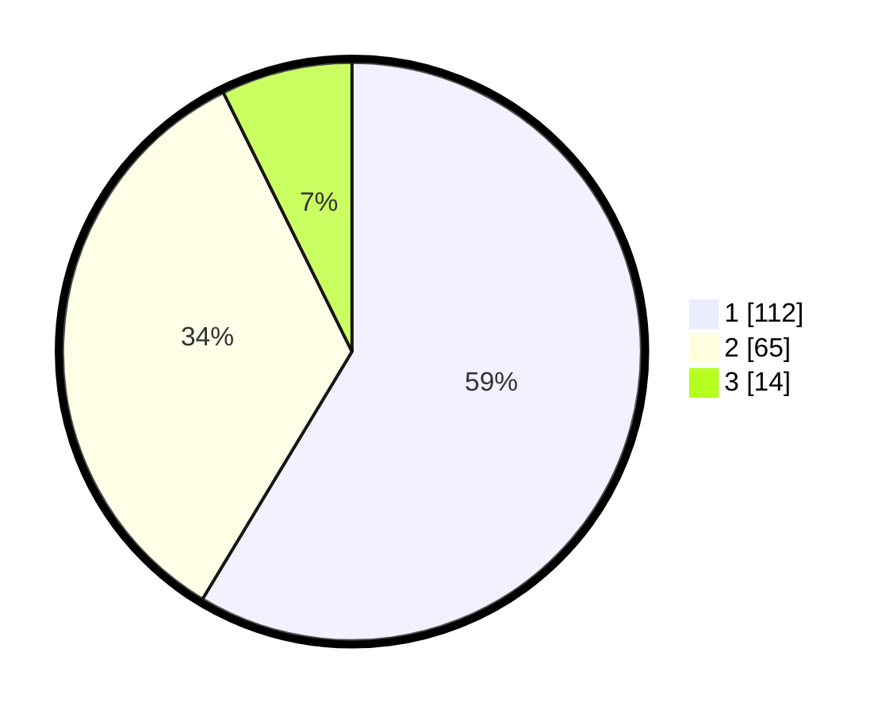

# Hasil

## Grafik

## Tabel

| No.    | Nama Paslon    | Suara | Suara (raw) | Persentase |
|:------ |:-------------- | -----:| -----------:| ----------:|
| 100025 | ANIES MUHAIMIN | 112   | [112][p-1]  | 58,64      |
| 100026 | PRABOWO GIBRAN | 65    | [65][p-2]   | 34,03      |
| 100027 | GANJAR MAHFUD  | 14    | [14][p-3]   | 7,33       |

[p-1]: https://github.com/gigit-pemilu/pemilu-2024/blob/main/pilpres/hitung-suara/sub/31-dki-jakarta/sub/75-jakarta-timur/sub/04-kramatjati/sub/1003-dukuh/sub/002-tps/sub/paslon-1.txt
[p-2]: https://github.com/gigit-pemilu/pemilu-2024/blob/main/pilpres/hitung-suara/sub/31-dki-jakarta/sub/75-jakarta-timur/sub/04-kramatjati/sub/1003-dukuh/sub/002-tps/sub/paslon-2.txt
[p-3]: https://github.com/gigit-pemilu/pemilu-2024/blob/main/pilpres/hitung-suara/sub/31-dki-jakarta/sub/75-jakarta-timur/sub/04-kramatjati/sub/1003-dukuh/sub/002-tps/sub/paslon-3.txt

## Foto C Plano

https://sirekap-obj-formc.kpu.go.id/5099/pemilu/ppwp/31/75/04/10/03/3175041003002-20240219-093843--0637999b-d3bd-44af-bc58-1797e06f221d.jpg

https://sirekap-obj-formc.kpu.go.id/5099/pemilu/ppwp/31/75/04/10/03/3175041003002-20240219-093722--973cfc1e-8d0e-4bf7-a1e8-59f09c34c8ef.jpg

https://sirekap-obj-formc.kpu.go.id/5099/pemilu/ppwp/31/75/04/10/03/3175041003002-20240219-093545--36736021-6dc8-4867-ace4-3ab1b6e50b4f.jpg

## Metadata

| Key        | Value               |
| ---------- | ------------------- |
| Time Stamp | 2024-02-19 11:00:00 |

