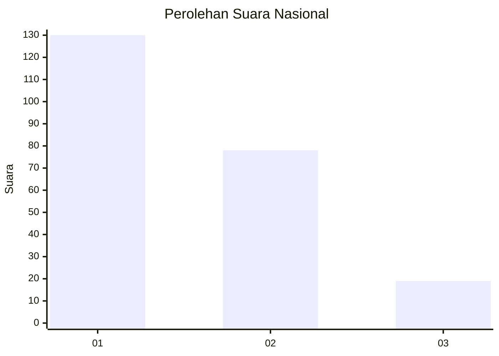
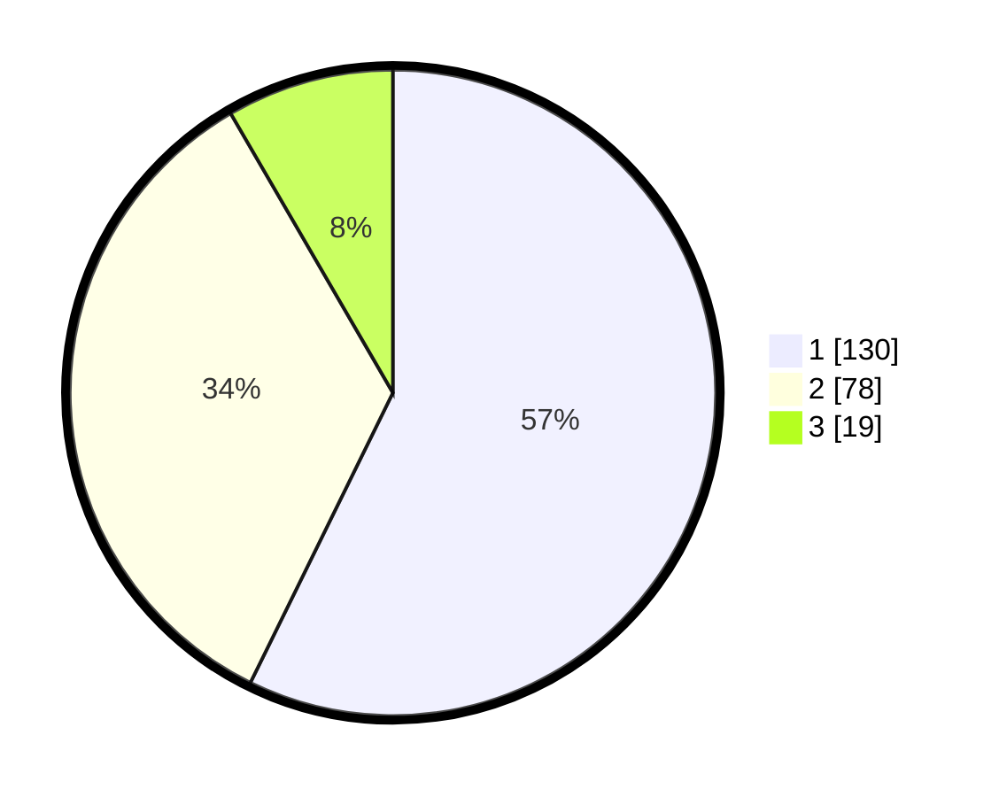

# Hasil

## Grafik

## Tabel

| No.    | Nama Paslon    | Suara | Suara (raw) | Persentase |
|:------ |:-------------- | -----:| -----------:| ----------:|
| 100025 | ANIES MUHAIMIN | 130   | [130][p-1]  | 57,27      |
| 100026 | PRABOWO GIBRAN | 78    | [78][p-2]   | 34,36      |
| 100027 | GANJAR MAHFUD  | 19    | [19][p-3]   | 8,37       |

[p-1]: https://github.com/gigit-pemilu/pemilu-2024/blob/main/pilpres/hitung-suara/sub/31-dki-jakarta/sub/75-jakarta-timur/sub/04-kramatjati/sub/1003-dukuh/sub/033-tps/sub/paslon-1.txt
[p-2]: https://github.com/gigit-pemilu/pemilu-2024/blob/main/pilpres/hitung-suara/sub/31-dki-jakarta/sub/75-jakarta-timur/sub/04-kramatjati/sub/1003-dukuh/sub/033-tps/sub/paslon-2.txt
[p-3]: https://github.com/gigit-pemilu/pemilu-2024/blob/main/pilpres/hitung-suara/sub/31-dki-jakarta/sub/75-jakarta-timur/sub/04-kramatjati/sub/1003-dukuh/sub/033-tps/sub/paslon-3.txt

## Foto C Plano

https://sirekap-obj-formc.kpu.go.id/490f/pemilu/ppwp/31/75/04/10/03/3175041003033-20240215-150311--b150c2c4-e8c7-4485-9b06-ffb7cd146141.jpg

https://sirekap-obj-formc.kpu.go.id/490f/pemilu/ppwp/31/75/04/10/03/3175041003033-20240214-221503--bde6c20c-7f2d-4f29-b7e1-6b63d332a300.jpg

https://sirekap-obj-formc.kpu.go.id/490f/pemilu/ppwp/31/75/04/10/03/3175041003033-20240214-221617--0ac0cc6b-32a0-49f2-bf86-921bdc6cf6b5.jpg

## Metadata

| Key        | Value               |
| ---------- | ------------------- |
| Time Stamp | 2024-02-15 15:30:25 |

