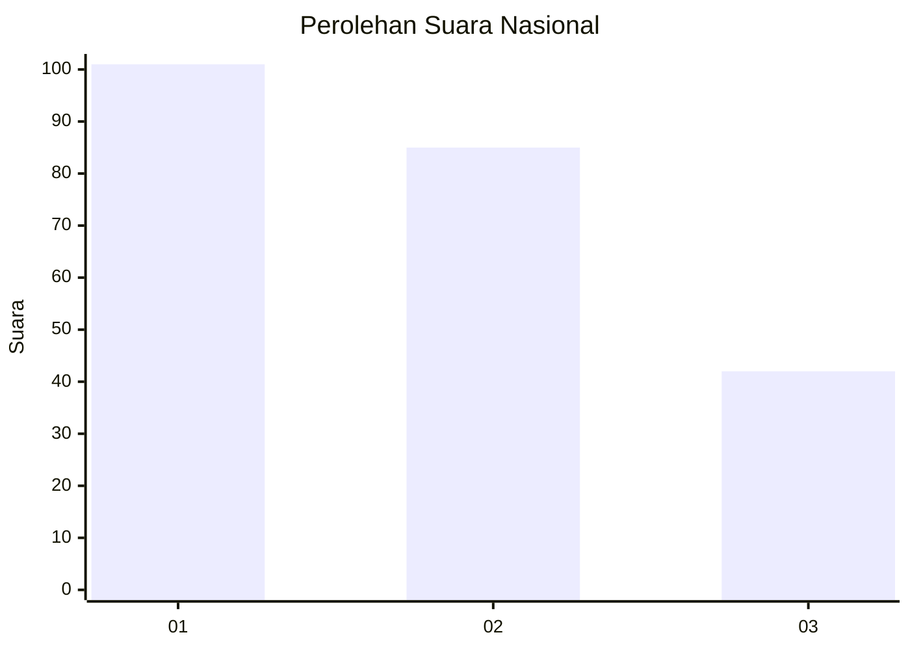
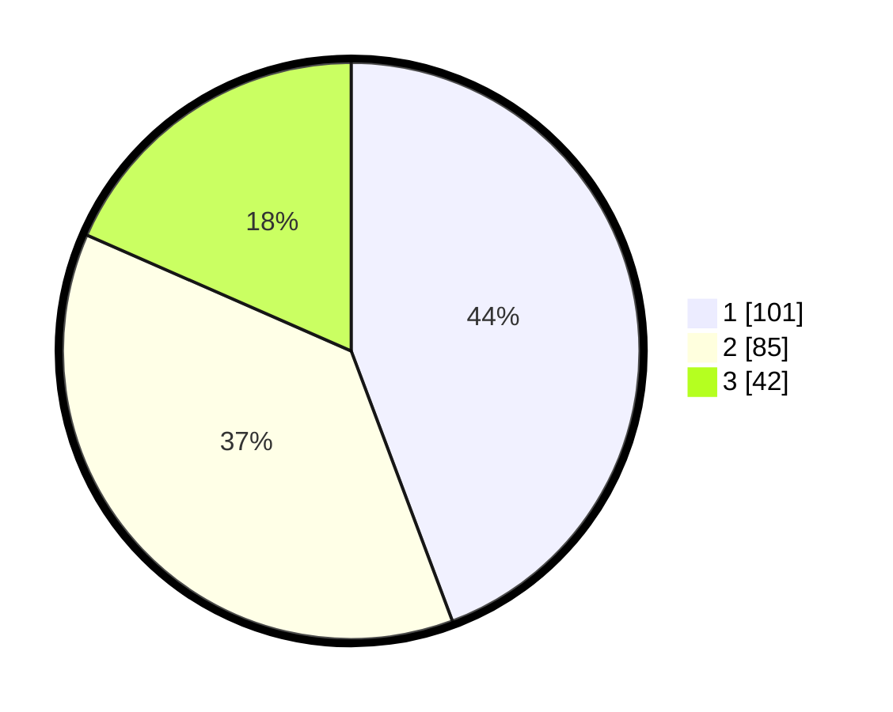

# Hasil

## Grafik

## Tabel

| No.    | Nama Paslon    | Suara | Suara (raw) | Persentase |
|:------ |:-------------- | -----:| -----------:| ----------:|
| 100025 | ANIES MUHAIMIN | 101   | [101][p-1]  | 44,30      |
| 100026 | PRABOWO GIBRAN | 85    | [85][p-2]   | 37,28      |
| 100027 | GANJAR MAHFUD  | 42    | [42][p-3]   | 18,42      |

[p-1]: https://github.com/gigit-pemilu/pemilu-2024/blob/main/pilpres/hitung-suara/sub/31-dki-jakarta/sub/75-jakarta-timur/sub/04-kramatjati/sub/1003-dukuh/sub/039-tps/sub/paslon-1.txt
[p-2]: https://github.com/gigit-pemilu/pemilu-2024/blob/main/pilpres/hitung-suara/sub/31-dki-jakarta/sub/75-jakarta-timur/sub/04-kramatjati/sub/1003-dukuh/sub/039-tps/sub/paslon-2.txt
[p-3]: https://github.com/gigit-pemilu/pemilu-2024/blob/main/pilpres/hitung-suara/sub/31-dki-jakarta/sub/75-jakarta-timur/sub/04-kramatjati/sub/1003-dukuh/sub/039-tps/sub/paslon-3.txt

## Foto C Plano

https://sirekap-obj-formc.kpu.go.id/ff32/pemilu/ppwp/31/75/04/10/03/3175041003039-20240214-233322--02d3d446-7f64-46f6-a879-cbc5d79d89cb.jpg

https://sirekap-obj-formc.kpu.go.id/ff32/pemilu/ppwp/31/75/04/10/03/3175041003039-20240214-233635--7e5d98be-2266-40d5-a1be-660e0ce9560c.jpg

https://sirekap-obj-formc.kpu.go.id/ff32/pemilu/ppwp/31/75/04/10/03/3175041003039-20240214-233940--b714af60-543d-4d12-aabd-1aae7dbf9c88.jpg

## Metadata

| Key        | Value               |
| ---------- | ------------------- |
| Time Stamp | 2024-02-15 15:00:29 |

