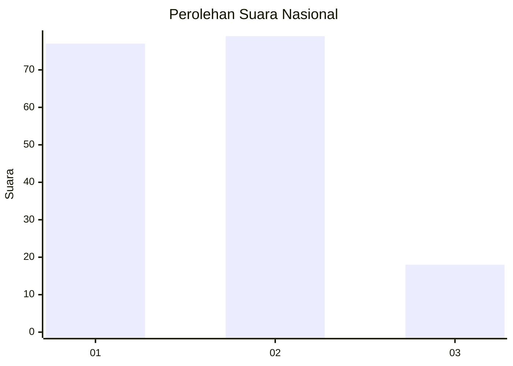
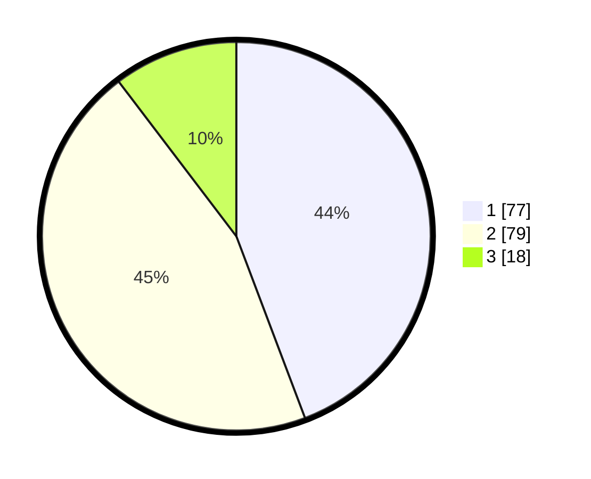

# Hasil

## Grafik

## Tabel

| No.    | Nama Paslon    | Suara | Suara (raw) | Persentase |
|:------ |:-------------- | -----:| -----------:| ----------:|
| 100025 | ANIES MUHAIMIN | 77    | [77][p-1]   | 44,25      |
| 100026 | PRABOWO GIBRAN | 79    | [79][p-2]   | 45,40      |
| 100027 | GANJAR MAHFUD  | 18    | [18][p-3]   | 10,34      |

[p-1]: https://github.com/gigit-pemilu/pemilu-2024/blob/main/pilpres/hitung-suara/sub/31-dki-jakarta/sub/75-jakarta-timur/sub/04-kramatjati/sub/1003-dukuh/sub/042-tps/sub/paslon-1.txt
[p-2]: https://github.com/gigit-pemilu/pemilu-2024/blob/main/pilpres/hitung-suara/sub/31-dki-jakarta/sub/75-jakarta-timur/sub/04-kramatjati/sub/1003-dukuh/sub/042-tps/sub/paslon-2.txt
[p-3]: https://github.com/gigit-pemilu/pemilu-2024/blob/main/pilpres/hitung-suara/sub/31-dki-jakarta/sub/75-jakarta-timur/sub/04-kramatjati/sub/1003-dukuh/sub/042-tps/sub/paslon-3.txt

## Foto C Plano

https://sirekap-obj-formc.kpu.go.id/853e/pemilu/ppwp/31/75/04/10/03/3175041003042-20240214-235536--35fdea95-9666-470d-a8ea-e710b29e5593.jpg

https://sirekap-obj-formc.kpu.go.id/853e/pemilu/ppwp/31/75/04/10/03/3175041003042-20240214-234706--c5726019-e886-42bd-b26a-0137473b07a1.jpg

https://sirekap-obj-formc.kpu.go.id/853e/pemilu/ppwp/31/75/04/10/03/3175041003042-20240214-235927--9bf762ec-c8d1-4844-869c-2127cb0879ae.jpg

## Metadata

| Key        | Value               |
| ---------- | ------------------- |
| Time Stamp | 2024-02-15 22:40:13 |

