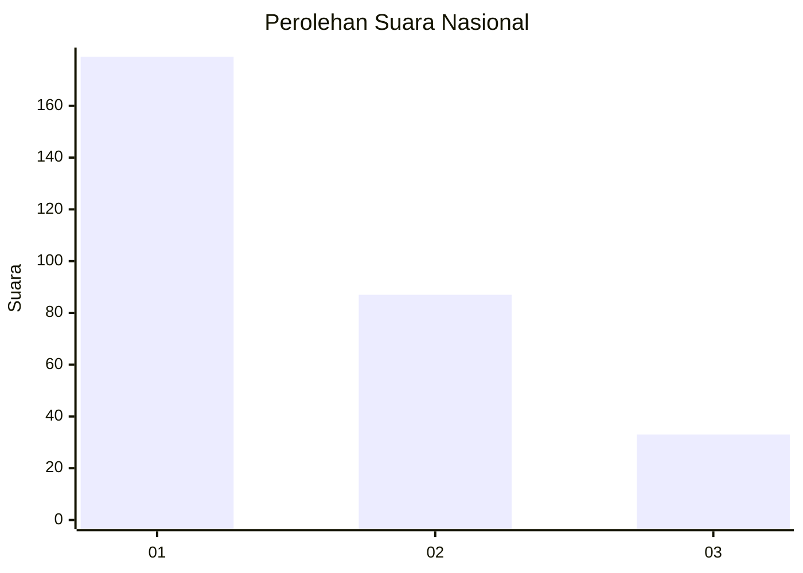
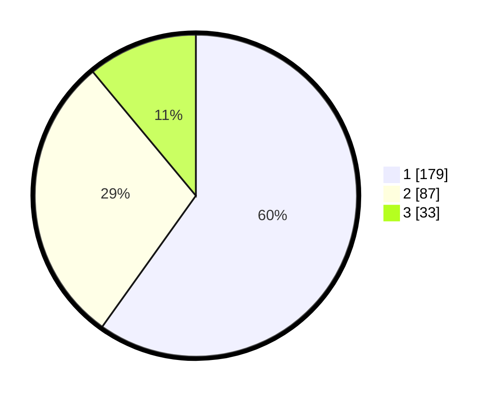

# Hasil

## Grafik

## Tabel

| No. | Nama Paslon    | Suara | Suara (raw) | Persentase |
|:--- |:-------------- | -----:| -----------:| ----------:|
| 1   | ANIES MUHAIMIN | 179   | [179][p-1]  | 59,87      |
| 2   | PRABOWO GIBRAN | 87    | [87][p-2]   | 29,10      |
| 3   | GANJAR MAHFUD  | 33    | [33][p-3]   | 11,04      |

[p-1]: https://github.com/gigit-pemilu/pemilu-2024/blob/main/pilpres/hitung-suara/sub/31-dki-jakarta/sub/75-jakarta-timur/sub/04-kramatjati/sub/1003-dukuh/sub/050-tps/sub/paslon-1.txt
[p-2]: https://github.com/gigit-pemilu/pemilu-2024/blob/main/pilpres/hitung-suara/sub/31-dki-jakarta/sub/75-jakarta-timur/sub/04-kramatjati/sub/1003-dukuh/sub/050-tps/sub/paslon-2.txt
[p-3]: https://github.com/gigit-pemilu/pemilu-2024/blob/main/pilpres/hitung-suara/sub/31-dki-jakarta/sub/75-jakarta-timur/sub/04-kramatjati/sub/1003-dukuh/sub/050-tps/sub/paslon-3.txt

## Foto C Plano

https://sirekap-obj-formc.kpu.go.id/51c8/pemilu/ppwp/31/75/04/10/03/3175041003050-20240215-000836--8c8de0e1-bb61-4b04-90aa-5d571c66b7a9.jpg

https://sirekap-obj-formc.kpu.go.id/51c8/pemilu/ppwp/31/75/04/10/03/3175041003050-20240215-003214--a8819723-1fd7-4819-8c01-0753bc925927.jpg

https://sirekap-obj-formc.kpu.go.id/51c8/pemilu/ppwp/31/75/04/10/03/3175041003050-20240219-200805--1f7e81c1-ec46-452f-ada3-fc99433da94a.jpg

## Metadata

| Key        | Value               |
| ---------- | ------------------- |
| Time Stamp | 2024-02-24 22:31:28 |

