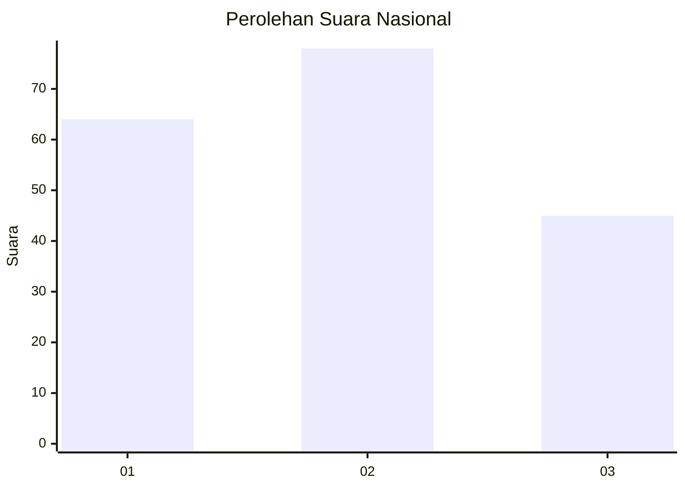
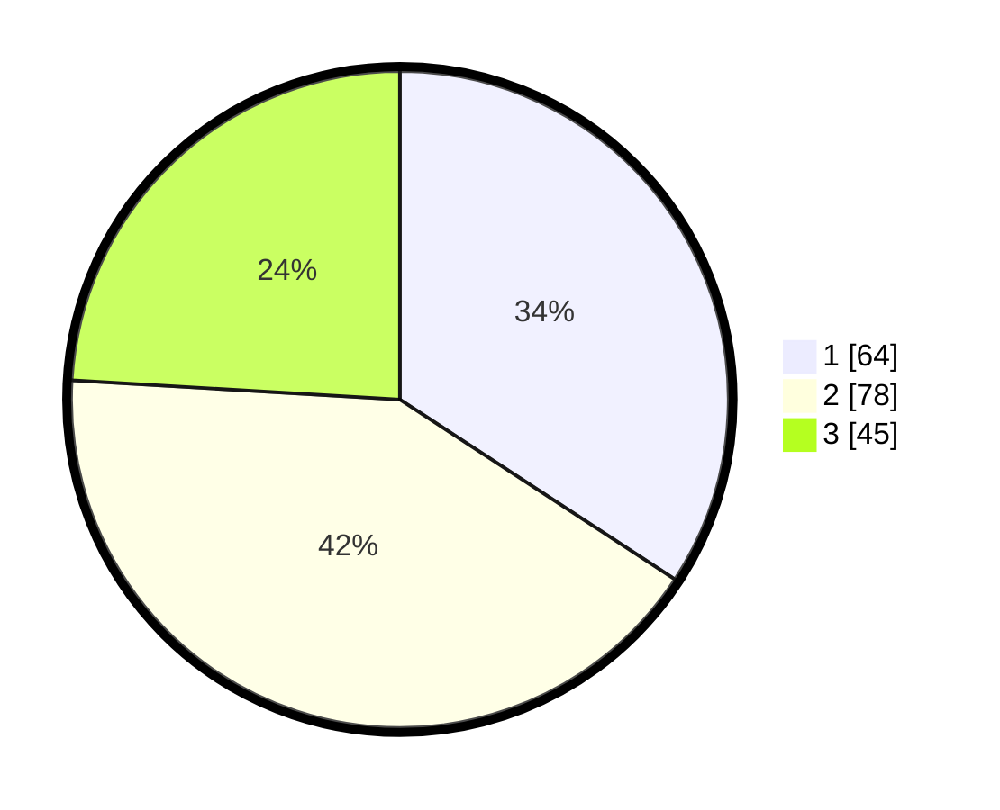

# Hasil

## Grafik

## Tabel

| No.    | Nama Paslon    | Suara | Suara (raw) | Persentase |
|:------ |:-------------- | -----:| -----------:| ----------:|
| 100025 | ANIES MUHAIMIN | 64    | [64][p-1]   | 34,22      |
| 100026 | PRABOWO GIBRAN | 78    | [78][p-2]   | 41,71      |
| 100027 | GANJAR MAHFUD  | 45    | [45][p-3]   | 24,06      |

[p-1]: https://github.com/gigit-pemilu/pemilu-2024/blob/main/pilpres/hitung-suara/sub/31-dki-jakarta/sub/75-jakarta-timur/sub/04-kramatjati/sub/1003-dukuh/sub/075-tps/sub/paslon-1.txt
[p-2]: https://github.com/gigit-pemilu/pemilu-2024/blob/main/pilpres/hitung-suara/sub/31-dki-jakarta/sub/75-jakarta-timur/sub/04-kramatjati/sub/1003-dukuh/sub/075-tps/sub/paslon-2.txt
[p-3]: https://github.com/gigit-pemilu/pemilu-2024/blob/main/pilpres/hitung-suara/sub/31-dki-jakarta/sub/75-jakarta-timur/sub/04-kramatjati/sub/1003-dukuh/sub/075-tps/sub/paslon-3.txt

## Foto C Plano

https://sirekap-obj-formc.kpu.go.id/dfa2/pemilu/ppwp/31/75/04/10/03/3175041003075-20240214-233907--18d4db4d-8b68-4817-9dce-fe4b06e6b766.jpg

https://sirekap-obj-formc.kpu.go.id/dfa2/pemilu/ppwp/31/75/04/10/03/3175041003075-20240214-233951--857246ab-b07d-49d4-8a08-479f67e7a2a3.jpg

https://sirekap-obj-formc.kpu.go.id/dfa2/pemilu/ppwp/31/75/04/10/03/3175041003075-20240214-234036--a8a45c70-8322-4f3d-bd2b-4cf6da4c913d.jpg

## Metadata

| Key        | Value               |
| ---------- | ------------------- |
| Time Stamp | 2024-02-15 21:01:18 |

