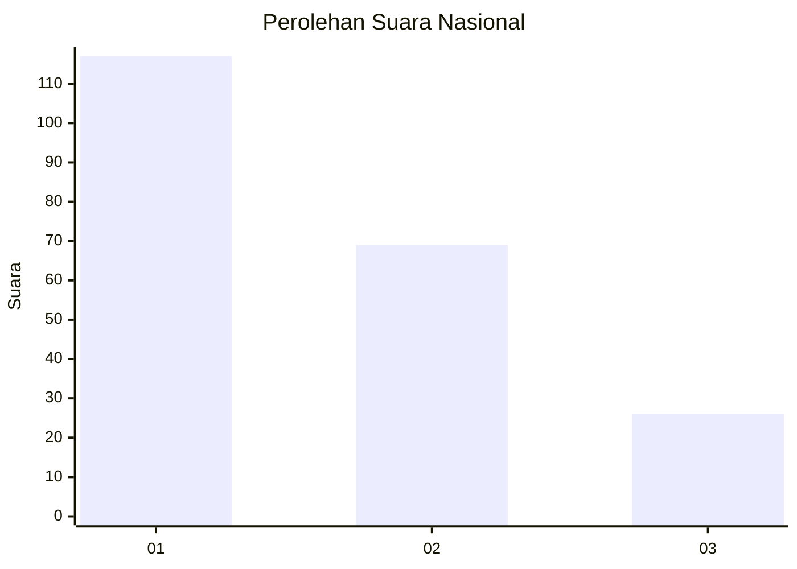
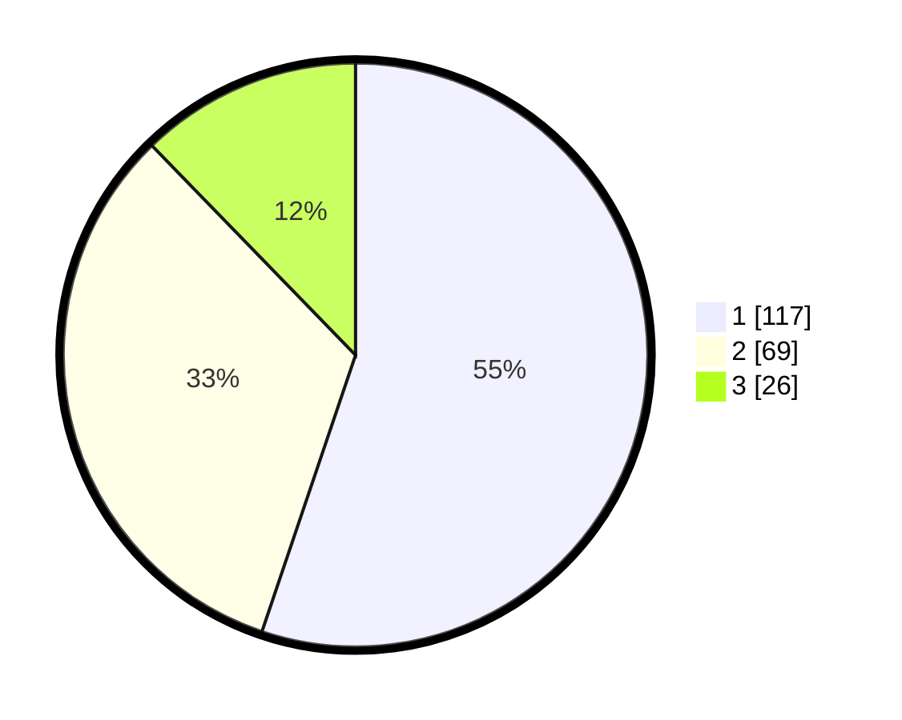

# Hasil

## Grafik

## Tabel

| No.    | Nama Paslon    | Suara | Suara (raw) | Persentase |
|:------ |:-------------- | -----:| -----------:| ----------:|
| 100025 | ANIES MUHAIMIN | 117   | [117][p-1]  | 55,19      |
| 100026 | PRABOWO GIBRAN | 69    | [69][p-2]   | 32,55      |
| 100027 | GANJAR MAHFUD  | 26    | [26][p-3]   | 12,26      |

[p-1]: https://github.com/gigit-pemilu/pemilu-2024/blob/main/pilpres/hitung-suara/sub/31-dki-jakarta/sub/75-jakarta-timur/sub/04-kramatjati/sub/1003-dukuh/sub/078-tps/sub/paslon-1.txt
[p-2]: https://github.com/gigit-pemilu/pemilu-2024/blob/main/pilpres/hitung-suara/sub/31-dki-jakarta/sub/75-jakarta-timur/sub/04-kramatjati/sub/1003-dukuh/sub/078-tps/sub/paslon-2.txt
[p-3]: https://github.com/gigit-pemilu/pemilu-2024/blob/main/pilpres/hitung-suara/sub/31-dki-jakarta/sub/75-jakarta-timur/sub/04-kramatjati/sub/1003-dukuh/sub/078-tps/sub/paslon-3.txt

## Foto C Plano

https://sirekap-obj-formc.kpu.go.id/134d/pemilu/ppwp/31/75/04/10/03/3175041003078-20240214-195826--a0389a84-40bf-481e-b38a-467542227118.jpg

https://sirekap-obj-formc.kpu.go.id/134d/pemilu/ppwp/31/75/04/10/03/3175041003078-20240214-195835--c9f36220-fb8a-4655-a2e6-ba5b0a150747.jpg

https://sirekap-obj-formc.kpu.go.id/134d/pemilu/ppwp/31/75/04/10/03/3175041003078-20240214-195841--b0c8483a-5084-4dc8-aab7-a2bd57febbd9.jpg

## Metadata

| Key        | Value               |
| ---------- | ------------------- |
| Time Stamp | 2024-02-15 12:00:28 |

