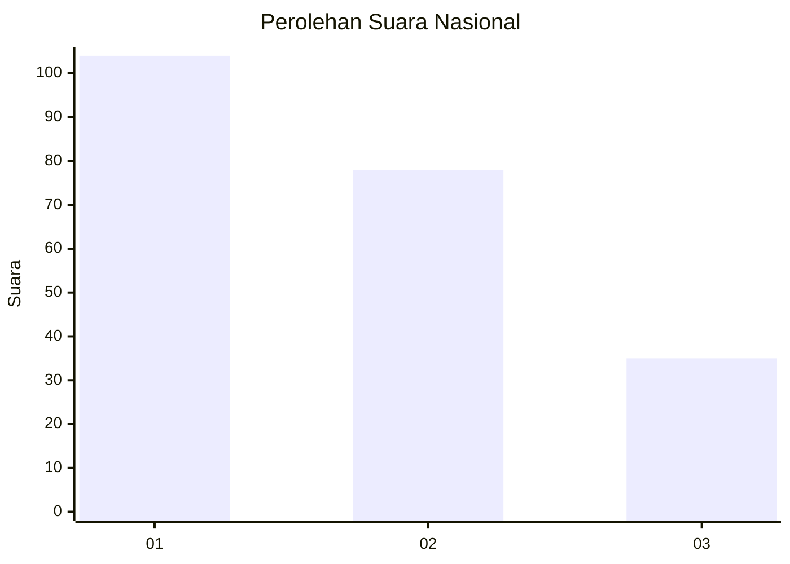
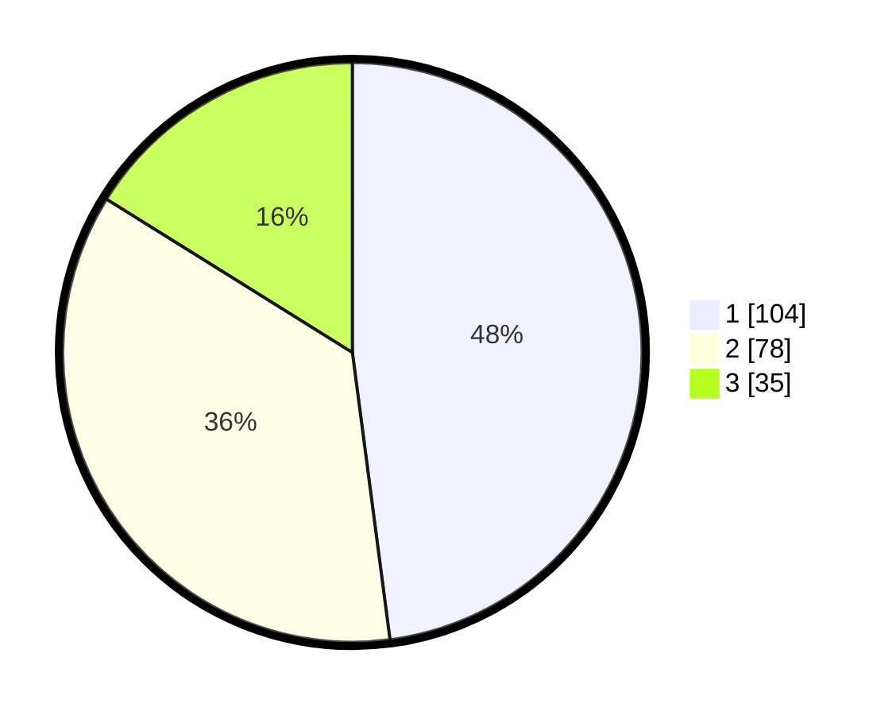

# Hasil

## Grafik

## Tabel

| No.    | Nama Paslon    | Suara | Suara (raw) | Persentase |
|:------ |:-------------- | -----:| -----------:| ----------:|
| 100025 | ANIES MUHAIMIN | 104   | [104][p-1]  | 47,93      |
| 100026 | PRABOWO GIBRAN | 78    | [78][p-2]   | 35,94      |
| 100027 | GANJAR MAHFUD  | 35    | [35][p-3]   | 16,13      |

[p-1]: https://github.com/gigit-pemilu/pemilu-2024/blob/main/pilpres/hitung-suara/sub/31-dki-jakarta/sub/75-jakarta-timur/sub/04-kramatjati/sub/1004-batu-ampar/sub/006-tps/sub/paslon-1.txt
[p-2]: https://github.com/gigit-pemilu/pemilu-2024/blob/main/pilpres/hitung-suara/sub/31-dki-jakarta/sub/75-jakarta-timur/sub/04-kramatjati/sub/1004-batu-ampar/sub/006-tps/sub/paslon-2.txt
[p-3]: https://github.com/gigit-pemilu/pemilu-2024/blob/main/pilpres/hitung-suara/sub/31-dki-jakarta/sub/75-jakarta-timur/sub/04-kramatjati/sub/1004-batu-ampar/sub/006-tps/sub/paslon-3.txt

## Foto C Plano

https://sirekap-obj-formc.kpu.go.id/550c/pemilu/ppwp/31/75/04/10/04/3175041004006-20240215-002144--5d57cfd5-4453-49f4-9a1a-ecea97e2b2f4.jpg

https://sirekap-obj-formc.kpu.go.id/550c/pemilu/ppwp/31/75/04/10/04/3175041004006-20240215-002455--e685d39b-6f1c-4227-b572-cfcc8fa17c9b.jpg

https://sirekap-obj-formc.kpu.go.id/550c/pemilu/ppwp/31/75/04/10/04/3175041004006-20240215-002631--f4e756fe-5781-4840-a0c6-4d0e16ea39be.jpg

## Metadata

| Key        | Value               |
| ---------- | ------------------- |
| Time Stamp | 2024-02-15 15:00:29 |

