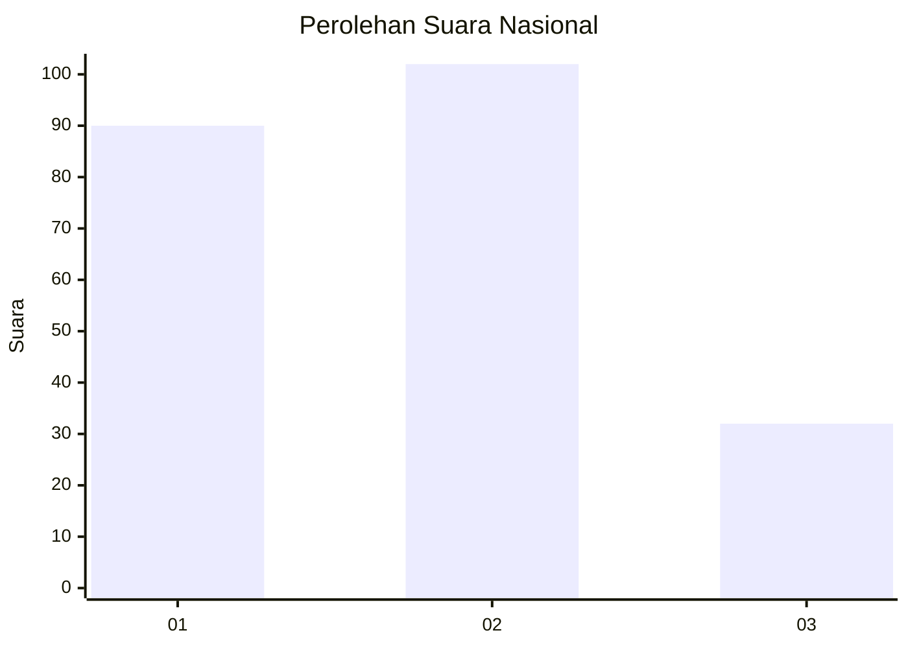
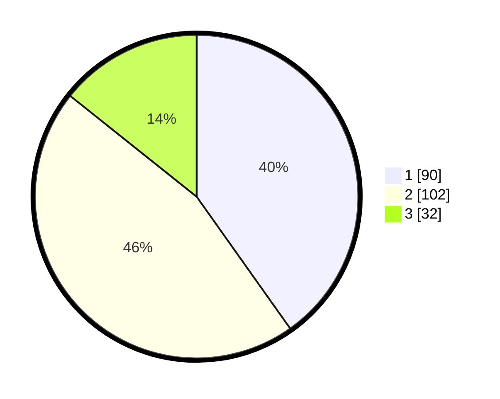

# Hasil

## Grafik

## Tabel

| No.    | Nama Paslon    | Suara | Suara (raw) | Persentase |
|:------ |:-------------- | -----:| -----------:| ----------:|
| 100025 | ANIES MUHAIMIN | 90    | [90][p-1]   | 40,18      |
| 100026 | PRABOWO GIBRAN | 102   | [102][p-2]  | 45,54      |
| 100027 | GANJAR MAHFUD  | 32    | [32][p-3]   | 14,29      |

[p-1]: https://github.com/gigit-pemilu/pemilu-2024/blob/main/pilpres/hitung-suara/sub/31-dki-jakarta/sub/75-jakarta-timur/sub/04-kramatjati/sub/1004-batu-ampar/sub/009-tps/sub/paslon-1.txt
[p-2]: https://github.com/gigit-pemilu/pemilu-2024/blob/main/pilpres/hitung-suara/sub/31-dki-jakarta/sub/75-jakarta-timur/sub/04-kramatjati/sub/1004-batu-ampar/sub/009-tps/sub/paslon-2.txt
[p-3]: https://github.com/gigit-pemilu/pemilu-2024/blob/main/pilpres/hitung-suara/sub/31-dki-jakarta/sub/75-jakarta-timur/sub/04-kramatjati/sub/1004-batu-ampar/sub/009-tps/sub/paslon-3.txt

## Foto C Plano

https://sirekap-obj-formc.kpu.go.id/4d73/pemilu/ppwp/31/75/04/10/04/3175041004009-20240214-213350--af22ddf1-5a98-4264-a50f-ecbdcf23b394.jpg

https://sirekap-obj-formc.kpu.go.id/4d73/pemilu/ppwp/31/75/04/10/04/3175041004009-20240214-211023--19afd652-e7ad-4e0f-92c0-e83b77fde2b4.jpg

https://sirekap-obj-formc.kpu.go.id/4d73/pemilu/ppwp/31/75/04/10/04/3175041004009-20240214-211240--739361bf-d93b-4b42-ba4d-407fc6bb9744.jpg

## Metadata

| Key        | Value               |
| ---------- | ------------------- |
| Time Stamp | 2024-02-15 16:00:26 |

