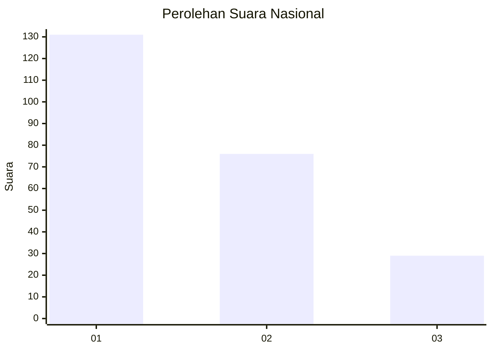
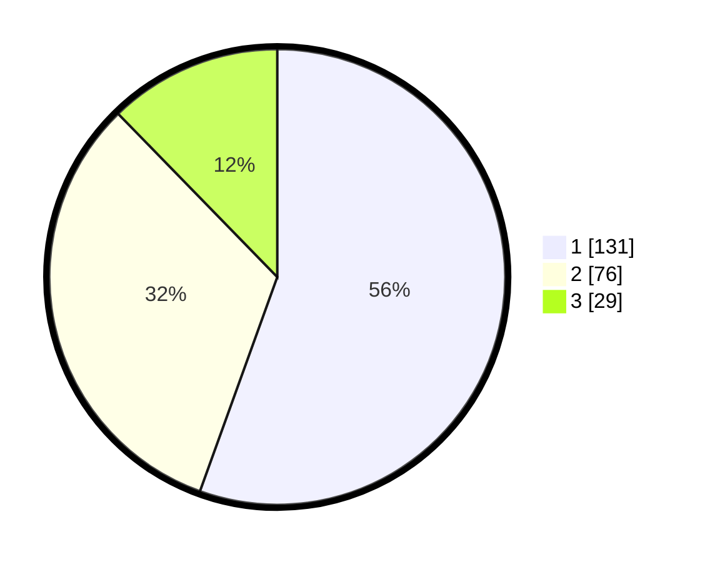

# Hasil

## Grafik

## Tabel

| No.    | Nama Paslon    | Suara | Suara (raw) | Persentase |
|:------ |:-------------- | -----:| -----------:| ----------:|
| 100025 | ANIES MUHAIMIN | 131   | [131][p-1]  | 55,51      |
| 100026 | PRABOWO GIBRAN | 76    | [76][p-2]   | 32,20      |
| 100027 | GANJAR MAHFUD  | 29    | [29][p-3]   | 12,29      |

[p-1]: https://github.com/gigit-pemilu/pemilu-2024/blob/main/pilpres/hitung-suara/sub/31-dki-jakarta/sub/75-jakarta-timur/sub/04-kramatjati/sub/1004-batu-ampar/sub/011-tps/sub/paslon-1.txt
[p-2]: https://github.com/gigit-pemilu/pemilu-2024/blob/main/pilpres/hitung-suara/sub/31-dki-jakarta/sub/75-jakarta-timur/sub/04-kramatjati/sub/1004-batu-ampar/sub/011-tps/sub/paslon-2.txt
[p-3]: https://github.com/gigit-pemilu/pemilu-2024/blob/main/pilpres/hitung-suara/sub/31-dki-jakarta/sub/75-jakarta-timur/sub/04-kramatjati/sub/1004-batu-ampar/sub/011-tps/sub/paslon-3.txt

## Foto C Plano

https://sirekap-obj-formc.kpu.go.id/6fbd/pemilu/ppwp/31/75/04/10/04/3175041004011-20240215-005145--5f57e4e2-ea09-4121-9e48-38cf475824eb.jpg

https://sirekap-obj-formc.kpu.go.id/6fbd/pemilu/ppwp/31/75/04/10/04/3175041004011-20240215-005402--58e89fe3-1473-4e3e-a37f-678659f8c949.jpg

https://sirekap-obj-formc.kpu.go.id/6fbd/pemilu/ppwp/31/75/04/10/04/3175041004011-20240215-005644--eac2b64e-b112-47c7-8d32-4a7decfc213c.jpg

## Metadata

| Key        | Value               |
| ---------- | ------------------- |
| Time Stamp | 2024-02-15 15:00:29 |

