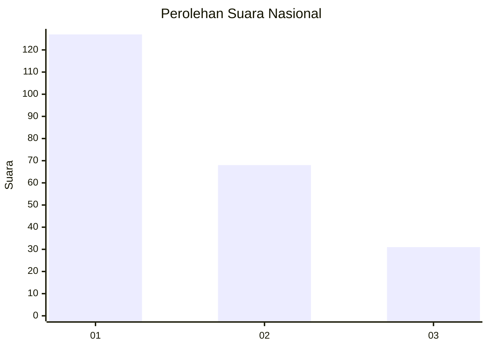
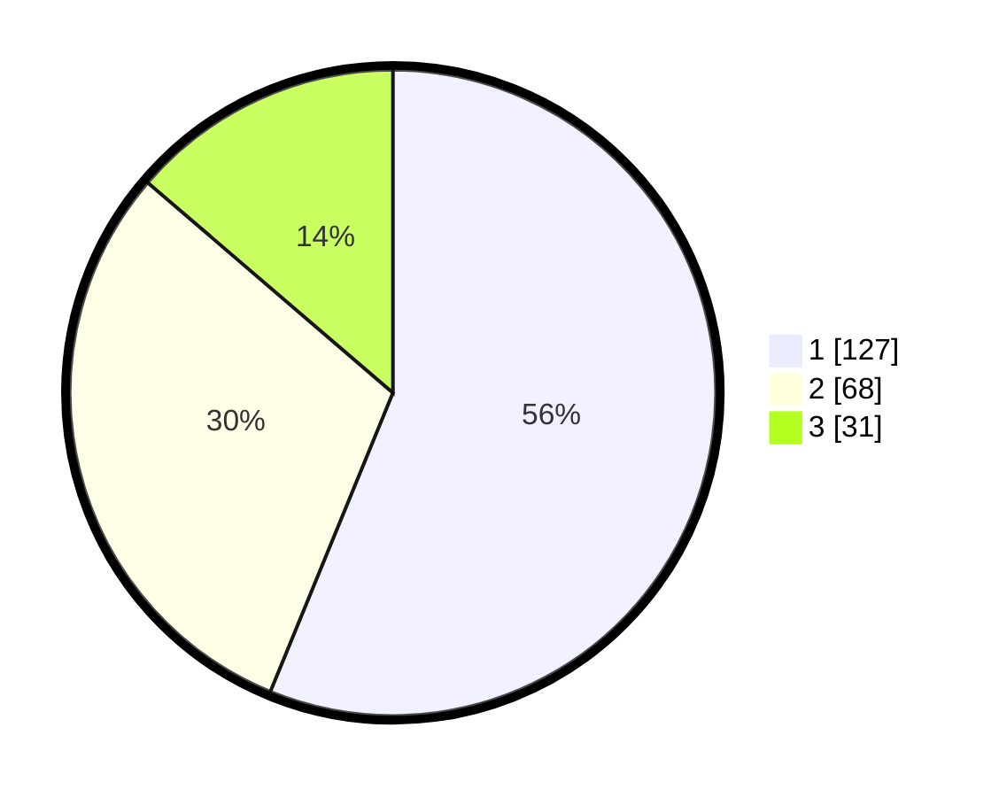

# Hasil

## Grafik

## Tabel

| No.    | Nama Paslon    | Suara | Suara (raw) | Persentase |
|:------ |:-------------- | -----:| -----------:| ----------:|
| 100025 | ANIES MUHAIMIN | 127   | [127][p-1]  | 56,19      |
| 100026 | PRABOWO GIBRAN | 68    | [68][p-2]   | 30,09      |
| 100027 | GANJAR MAHFUD  | 31    | [31][p-3]   | 13,72      |

[p-1]: https://github.com/gigit-pemilu/pemilu-2024/blob/main/pilpres/hitung-suara/sub/31-dki-jakarta/sub/75-jakarta-timur/sub/04-kramatjati/sub/1004-batu-ampar/sub/015-tps/sub/paslon-1.txt
[p-2]: https://github.com/gigit-pemilu/pemilu-2024/blob/main/pilpres/hitung-suara/sub/31-dki-jakarta/sub/75-jakarta-timur/sub/04-kramatjati/sub/1004-batu-ampar/sub/015-tps/sub/paslon-2.txt
[p-3]: https://github.com/gigit-pemilu/pemilu-2024/blob/main/pilpres/hitung-suara/sub/31-dki-jakarta/sub/75-jakarta-timur/sub/04-kramatjati/sub/1004-batu-ampar/sub/015-tps/sub/paslon-3.txt

## Foto C Plano

https://sirekap-obj-formc.kpu.go.id/f972/pemilu/ppwp/31/75/04/10/04/3175041004015-20240217-212235--28566c2d-04c3-4e64-9160-3945d7175762.jpg

https://sirekap-obj-formc.kpu.go.id/f972/pemilu/ppwp/31/75/04/10/04/3175041004015-20240217-212536--abf2637e-3600-46be-a0f6-73e25cfe7ccb.jpg

https://sirekap-obj-formc.kpu.go.id/f972/pemilu/ppwp/31/75/04/10/04/3175041004015-20240217-212724--413cee44-c567-495d-b553-bc6c06ac4203.jpg

## Metadata

| Key        | Value               |
| ---------- | ------------------- |
| Time Stamp | 2024-02-19 11:00:00 |

