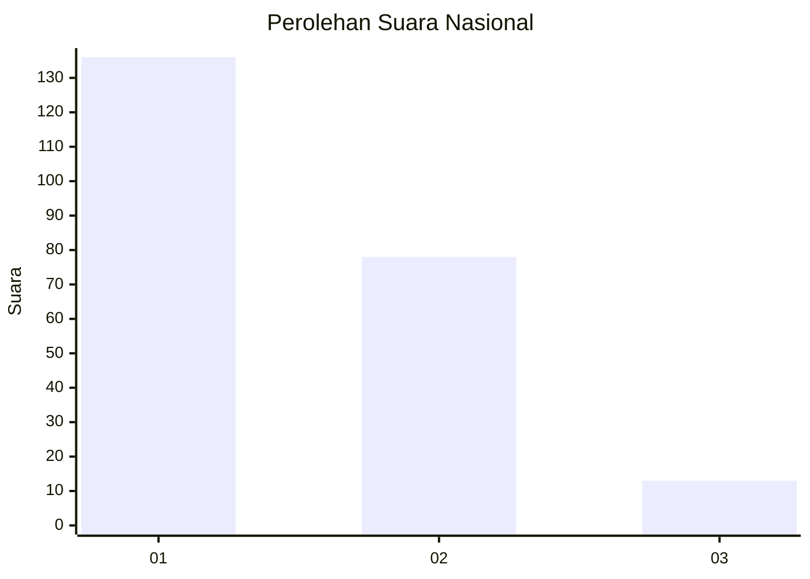
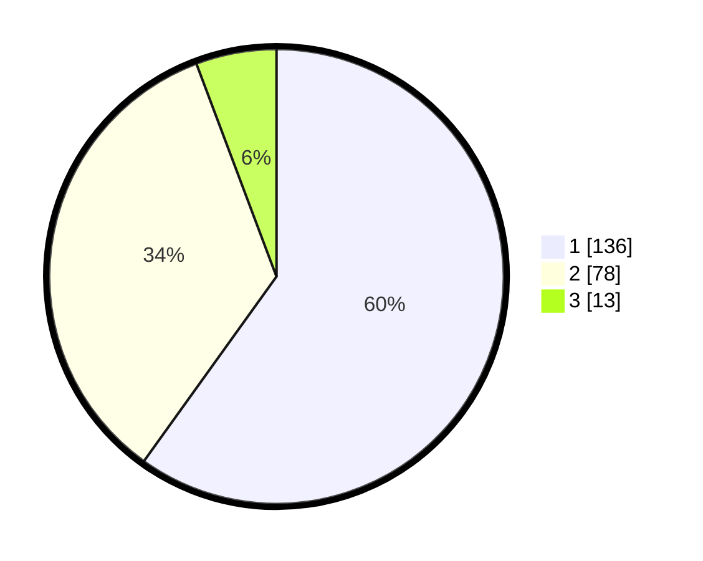

# Hasil

## Grafik

## Tabel

| No.    | Nama Paslon    | Suara | Suara (raw) | Persentase |
|:------ |:-------------- | -----:| -----------:| ----------:|
| 100025 | ANIES MUHAIMIN | 136   | [136][p-1]  | 59,91      |
| 100026 | PRABOWO GIBRAN | 78    | [78][p-2]   | 34,36      |
| 100027 | GANJAR MAHFUD  | 13    | [13][p-3]   | 5,73       |

[p-1]: https://github.com/gigit-pemilu/pemilu-2024/blob/main/pilpres/hitung-suara/sub/31-dki-jakarta/sub/75-jakarta-timur/sub/04-kramatjati/sub/1004-batu-ampar/sub/069-tps/sub/paslon-1.txt
[p-2]: https://github.com/gigit-pemilu/pemilu-2024/blob/main/pilpres/hitung-suara/sub/31-dki-jakarta/sub/75-jakarta-timur/sub/04-kramatjati/sub/1004-batu-ampar/sub/069-tps/sub/paslon-2.txt
[p-3]: https://github.com/gigit-pemilu/pemilu-2024/blob/main/pilpres/hitung-suara/sub/31-dki-jakarta/sub/75-jakarta-timur/sub/04-kramatjati/sub/1004-batu-ampar/sub/069-tps/sub/paslon-3.txt

## Foto C Plano

https://sirekap-obj-formc.kpu.go.id/2536/pemilu/ppwp/31/75/04/10/04/3175041004069-20240214-225026--349792b3-0c4d-4992-a080-2cd807c00531.jpg

https://sirekap-obj-formc.kpu.go.id/2536/pemilu/ppwp/31/75/04/10/04/3175041004069-20240214-225136--d9022048-1713-4f5f-adbc-c504d5ac502a.jpg

https://sirekap-obj-formc.kpu.go.id/2536/pemilu/ppwp/31/75/04/10/04/3175041004069-20240214-225226--c3ec3141-2b9c-42e0-be15-e3a7081b5427.jpg

## Metadata

| Key        | Value               |
| ---------- | ------------------- |
| Time Stamp | 2024-02-15 15:00:29 |

