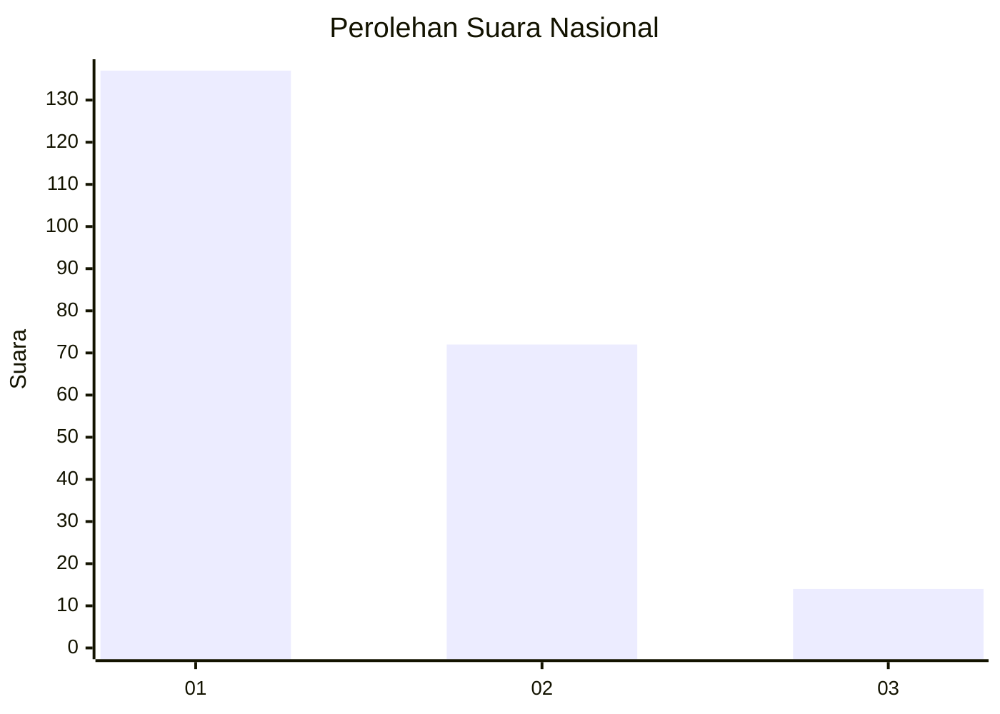
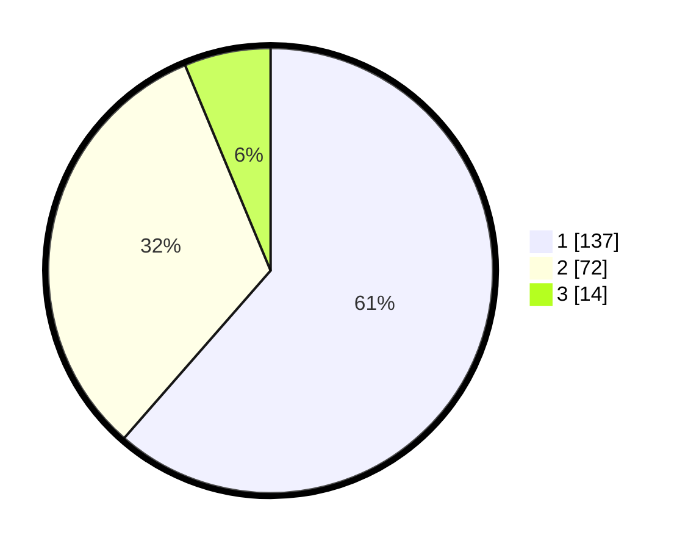

# Hasil

## Grafik

## Tabel

| No.    | Nama Paslon    | Suara | Suara (raw) | Persentase |
|:------ |:-------------- | -----:| -----------:| ----------:|
| 100025 | ANIES MUHAIMIN | 137   | [137][p-1]  | 61,43      |
| 100026 | PRABOWO GIBRAN | 72    | [72][p-2]   | 32,29      |
| 100027 | GANJAR MAHFUD  | 14    | [14][p-3]   | 6,28       |

[p-1]: https://github.com/gigit-pemilu/pemilu-2024/blob/main/pilpres/hitung-suara/sub/31-dki-jakarta/sub/75-jakarta-timur/sub/04-kramatjati/sub/1004-batu-ampar/sub/087-tps/sub/paslon-1.txt
[p-2]: https://github.com/gigit-pemilu/pemilu-2024/blob/main/pilpres/hitung-suara/sub/31-dki-jakarta/sub/75-jakarta-timur/sub/04-kramatjati/sub/1004-batu-ampar/sub/087-tps/sub/paslon-2.txt
[p-3]: https://github.com/gigit-pemilu/pemilu-2024/blob/main/pilpres/hitung-suara/sub/31-dki-jakarta/sub/75-jakarta-timur/sub/04-kramatjati/sub/1004-batu-ampar/sub/087-tps/sub/paslon-3.txt

## Foto C Plano

https://sirekap-obj-formc.kpu.go.id/cc56/pemilu/ppwp/31/75/04/10/04/3175041004087-20240214-210948--0ad2673f-0f57-4323-9feb-c0988028d166.jpg

https://sirekap-obj-formc.kpu.go.id/cc56/pemilu/ppwp/31/75/04/10/04/3175041004087-20240214-211015--693e4b49-1f77-4975-a196-bb0a7ddfa8c0.jpg

https://sirekap-obj-formc.kpu.go.id/cc56/pemilu/ppwp/31/75/04/10/04/3175041004087-20240214-211047--e0dcde34-253a-4a11-979a-67ac0b188171.jpg

## Metadata

| Key        | Value               |
| ---------- | ------------------- |
| Time Stamp | 2024-02-15 15:00:29 |

