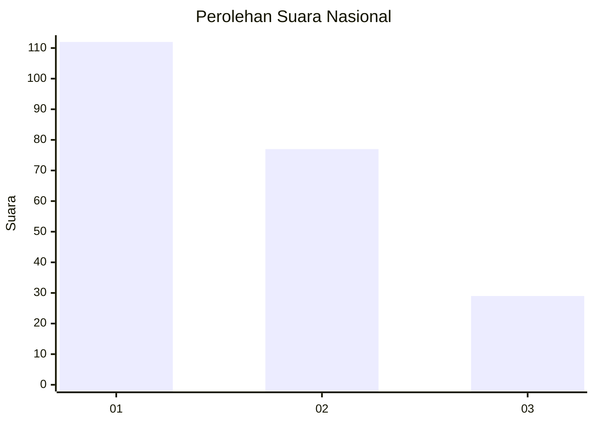
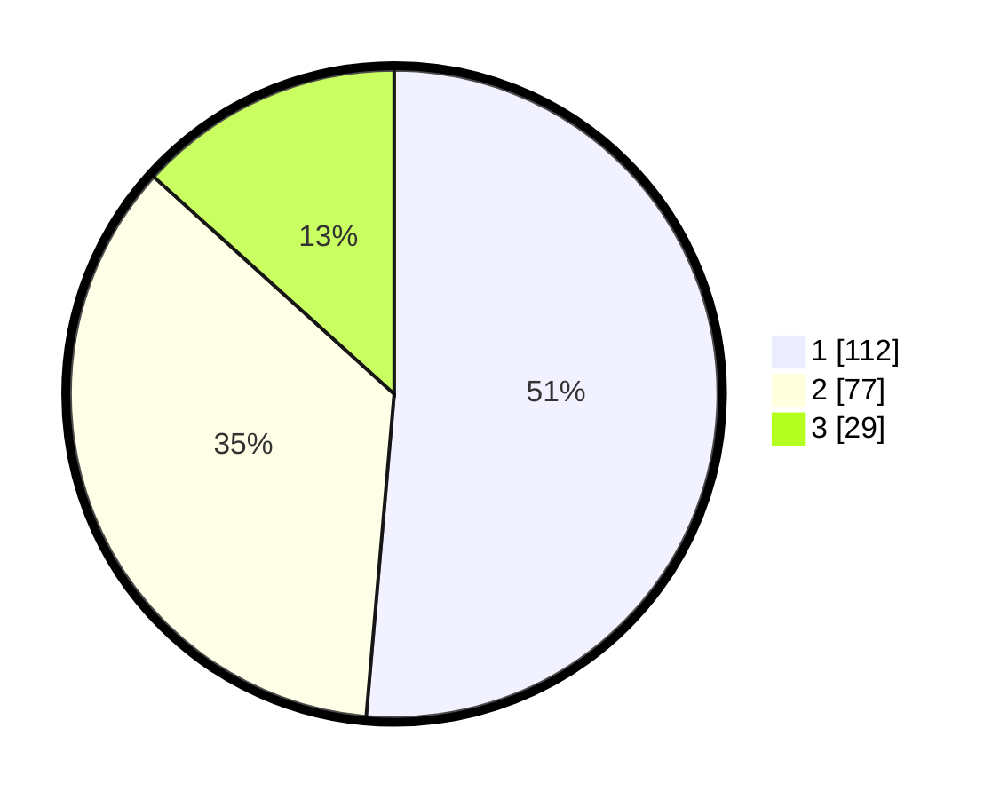

# Hasil

## Grafik

## Tabel

| No.    | Nama Paslon    | Suara | Suara (raw) | Persentase |
|:------ |:-------------- | -----:| -----------:| ----------:|
| 100025 | ANIES MUHAIMIN | 112   | [112][p-1]  | 51,38      |
| 100026 | PRABOWO GIBRAN | 77    | [77][p-2]   | 35,32      |
| 100027 | GANJAR MAHFUD  | 29    | [29][p-3]   | 13,30      |

[p-1]: https://github.com/gigit-pemilu/pemilu-2024/blob/main/pilpres/hitung-suara/sub/31-dki-jakarta/sub/75-jakarta-timur/sub/04-kramatjati/sub/1004-batu-ampar/sub/088-tps/sub/paslon-1.txt
[p-2]: https://github.com/gigit-pemilu/pemilu-2024/blob/main/pilpres/hitung-suara/sub/31-dki-jakarta/sub/75-jakarta-timur/sub/04-kramatjati/sub/1004-batu-ampar/sub/088-tps/sub/paslon-2.txt
[p-3]: https://github.com/gigit-pemilu/pemilu-2024/blob/main/pilpres/hitung-suara/sub/31-dki-jakarta/sub/75-jakarta-timur/sub/04-kramatjati/sub/1004-batu-ampar/sub/088-tps/sub/paslon-3.txt

## Foto C Plano

https://sirekap-obj-formc.kpu.go.id/0176/pemilu/ppwp/31/75/04/10/04/3175041004088-20240215-014917--f2f39940-e5ae-48ba-849a-9b87f556f872.jpg

https://sirekap-obj-formc.kpu.go.id/0176/pemilu/ppwp/31/75/04/10/04/3175041004088-20240215-015137--8ae1ff96-2917-400b-bb88-e6a2c69644e5.jpg

https://sirekap-obj-formc.kpu.go.id/0176/pemilu/ppwp/31/75/04/10/04/3175041004088-20240215-015220--2f6f5a99-47b4-40c7-be89-387e6f027b40.jpg

## Metadata

| Key        | Value               |
| ---------- | ------------------- |
| Time Stamp | 2024-02-15 15:00:29 |

