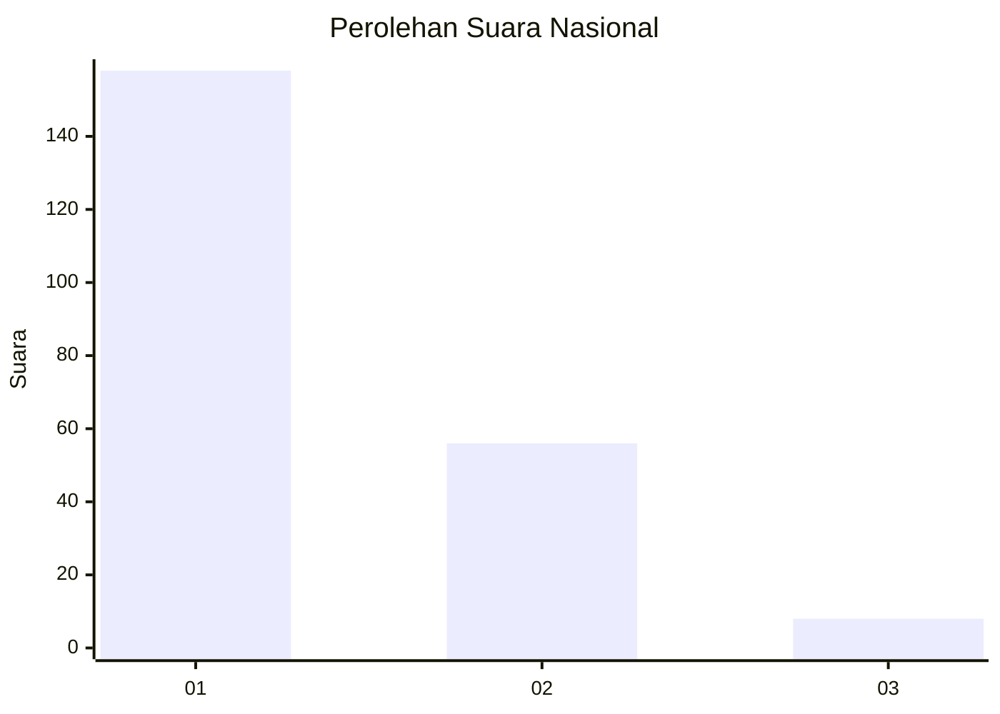
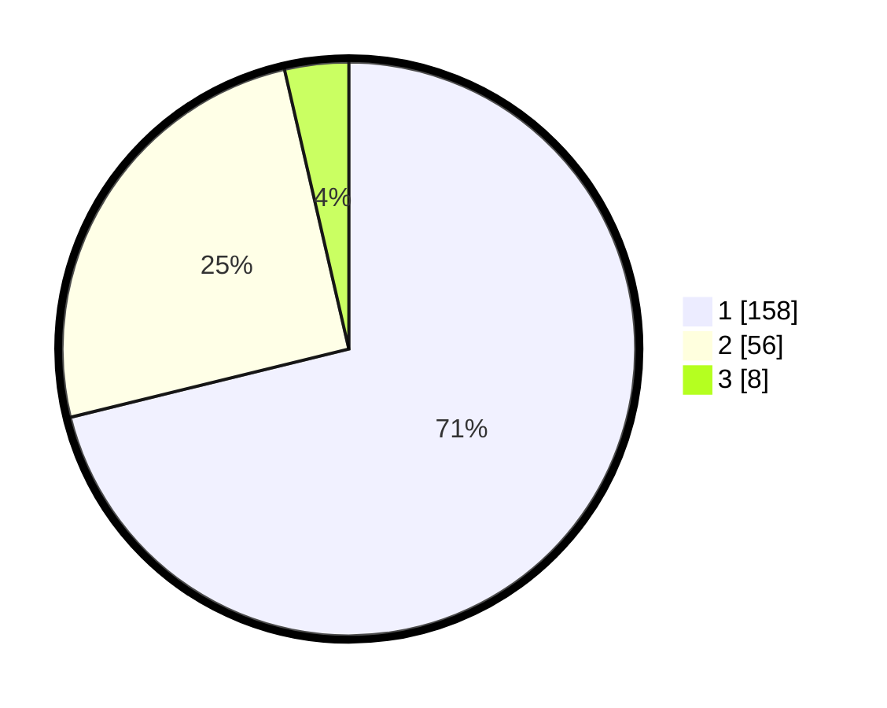

# Hasil

## Grafik

## Tabel

| No.    | Nama Paslon    | Suara | Suara (raw) | Persentase |
|:------ |:-------------- | -----:| -----------:| ----------:|
| 100025 | ANIES MUHAIMIN | 158   | [158][p-1]  | 71,17      |
| 100026 | PRABOWO GIBRAN | 56    | [56][p-2]   | 25,23      |
| 100027 | GANJAR MAHFUD  | 8     | [8][p-3]    | 3,60       |

[p-1]: https://github.com/gigit-pemilu/pemilu-2024/blob/main/pilpres/hitung-suara/sub/31-dki-jakarta/sub/75-jakarta-timur/sub/04-kramatjati/sub/1004-batu-ampar/sub/159-tps/sub/paslon-1.txt
[p-2]: https://github.com/gigit-pemilu/pemilu-2024/blob/main/pilpres/hitung-suara/sub/31-dki-jakarta/sub/75-jakarta-timur/sub/04-kramatjati/sub/1004-batu-ampar/sub/159-tps/sub/paslon-2.txt
[p-3]: https://github.com/gigit-pemilu/pemilu-2024/blob/main/pilpres/hitung-suara/sub/31-dki-jakarta/sub/75-jakarta-timur/sub/04-kramatjati/sub/1004-batu-ampar/sub/159-tps/sub/paslon-3.txt

## Foto C Plano

https://sirekap-obj-formc.kpu.go.id/03ef/pemilu/ppwp/31/75/04/10/04/3175041004159-20240215-004223--bb525871-f0a1-4e38-87cc-bf0f7c75555d.jpg

https://sirekap-obj-formc.kpu.go.id/03ef/pemilu/ppwp/31/75/04/10/04/3175041004159-20240215-004317--6cfd6d0c-998d-446b-aab2-408760cb3ace.jpg

https://sirekap-obj-formc.kpu.go.id/03ef/pemilu/ppwp/31/75/04/10/04/3175041004159-20240215-004420--2ff5fcb0-73dc-4e1c-aa43-4c00ed8520e1.jpg

## Metadata

| Key        | Value               |
| ---------- | ------------------- |
| Time Stamp | 2024-02-15 16:00:26 |

