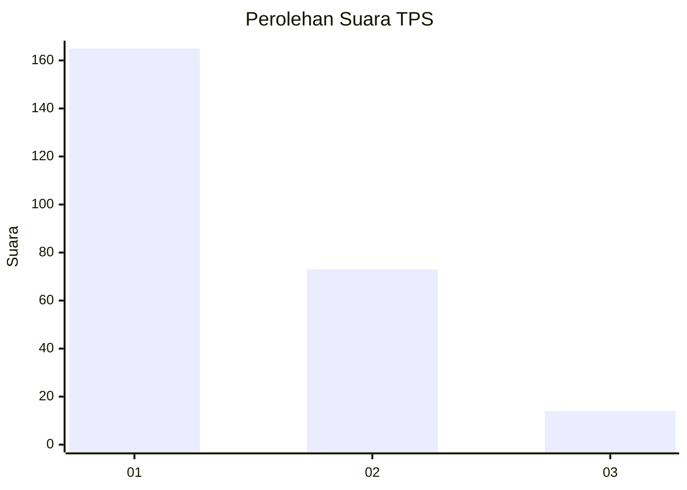
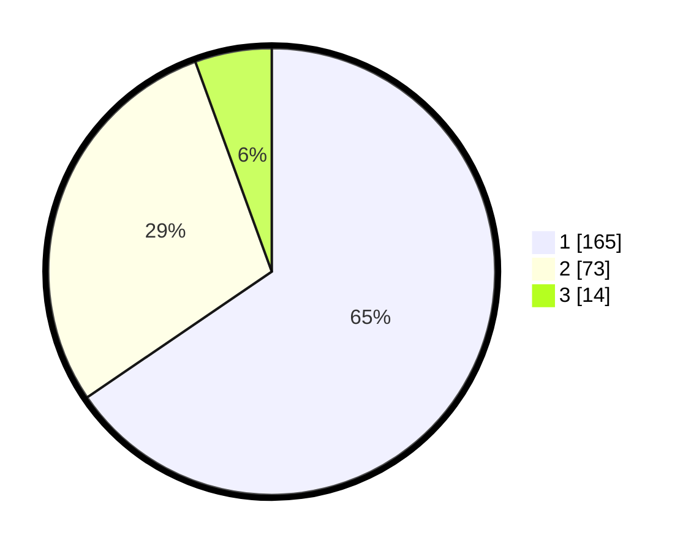

# Hasil

## Grafik

## Tabel

| No. | Nama Paslon    | Suara | Suara (raw) | Persentase |
|:--- |:-------------- | -----:| -----------:| ----------:|
| 1   | ANIES MUHAIMIN | 165   | [165][p-1]  | 65,48      |
| 2   | PRABOWO GIBRAN | 73    | [73][p-2]   | 28,97      |
| 3   | GANJAR MAHFUD  | 14    | [14][p-3]   | 5,56       |

[p-1]: https://github.com/gigit-pemilu/pemilu-2024-31-dki-jakarta/blob/main/pilpres/hitung-suara/sub/31-dki-jakarta/sub/75-jakarta-timur/sub/04-kramatjati/sub/1005-balekambang/sub/003-tps/sub/paslon-1.txt
[p-2]: https://github.com/gigit-pemilu/pemilu-2024-31-dki-jakarta/blob/main/pilpres/hitung-suara/sub/31-dki-jakarta/sub/75-jakarta-timur/sub/04-kramatjati/sub/1005-balekambang/sub/003-tps/sub/paslon-2.txt
[p-3]: https://github.com/gigit-pemilu/pemilu-2024-31-dki-jakarta/blob/main/pilpres/hitung-suara/sub/31-dki-jakarta/sub/75-jakarta-timur/sub/04-kramatjati/sub/1005-balekambang/sub/003-tps/sub/paslon-3.txt

## Foto C Plano

https://sirekap-obj-formc.kpu.go.id/6e96/pemilu/ppwp/31/75/04/10/05/3175041005003-20240220-094736--a327295c-604e-4ea0-81cf-bd0f737578fe.jpg

https://sirekap-obj-formc.kpu.go.id/6e96/pemilu/ppwp/31/75/04/10/05/3175041005003-20240220-095015--2c6fce1e-3547-4830-9bc4-d03307fe3c8e.jpg

https://sirekap-obj-formc.kpu.go.id/6e96/pemilu/ppwp/31/75/04/10/05/3175041005003-20240220-095243--9746c55f-791b-4e0d-9bb2-f48a6bdc2d09.jpg

## Metadata

| Key        | Value               |
| ---------- | ------------------- |
| Time Stamp | 2024-02-24 22:31:28 |

