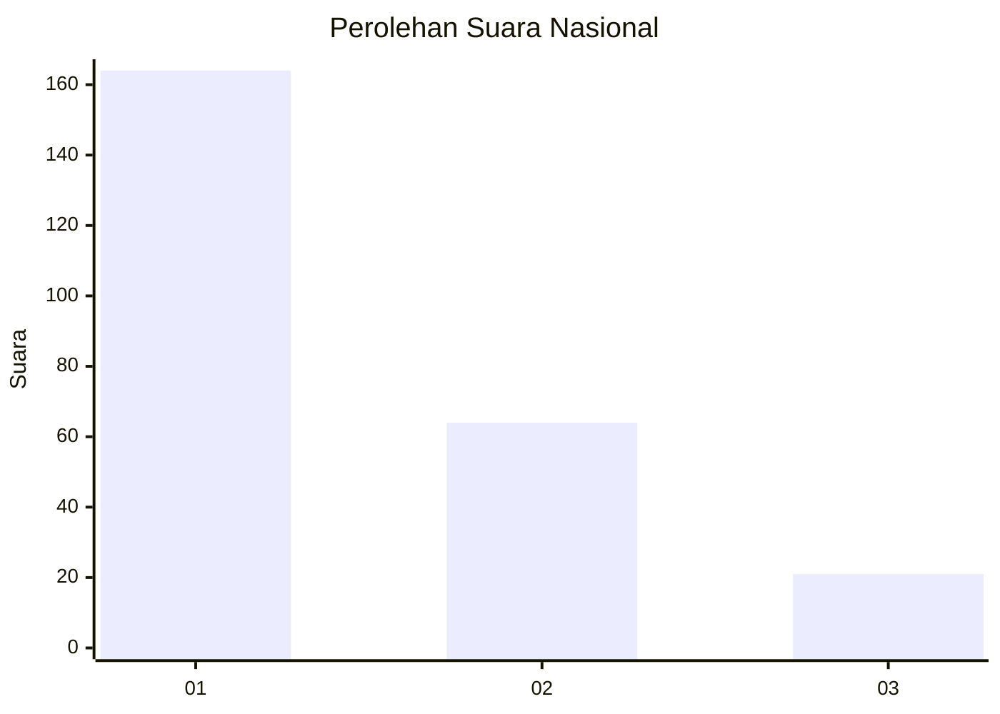
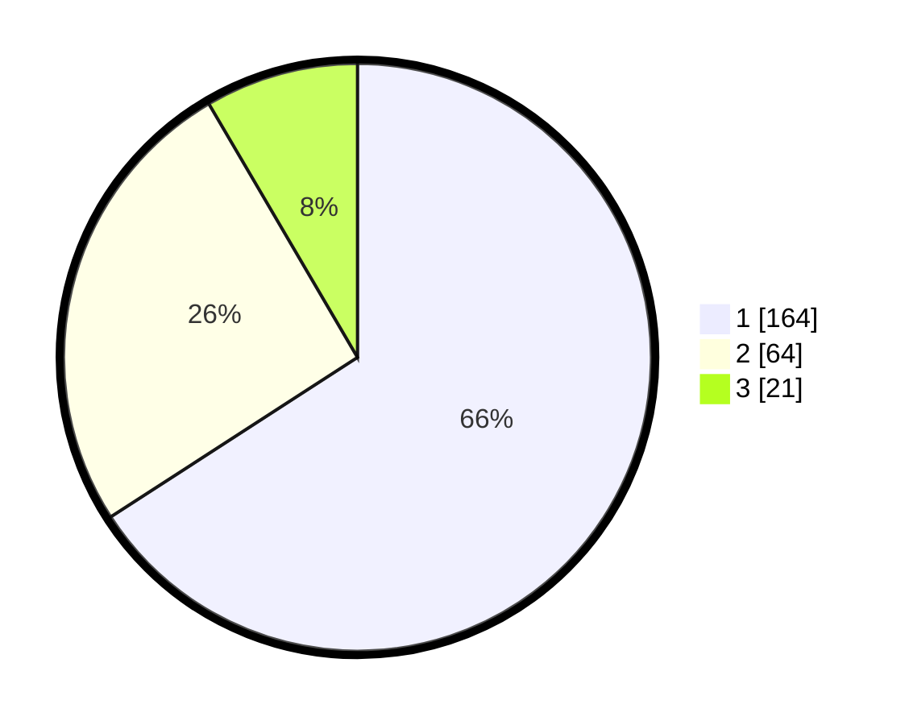

# Hasil

## Grafik

## Tabel

| No. | Nama Paslon    | Suara | Suara (raw) | Persentase |
|:--- |:-------------- | -----:| -----------:| ----------:|
| 1   | ANIES MUHAIMIN | 164   | [164][p-1]  | 65,86      |
| 2   | PRABOWO GIBRAN | 64    | [64][p-2]   | 25,70      |
| 3   | GANJAR MAHFUD  | 21    | [21][p-3]   | 8,43       |

[p-1]: https://github.com/gigit-pemilu/pemilu-2024/blob/main/pilpres/hitung-suara/sub/31-dki-jakarta/sub/75-jakarta-timur/sub/04-kramatjati/sub/1005-balekambang/sub/004-tps/sub/paslon-1.txt
[p-2]: https://github.com/gigit-pemilu/pemilu-2024/blob/main/pilpres/hitung-suara/sub/31-dki-jakarta/sub/75-jakarta-timur/sub/04-kramatjati/sub/1005-balekambang/sub/004-tps/sub/paslon-2.txt
[p-3]: https://github.com/gigit-pemilu/pemilu-2024/blob/main/pilpres/hitung-suara/sub/31-dki-jakarta/sub/75-jakarta-timur/sub/04-kramatjati/sub/1005-balekambang/sub/004-tps/sub/paslon-3.txt

## Foto C Plano

https://sirekap-obj-formc.kpu.go.id/d32b/pemilu/ppwp/31/75/04/10/05/3175041005004-20240214-220554--3c3e3320-4d53-407b-98fe-55b5dab46f6e.jpg

https://sirekap-obj-formc.kpu.go.id/d32b/pemilu/ppwp/31/75/04/10/05/3175041005004-20240214-220657--c9014e84-88f3-4f85-9d30-217d66ff6d72.jpg

https://sirekap-obj-formc.kpu.go.id/d32b/pemilu/ppwp/31/75/04/10/05/3175041005004-20240214-220744--ea8babf2-605c-46a3-8681-0bf460371e72.jpg

## Metadata

| Key        | Value               |
| ---------- | ------------------- |
| Time Stamp | 2024-02-15 15:00:29 |

